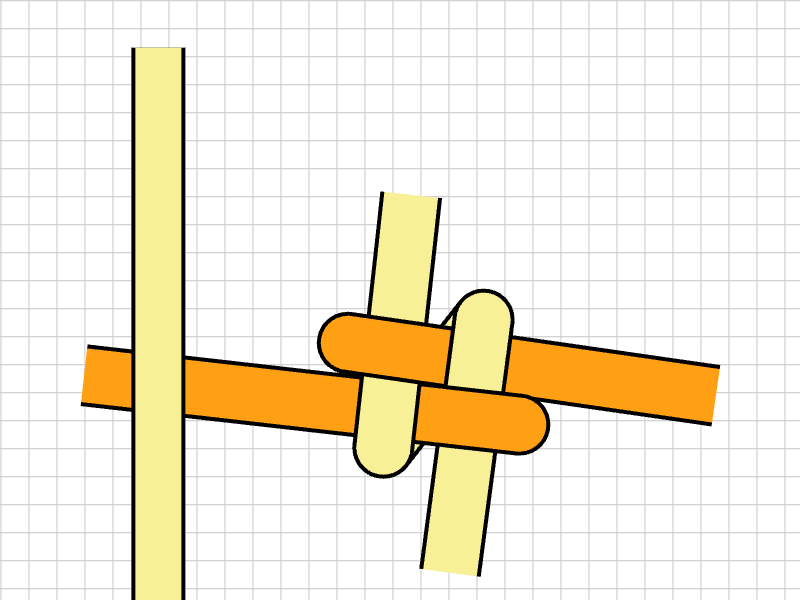
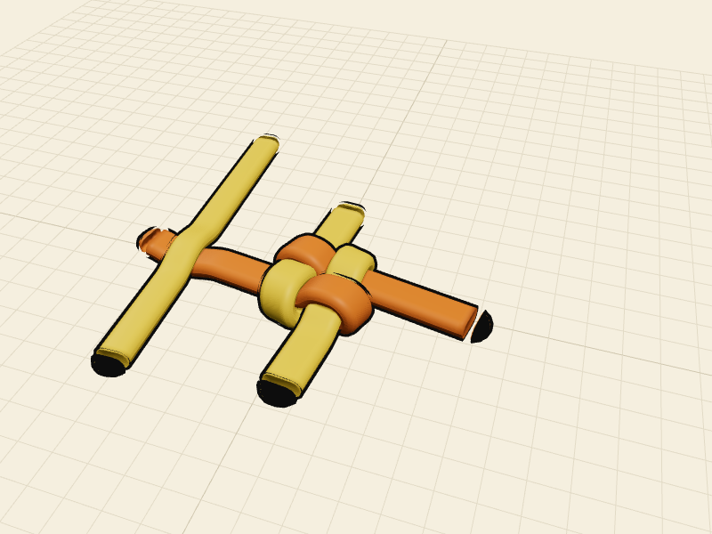
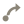
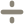
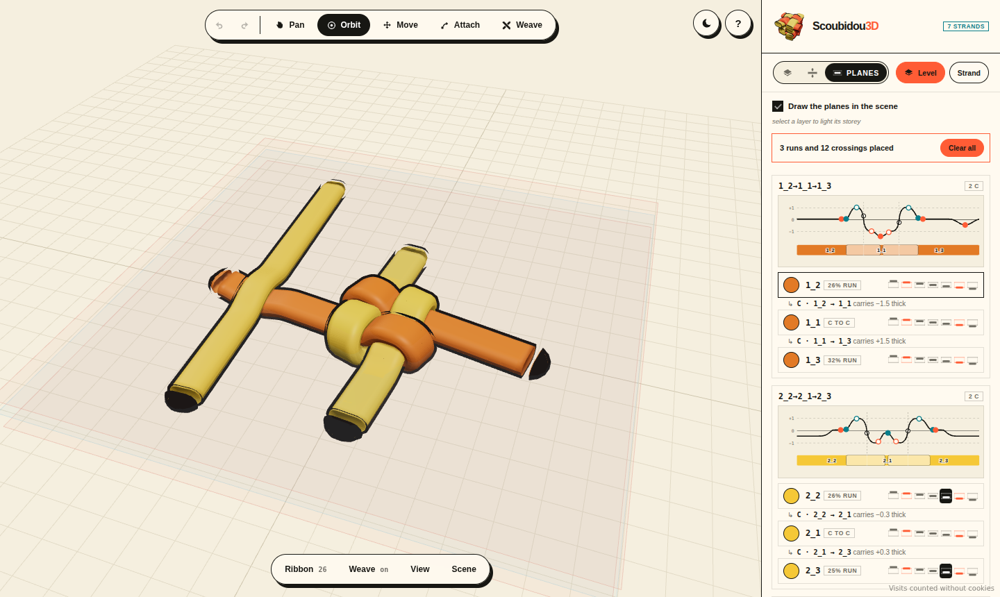
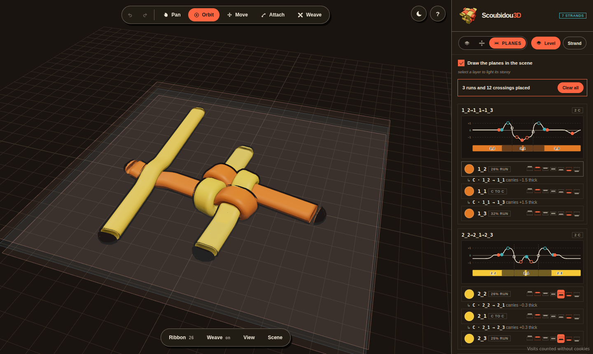

# Scoubidou3D

**a 3D reimagining of [OpenStrand Studio](https://github.com/ysetbon/OpenStrandStudio)** — a strand
gets a real thickness, its layer number becomes its height, and a mask stops being paint and becomes
a weave you can orbit.

**[open the studio](https://ysetbon.github.io/Scoubidou3D/app/)** ·
**[the site](https://ysetbon.github.io/Scoubidou3D/)** ·
**[the twist study](https://ysetbon.github.io/Scoubidou3D/twist/)** ·
**[the MXN lab](https://ysetbon.github.io/Scoubidou3D/mxn/)** ·
**[every link](docs/links.md)**


nothing to install, nothing uploaded. it runs in the browser and your files stay on your machine.

---

## the idea

OpenStrand Studio, and its browser port [OpenStrandJS](https://github.com/ysetbon/OpenStrandJS),
draw strands from straight above. a strand has a *width*, and over/under is *faked* by masking one
strand out where it crosses another. that is the right call for a 2D editor and it is also a
picture of something that isn't flat.

> so what if the strand had a real **thickness**, and "layer over layer" in the panel meant it
> physically sits **on top** in space — so you tilt the camera and the weave is actually there?

that is the whole repo. every strand becomes a **ribbon**, like the plastic lacing this is named
after: the OpenStrand *width* runs across it, a new *thickness* runs through it, and the **layer
index is its height**. strand `2_1` above strand `1_3` in the panel means `2_1`'s ribbon rides over
`1_3`'s — and a **mask** flips that at one single crossing, so one lace goes over its neighbour and
under the next, which is what a real basket does.

both of these are real screenshots, not diagrams — the same stitch drawn in
[OpenStrandJS](https://github.com/ysetbon/OpenStrandJS) from straight above, over/under faked by
masking, and the box + strand sample in this app's studio, where the over lace physically rides:

<table>
<tr>
<td width="50%"></td>
<td width="50%"></td>
</tr>
<tr>
<td align="center"><em>OpenStrandJS — top-down, masked</em></td>
<td align="center"><em>Scoubidou3D — tilted, real depth</em></td>
</tr>
</table>

## the studio

<table>
<tr>
<td width="50%"></td>
<td width="50%"></td>
</tr>
</table>

the panel is the **layer stack and nothing else**. a bar per storey sits *under* the layers it
carries, because that is what a storey is — the floor they rest on — so level 0's bar is the last
thing in the list and the stack hangs off the ground. the settings live in a **dock** along the
bottom (Ribbon / Weave / View / Scene), one card at a time, every pill printing its own value so a
scene's setup reads without opening anything. everything the panel used to explain is behind the
**?**, and what's left over the canvas is one status line.

**light and dark** are both built from the site's palette rather than one inverted into the other —
cream paper and coral, or the warm near-black it turns into. follows the OS, ◐ overrides it, the
choice is remembered and the site wears the same one. the artwork does not follow it: the gold
stage and the laces on it are the product and they look the same on every page.

**it works on a phone.** the panel becomes a bottom sheet, and the dock's cards open *inside* it
instead of over the scene — tap Ribbon and the stack becomes the Ribbon controls, so you can watch
the ribbons fatten while you drag Thickness. the handles carry OpenStrand's own generous grab areas
(`move_mode.py`'s 120px endpoint square, `attach_mode.py`'s 120px attach circle) scaled for a
fingertip. one finger orbits, pinch zooms, two fingers pan.


### what it does

- **strands → ribbons.** every strand extruded into a solid ribbon with a configurable
  **thickness**, rounded edges, rounded ends and a stroke-coloured outline.
-  **masks → a real over/under weave.** this is the headline. in OpenStrand a `MaskedStrand`
  paints one strand on top of another where they cross. here the **over** lace lifts and the
  **under** lace dips, so a single strand goes over one neighbour and under the next.
  - the **Weave** tool: click the strand that goes over, then the one it crosses. hovering lights
    **one layer** and names it at the cursor, green for the over and blue for the under, so on a
    stitch drawn as one seamless lace you still see which strand a click takes.
  - **masks are layers.** the stack bar switches **Layers | Masks | Planes**; the masks side is a
    row per crossing reading `1_2` over `1_3` (OSS's `first_second`), with a two-tone disc and
    flip / delete. a mask changes only its own crossing.
  - **imported masks weave by themselves.** `MaskedStrand` records become over/under links, so an
    imported basket interlaces the way it was drawn. no mask on a crossing → the higher layer rides.
  - **Depth / Span / Layer-lift** tune how far the laces rise and dip and how wide the bump is.
-  **attached strands are really joined.** an attached strand lives on another layer, so the join
  used to float with a Z gap. now a **lofted bridge** morphs the parent's end cross-section into the
  child's start across that gap, banking gently — one continuous lace stepping between layers.
  derived from coincident endpoints, so imported files reconnect too.
- **colour a layer, or the whole lace.** a layer name is `set_length`, so `1_2` is the second
  length of lace `1`. a switch under the palette says where a colour lands — **This layer** paints
  `1_2`, **All layers** paints every length of that lace at once — and either way it's one undo. a
  lace worked through ten rounds is twenty-odd layers; recolouring it used to be twenty-odd presses.
  read off the *name*, exactly as OSS writes it, so it survives a save and a hand edit.
  ([`src/model/colour.ts`](src/model/colour.ts), `npm run check:colour`)
- **any colour, and none of it spent until OK.** six chips are the laces you keep; the **wheel**
  opens a picker window — sat/brightness square over a hue strip, plus a hex field. a window rather
  than a live well because hunting for a colour is a *drag*, and painting every step of that drag
  put a hundred colours through undo on the way to the one you wanted.
-  **layer order = default depth.** higher layer rides over; masks override single crossings, same
  as OSS. reorder and it restacks live.
-  **levels — storeys in the stack.** **Level** adds a storey, and everything above it rests one
  storey higher: two thicknesses, the height of a woven round (a lace over plus a lace under), which
  is what it takes for the next round to sit *on* it rather than sink into it. the storey goes in at
  the top so nothing already drawn moves. each storey is its own bar, numbered from **0**, and `▲▼`
  walk it through the stack. ([how it works](docs/layer-levels.md))
-  **Attach & Move — OpenStrand's editing, in 3D.** a tool bar across the top of the scene (the
  undo pair, then Pan / Orbit / Move / Attach / Weave) turns endpoints into handles.
  - **Attach**: pull from a *free* (green) endpoint and a new strand is born glued to the parent,
    inheriting its look, joining the same set (`1_1` → `1_2`), stacked on top and bridged. occupied
    junctions go gray and refuse, exactly like OSS's `has_circles`.
  - **Move**: drag a (blue) endpoint and everything glued to it comes along. the weave re-solves as
    you drag.
  - **control points are OpenStrand's own.** same marks, same staging — a green **triangle** on an
    untouched strand, pulling it brings out the **circle** and the **square**, on OSS's dashed green
    rig. put every mark home and the set folds away again.
    ([the full behaviour, and the one place it differs](docs/control-points.md))
-  **undo, recorded off the scene's own JSON.** a scene whose JSON doesn't match the last
  recording is a new recording; one that matches isn't. that single test is the whole mechanism — no
  edit declares what it changed, so a canvas drag, a slider and a mask all land in the same history,
  and an edit that ends where it began records nothing. **the camera is the exception:** orbit, pan,
  zoom and Fit change no strand, so they never record, which is also why undo never moves the camera
  back. `⌘/Ctrl+Z` and `⇧⌘/Ctrl+Shift+Z`. ([`src/model/history.ts`](src/model/history.ts),
  `npm run check:history`)
- **full 3D camera.** orbit, pan, zoom. one click snaps back to the familiar top-down view.
- **import real files.** load an OpenStrand Studio / OpenStrandJS `.json` and see it in 3D. the
  curve math is a faithful port of `strand.py::_build_curve_profile`, so curves match the original.
- **save your own.** **Save** keeps a scene in your browser, so it's still in the dropdown after a
  refresh. **JSON** hands you the text to send on or paste back, and that same text dropped into
  `samples.ts` becomes a permanent built-in. nothing is uploaded.

## where each part of a lace rests — the Planes view

the third side of the stack bar's switch. a storey is two thicknesses deep, so a layer doesn't
only have a storey — it has somewhere to rest *inside* it: floor, middle, ceiling, or half a step
between. the fold lab could always say that; now the studio can too.

<table>
<tr>
<td width="50%"></td>
<td width="50%"></td>
</tr>
</table>

each lace gets its own **elevation**, measured off the built centreline so it can't disagree with
the canvas, with every crossing ticked where the weave puts it — you point at the part you mean
instead of naming it. under the picture, one row per member with **seven rungs**, half a thickness
apart: press one and the run rests there, press it again and the scene decides. a C never gets a
rung of its own — it just carries the difference between the two runs it joins — and crossings stay
the weave's to settle, as they always were.

**Draw the planes in the scene** puts the shelves on the canvas too, lit for whichever row is
selected. off is the default — an untouched layer has no entry, and the banner clears every placed
plane in one press. the brief this was built from, with the full reasoning, is
[docs/app-sublevels-handoff.md](docs/app-sublevels-handoff.md).

## the stitches

**box stitch — starting stitch** is the classic two-colour lanyard at the moment the first stitch
closes. two laces crossed and pinned, four arms lettered A/B/C/D, each folding back across the
middle in turn and the last tucking under the first. every fold turns an arm into its own strand, so
each lace ends up as **three runs** — `1_1` with `1_2` and `1_3` off it, the OpenStrand shape
exactly. the two laces cross **nine** times and it needs exactly **one** mask: the arms were folded
in layer order, so eight crossings are already true, and the ninth is the move that locks the stitch.
the geometry is a scene built by hand in the app, so the proportions are a real stitch and not a
diagram.

**box stitch — 10 / 15 levels** carry that on, each round a **level** above the last, out of one
generator so the round count is the only difference. round by round:
**[docs/box-stitch-levels](docs/box-stitch-levels/)**.

**twist stitch** is three laces on a **2×1** face instead of a square, eight crossings woven plain
and four masks a stitch, and each stitch lands on the same face turned **26°**. it is the one sample
that is *not* idealised — solve every fold's reach and the column comes out a cylinder, turned on a
lathe. in the hand-built stitch the six folds run 461, 405, 211, 267, 303 and 272 units and the
rotation carries that unevenness all the way up. the turn is one rigid motion applied over and over
— a discrete screw group — so every level can be written in closed form:
**[docs/twist-stitch](docs/twist-stitch/)**, and where the 26° comes from:
**[deriving-the-turn.md](docs/twist-stitch/deriving-the-turn.md)**.

**the m×n families** are generated rather than listed: every twist face and every box face from 1×1
to 8×8, both hands, plus the two-fan columns and the swirl. the browser shows them as grids.
`?sample=<key>` opens any of them —
[`/app/?sample=box-stitch-10`](https://ysetbon.github.io/Scoubidou3D/app/?sample=box-stitch-10) —
and every face has a link of its own in **[docs/links.md](docs/links.md)**.

**placed scenes** are the other kind of thing. a generated sample is really its generator, and the
scene is whatever it says today. a placed one is coordinates somebody sat down and put there, so it
ships as a saved file and loads through the same door a dropped file comes through
([`src/model/placedScenes.ts`](src/model/placedScenes.ts)): a fitted ring — 2×1, k = −1 four times
over, 33 strands and four storeys — and a swirl column, 1×2 left hand, 41 strands over six storeys,
which is the scene the swirl notes are read off.

## the other pages

it isn't one page any more. the build has twelve entries plus one per k board.

| | |
| --- | --- |
| **[/](https://ysetbon.github.io/Scoubidou3D/)** | the project site — every sample with a picture of *that sample*, screenshotted out of the real app |
| **[/app/](https://ysetbon.github.io/Scoubidou3D/app/)** | the studio |
| **[/twist/](https://ysetbon.github.io/Scoubidou3D/twist/)** | the twist study's front door — the stable link, pointing at the write-up, the gallery and the app |
| **[/levels/](https://ysetbon.github.io/Scoubidou3D/levels/)** | every level of all 64 twist faces, rendered |
| **[/mxn/](https://ysetbon.github.io/Scoubidou3D/mxn/)** | the MXN Continuation Lab — m, n and one k per level, every Lᵥ continuation ring drawn with its audit numbers. Pyodide in the tab, no server ([docs](docs/mxn-lab.md)) |
| **[/mxn/gpu/](https://ysetbon.github.io/Scoubidou3D/mxn/gpu/)** | the compute farm — the same engine driven headlessly over a range of sizes, every answer stored on Cloudflare so the lab reads instead of computing ([docs](docs/mxn-farm.md), [runbook](docs/gpu-runbook.md)) |
| **[/mxn/ks/](https://ysetbon.github.io/Scoubidou3D/mxn/ks/)** | the k atlas — that shelf read whole and folded by k: for a given k, what happens as m and n grow ([docs](docs/mxn-ks.md)) |
| **[/mxn/ks/-1/](https://ysetbon.github.io/Scoubidou3D/mxn/ks/-1/)** | the k boards — one k held still, the whole 8×8 size plane on a screen. thirty real pages, `-14` to `+15`, because `/mxn/ks/-1` is a URL somebody types ([docs](docs/mxn-ks-board.md)) |
| **[/mxn/fit/](https://ysetbon.github.io/Scoubidou3D/mxn/fit/)** | the fitter — m, n, k, a hand and a direction in, and **a file** out: the best ring those parameters admit with each band's arms the same length ([docs](docs/mxn-fit.md)) |
| **/mxn/fast/**, **/mxn/rate/**, **/mxn/semi/** | the lab on the fast engine, the categoriser, and the near-misses |
| **/foldlab/** | the fold lab — the studio's own renderer and its own panel over two levels of a box stitch, printing per layer exactly what it rides over and ducks under. a working page, noindex |

the lab, the farm, the atlas and the boards are all the same shelf seen from different ends: the
farm fills it, the lab spends it one parameter set at a time, the atlas reads it whole, the boards
read one k of it, and the fitter is the one that hands back a file.

## run it

nothing to install to *use* it — it's live at
**[ysetbon.github.io/Scoubidou3D/app/](https://ysetbon.github.io/Scoubidou3D/app/)**. to hack on it
you want [Node.js](https://nodejs.org/) 18+.

```bash
npm install
npm run dev      # opens /foldlab/ — set OPEN to land somewhere else
npm run build    # tsc --noEmit && vite build → dist/
npm run preview
```

`npm run dev` opens the fold lab rather than the site root, because the root is the right landing
for a visitor and the wrong one for whoever is working. point it anywhere:

```powershell
$env:OPEN = '/Scoubidou3D/app/'; npm run dev      # the studio
$env:OPEN = 'true'; npm run dev                   # the project site
```

every push to `main` publishes all the pages to GitHub Pages
([deploy.yml](.github/workflows/deploy.yml)); every push and PR type-checks and builds
([ci.yml](.github/workflows/ci.yml)). serving from a domain root instead: `BASE_PATH=/ npm run build`.

### the pictures, and the checks

```sh
npm run shots    # reshoot site/shots/*.webp from the running app (needs npm run dev)
npm run art      # redraw site/art/*.svg from src/model/samples.ts
```

every picture of a sample on the site is *that sample*. [`scripts/site-shots.mjs`](scripts/site-shots.mjs)
drives the studio in a real browser, loads the scene, frames it by projecting the ribbons themselves
until the model fills the frame, and reads the WebGL canvas back — so the card shows the render,
grid and all. two files per sample, one per canvas skin, because a screenshot carries its background
with it and a cream canvas dropped into the dark theme is a hole in the page.

there is a checker per piece of geometry, and CI runs the set:

```sh
npm run check:history   npm run check:colour    npm run check:box
npm run check:planes    npm run check:roll      npm run check:ladder
npm run check:board     npm run check:plan      npm run check:fit
npm run check:boundary  npm run check:enginekey npm run qa:fold
npm run qa:cache        npm run qa:board
```

`npm run art` is the older flat generator and the site no longer shows its output, but it stays for
two reasons: it prints each scene's strand / mask / level / junction counts, which are the numbers
the cards quote, and it's deterministic — `site/art` re-rendering byte-identical is how the geometry
notes check that nothing moved.

## how it's built

TypeScript, [Three.js](https://threejs.org/) and Vite. React only on the `/mxn/` pages, which is
why `plugin-react` is scoped to those four folders and nothing else.

```
index.html         the project site
app/ levels/ twist/ foldlab/ mxn/…    one static page each — see vite.config.ts
site/              the site's stylesheet, theme switch, and GENERATED pictures
public/            copied verbatim (favicon, level renders, the lab's engine)
src/
  geometry/
    bezier.ts        port of OpenStrand's eased curve profile → sampled centreline
    ribbon.ts        sweep a (width × thickness) cross-section along a 3D centreline
    weave.ts         crossing detection + the Z height field that makes over/under real
    zturn.ts         the C-return a fold makes when it steps between planes
    polyline.ts      ownership, turn records, zFolds
    connector.ts     lofted bridge joining an attached strand across the layer gap
  model/
    types.ts         Strand3D / Scene3D / MaskLink
    connections.ts   attach, "connected strands move together", junctions
    levels.ts        storeys: a break at position k lifts everything above
    colour.ts        this layer vs. every length of the lace
    history.ts       undo, recorded off the scene's JSON
    importOss.ts     read OSS / OpenStrandJS .json (masks → MaskLinks)
    sceneIO.ts       the save format, v2 with levelBreaks
    samples.ts       the built-ins
    boxmn.ts twofan.ts swirl.ts    the m×n generators
    placedScenes.ts  scenes placed by hand, kept as records
  scene/
    StrandScene.ts   Three.js: weave, connectors, sublevels, guides, camera, handles
  ui/panel.ts        the layer stack, the tool strip, the dock, Layers|Masks|Planes
  foldlab/           the fold lab
  mxn-lab/ mxn-farm/ mxn-ks/ mxn-fit/ mxn-rate/    the /mxn/ pages
scripts/             the generators, the checkers and the QA runners
```

### how the weave works

at every place two centrelines cross we know who's over: a **mask** if one covers the pair,
otherwise the higher layer. each strand collects its crossings and turns them into a smooth **Z
height field** (`geometry/weave.ts`), then the ribbon is swept along that undulating centreline.

two properties make masks behave like OpenStrand's:

**a crossing sets an absolute height, not a nudge.** the over lace goes to `+h` and the under to
`−h` about the weave plane. so a mask means one purely local thing — *this strand crosses over that
one, here* — and costs the same whether the two are neighbours in the panel or ten layers apart.
sizing the correction *relative* to the layer distance instead is what makes a lace masked over
several strands ramp upward rather than ride flat.

**overlapping crossings blend, they don't add.** where two fall close together the heights are
pulse-weighted-averaged, so neighbouring crossings pulling opposite ways resolve instead of
cancelling or doubling. that also gets the three-way case right for free: top lands at `+h`, bottom
at `−h`, and one caught between settles in the middle.

because each crossing is resolved on its own, **cyclic weaves work** — `x` over `y`, `y` over `z`,
`z` over `x` is impossible for a rigid stack and is exactly what a real woven knot does.

the ribbon sweep uses a **fixed frame** (side = in-plane normal, up = world +Z) rather than Frenet,
so a flat ribbon never twists and its face points at the camera in top view, like the original.

### the 3D translation, in one table

| OpenStrand (2D) | Scoubidou3D |
| --- | --- |
| strand `width` | ribbon width (across) |
| — | ribbon **thickness** (through) — *new* |
| layer order in the panel | **default** height in Z (top layer rides over) |
| — | the **rung** inside the storey — *new* |
| `MaskedStrand` (first over second) | a real over/under weave: over lifts, under dips |
| attached strand (glued endpoint) | a lofted connector bridging the layer gap |
| top-down canvas | orbit camera, dropping to top view on demand |

## the write-ups

| | |
| --- | --- |
| [docs/links.md](docs/links.md) | every link the site has, one per m×n face included |
| [docs/layer-levels.md](docs/layer-levels.md) | levels: what a storey is and why it's two thicknesses |
| [docs/app-sublevels-handoff.md](docs/app-sublevels-handoff.md) | the brief the Planes view was built from |
| [docs/control-points.md](docs/control-points.md) | OpenStrand's control-point marks and staging, and the one difference |
| [docs/box-stitch-levels](docs/box-stitch-levels/) | the box stitch round by round, and the round stitch |
| [docs/box-stitch-mxn](docs/box-stitch-mxn/) | every m×n box stitch, 1×1 to 8×8, both hands |
| [docs/twist-stitch](docs/twist-stitch/) | the twist stitch, its screw group, and the turn's derivation |
| [docs/swirl-mxn-k-minus-one](docs/swirl-mxn-k-minus-one/) | the swirl at k = −1, and the turn measured against the fans |
| [docs/mxn-lab.md](docs/mxn-lab.md) | the lab at `/mxn/`: what was copied, the trace census, the level widget |
| [docs/mxn-farm.md](docs/mxn-farm.md) · [docs/gpu-runbook.md](docs/gpu-runbook.md) | the farm, and the runbook for the machine that runs it |
| [docs/mxn-ks.md](docs/mxn-ks.md) · [docs/mxn-ks-board.md](docs/mxn-ks-board.md) | the k atlas and the k boards |
| [docs/mxn-fit.md](docs/mxn-fit.md) | the fitter: same length arms, and a file out |
| [docs/picks-shelf.md](docs/picks-shelf.md) | is my ★ best actually saved in Cloudflare — the commands and the diagnosis order |
| [docs/panel-mocks](docs/panel-mocks/) | the three panel layouts, and which one shipped |

## still to do

- done: per-crossing undulation, imported masks honoured, really-connected attachments, direct 3D
  editing, undo/redo, and planes inside a storey.
- **deletion rectangles** — honour OSS's partial-mask edits (`mask_grid_dialog`) so a mask covering
  part of a crossing weaves partially.
- **round-trip** back to OpenStrand `.json` (write `MaskedStrand` records from the weave), plus
  PNG / GLTF export.
- **materials** — glossy plastic vs. matte cord, per strand.
- **snap-to-grid** and dragging in a tilted view.

## the OpenStrand family

- [OpenStrand Studio](https://github.com/ysetbon/OpenStrandStudio) — the original PyQt5 desktop app,
  and the spec.
- [OpenStrandJS](https://github.com/ysetbon/OpenStrandJS) — the fidelity-first browser port, 2D
  canvas.
- **Scoubidou3D** — this repo: the same strand model, seen with depth.

## license

GNU General Public License v3.0, matching OpenStrand Studio.
