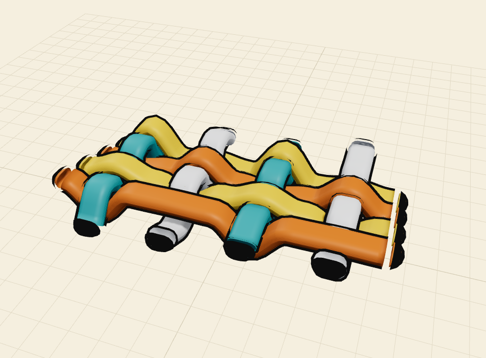
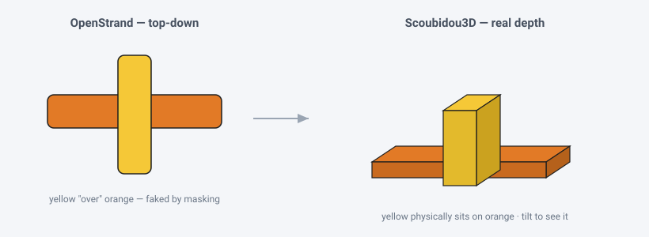
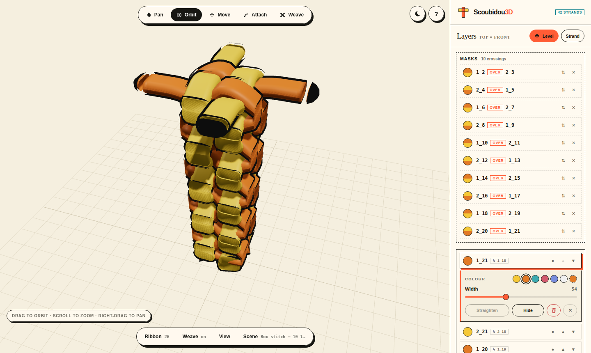
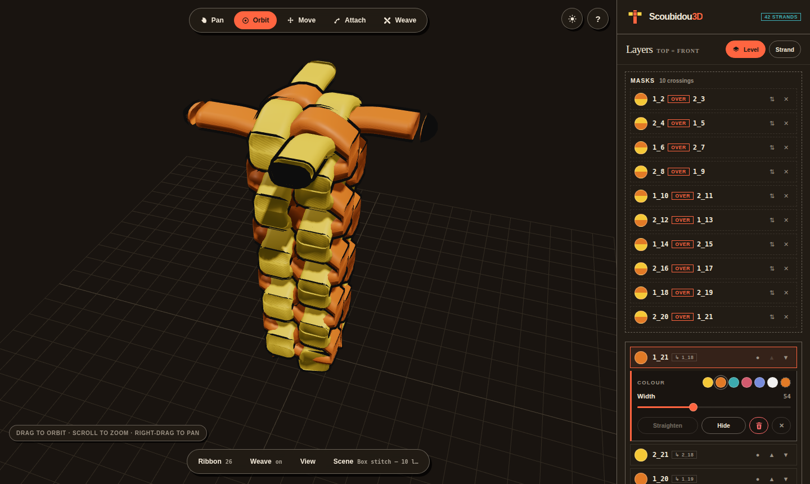
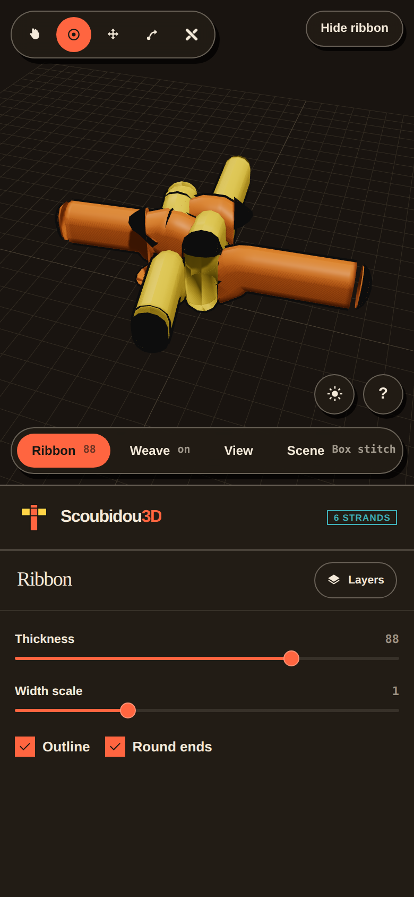

# Scoubidou3D

**A 3D reimagining of [OpenStrand Studio](https://github.com/ysetbon/OpenStrandStudio)** — strands
become ribbons with real thickness, layer order becomes height, and masks become a weave you can
orbit.

🧶 **[Open the studio](https://ysetbon.github.io/Scoubidou3D/app/)** ·
🌐 **[Project site](https://ysetbon.github.io/Scoubidou3D/)** ·
🪜 **[Level gallery](https://ysetbon.github.io/Scoubidou3D/levels/)** ·
🔗 **[Every link](docs/links.md)**



OpenStrand Studio (and its browser port [OpenStrandJS](https://github.com/ysetbon/OpenStrandJS))
draw strands from a **top-down** point of view. Strands have a *width*, and over/under weaving is
*faked* with masking. Scoubidou3D asks a different question:

> What if a strand had a real **thickness**, and "layer over layer" in the layer panel meant the
> strand physically sits **on top** in space — so you could tilt the camera and see the weave in 3D?

That's the whole idea. Each strand becomes a **ribbon** (like the plastic-lacing / gimp lanyards
this was inspired by): its OpenStrand *width* runs across the ribbon, a new *thickness* runs
through it, and its **layer index becomes its height (Z)**. When strand *Y* is above strand *X* in
the layer panel, *Y*'s ribbon sits over *X*'s by default — and a **mask** can flip that at any
single crossing, so one lace weaves over-and-under just like a real basket.



No install, nothing uploaded: it runs in your browser and your files stay on your machine.

---

## The studio

The panel is the **layer stack and nothing else** — a bar per storey sitting *under* the layers it
carries, because that is what a storey is: the floor they rest on. So level 0's bar is the last thing
in the panel, the ground under everything, and the stack hangs from the bottom where the ground is.
Masks get a card of their own above it all, and a strand's colour, width and *Straighten* open inside
its own row. The settings live in
a **dock** along the bottom of the canvas (Ribbon / Weave / View / Scene), one card at a time, each
pill printing its own value so a scene's whole setup reads without opening anything. Every note the
panel used to print — what each tool does, what a level is, what a mask is, the gestures — is behind
the **?**. What is left over the canvas is one status line: the camera gesture for the device you
are on, or the weave's half-made pick.

<table>
<tr>
<td width="50%"></td>
<td width="50%"></td>
</tr>
</table>

**Light and dark**, both built from the project site's own palette rather than inverted: cream paper
and coral, or the warm near-black it inverts to. It follows the OS, the ◐ button overrides it either
way, and the choice is remembered — the site wears it too, and both share the one stored choice, so
opening the studio from the site never changes the lights. The 3D canvas and its grid follow along.
What does *not* follow it is the artwork: the gold stage, the laces woven across it and the drawings
on the sample cards are the product, and they look the same on any page.

<table>
<tr>
<td width="62%">

**It works on a phone.** The panel becomes a bottom sheet you can fold away, and the dock's cards
open **inside it** rather than over the scene — tap Ribbon and the stack becomes the Ribbon
controls, so you can watch the ribbons fatten while you drag Thickness. (A floating card is right on
a desktop and useless at 390px, where it covers the very thing the slider is changing.)

The tool bar and the dock stay over the canvas so Move, Attach and every slider are one tap away,
and the handles carry OpenStrand's generous invisible grab areas — `move_mode.py`'s 120px endpoint
square, `attach_mode.py`'s 120px attach circle — scaled for a fingertip, so a press that lands
*near* a handle still takes it. One finger orbits, pinch zooms, two fingers pan.

The three layouts this was chosen from, as clickable mocks and renders:
**[docs/panel-mocks](docs/panel-mocks/)**.

</td>
<td width="38%"></td>
</tr>
</table>

## What works today

- 🧵 **Strands → 3D ribbons.** Every strand is extruded into a solid ribbon with configurable
  **thickness**, rounded edges, rounded ends, and a stroke-coloured outline.
- 🧶 **Masks → a real over/under weave.** This is the headline. In OpenStrand a *MaskedStrand* fakes
  over/under by painting one strand on top of another where they cross. Scoubidou3D makes it
  physical: at every crossing the **over** lace lifts and the **under** lace dips, so a *single*
  strand can go over one neighbour and under the next — a true basket weave, not a flat stack.
  - The **Weave** tool: click the strand that goes over, then the strand it crosses over — the 3D
    version of picking two strands for an OSS mask (first selected = over). Hovering lights **one
    layer** and names it at the cursor — green for the over, blue for the under — so on a stitch
    whose arms are drawn as one seamless lace you can still see exactly which strand a click takes.
  - **Masks are layers.** Each gets a row in the stack's own Masks card, reading `1_2` **over**
    `1_3` (OSS's `first_second`), with a two-tone disc showing the over strand's colour above the
    under strand's, and flip / delete controls. A mask changes only its own crossing.
  - **Imported masks weave automatically.** `MaskedStrand` records from a `.json` become over/under
    relationships, so an imported basket interlaces the way it was drawn. With no mask on a
    crossing, the **higher layer** rides over.
  - **Depth / Span / Layer-lift** tune how far laces rise and dip and how wide the bump around each
    crossing is.
- 🪢 **Attached strands are really connected.** An attached strand lives on a different layer than
  its parent, so the join used to float with a Z gap. Now a **lofted bridge** morphs the parent's
  end cross-section into the child's start across the gap, banking gently — the join reads as one
  continuous lace stepping between layers. Derived from coincident endpoints, so imported files
  reconnect too.
- 📚 **Layer stacking = default depth.** The layer order sets the *default* over/under (higher layer
  rides over); masks override specific crossings, just like in OSS. Reorder a layer and it restacks
  live.
- 🪜 **Levels — storeys in the layer stack.** The **Level** button adds a storey; everything above it
  rests **one storey** higher — two strand thicknesses, the height of a woven round (a lace over
  plus a lace under), which is what it takes for the next round to sit *on* it instead of sinking
  into it. Because the storey goes in at the top, nothing already drawn moves — but every strand you
  add next is born a storey up. Each storey is a bar of its own, numbered from **0** (the ground),
  sitting under the layers resting on it — so `▲▼` walk that bar through the stack like any other
  layer, and whichever rows it passes change storey. ([how it works](docs/layer-levels.md))
- 🔗 **Attach & Move — OpenStrand's editing, in 3D.** A **Tool** bar across the top of the scene
  (Pan / Orbit / Move / Attach / Weave), where OpenStrand Studio keeps its modes, turns the strand
  endpoints into grab handles:
  - **Attach**: pull from a *free* (green) endpoint and a new strand is born there — glued to the
    parent, inheriting its look, joining the same layer *set* (`1_1` → `1_2`), stacked on top, and
    bridged by a connector. Occupied junctions show gray and refuse new attachments, exactly like
    OSS's `has_circles` rule.
  - **Move**: drag a (blue) endpoint and every strand glued to that point moves with it, so
    attachments stay connected. The weave re-solves as you drag.
  - **Control points are OpenStrand's own.** Same marks, same staging: a green **triangle** on an
    untouched strand, and pulling it brings out the **circle** (the far handle) and the **square**
    (the middle), wired up with OSS's dashed green rig. The circle rides with the end until you pull
    it off; the square tracks the midpoint until you drag it, then locks — and unlocks itself if you
    drop it back. Put every mark home and the set folds away again.
    ([the full behaviour, and the one place it differs](docs/control-points.md))
- 🎥 **Full 3D camera.** Orbit, pan, zoom (Three.js `OrbitControls`). One click snaps back to the
  familiar top-down OpenStrand view. Panning is always on the right button and on two fingers; the
  **Pan** tool puts it on a plain drag too, for a trackpad with no second button and for a phone,
  where two fingers are already a pinch.
- 📥 **Import real files.** Load an OpenStrand Studio / OpenStrandJS `.json` save and see it in 3D.
  The strand geometry uses a faithful port of OSS's curve math (`strand.py::_build_curve_profile`),
  so curves match the original.
- 💾 **Save your own scenes.** Arrange strands, pick the over/unders, then **Save** — it is kept in
  your browser, so it is still in the Sample dropdown after a refresh (grouped under *Saved by
  you*). **JSON** gives you the scene as text to send on or paste back in, and that same text can be
  dropped into `samples.ts` to become a permanent built-in. Nothing is uploaded.
- 🧩 **Thirteen sample scenes:** two crossing strands, the **box stitch** (below) on its own and
  worked as a 10- or 15-round column, the **round stitch** — the same four folds without the
  reversal, so the column repeats every round instead of every two
  ([the difference](docs/box-stitch-levels/README.md#the-round-stitch)) — the **twist stitch**,
  three laces on a 2×1 face that turns 26° a stitch ([how it is built](docs/twist-stitch/)), and
  **two-fan columns** on a **1×3** and a **2×2** face, ten levels each, derived from the reference
  stitch rather than idealised ([the law](docs/twist-stitch/deriving-the-turn.md)), three- and
  four-strand braids, a truly-woven
  mat (a checkerboard of masks), a diagonal basket, and a curved ribbon weave. Each is listed with
  its own picture on [the project site](https://ysetbon.github.io/Scoubidou3D/), and
  `?sample=<key>` opens one directly — e.g.
  [`/app/?sample=box-stitch-10`](https://ysetbon.github.io/Scoubidou3D/app/?sample=box-stitch-10).
  Every m×n twist face has a link of its own, too: **[docs/links.md](docs/links.md)**.

### The box stitch

The built-in **Box stitch — starting stitch** is the classic two-colour lanyard, at the point where
the first stitch closes. Two laces are crossed and pinned and their four arms lettered A/B/C/D —
A–C one lace, B–D the other, which is why the instructions say to fold an arm over *"lanyard B‑D"*,
naming a whole lace. Then each arm folds back across the middle in turn, the last tucking under the
first.

Every fold turns one arm into its own strand hanging off the middle, so each lace ends up as **three
runs**: the short original pinned segment, plus an arm attached at each of its two ends. That middle
segment sits at an angle, and the angle is what offsets the two arms — no U‑turn is involved; the
fold is just the arm leaving the middle in a new direction. It is the OpenStrand shape exactly:
`1_1` with `1_2` and `1_3` grown off it.

The two laces cross **nine** times, and it needs exactly **one** mask. The arms were folded in layer
order, so the stacking already tells the truth at eight of the nine crossings; the ninth is the move
that locks the stitch, where the last arm dives back *under* the first one folded. That one
contradicts the stacking, so it gets a mask — which is precisely how you'd do it in OpenStrand
Studio: mask a crossing only where the natural order is wrong.

The geometry comes from a scene built by hand in the app, so the proportions are a real stitch
rather than an idealised diagram.

**Box stitch — 10 levels** and **Box stitch — 15 levels** carry on from there: the same four moves,
worked ten or fifteen times, each round a **level** above the last. Seen from above every round is
the same square, so the whole thing is three rules repeated — the four arms fold in a rotation
around that square, the rotation *reverses* every round (that alternation is what makes it the box
stitch rather than the round stitch), and each round takes exactly one mask, for the last arm
tucking back under the first. Rounds don't interlock with each other; they rest on each other, which
is what the level break between them says.

Both come out of one generator, so the round count is the only difference. Every round, every mask,
every start and end point, and the level rule they forced:
**[docs/box-stitch-levels](docs/box-stitch-levels/)**.

### The twist stitch

**Twist stitch — 10 twists** is three laces rather than two, on a **2×1** face instead of the box
stitch's square: four arms lying side by side across the face and two lying through it, eight
crossings woven plain, four masks a stitch. What makes it a twist is that each stitch lands on the
same face turned **26°**, so ten of them wind the column 260°.

It is the one sample that is **not** an idealised diagram. Its first three levels are a scene built
by hand in the app, coordinate for coordinate, and every level above is that scene turned — because
the idealised version came out a *cylinder*. Solve every fold's reach and each one travels the same
distance, every tip lands on one circle, and the column looks turned on a lathe. In the hand-built
stitch the six folds run 461, 405, 211, 267, 303 and 272 units, and rotation carries that unevenness
all the way up.

The turn is one rigid motion applied over and over — a discrete screw group — so a level's six start
points ride six circles about a fixed centre and every level can be written down in closed form. The
matrix, the six radii, the one place two slots are coupled, and what the level-by-level pictures
show: **[docs/twist-stitch](docs/twist-stitch/)**. Where the 26° itself might come from — a
proposition that the turn is whatever carries a fold's tip onto its sibling's line, and so is set by
the face's shape and how hard each fold is pulled, for any m×n stitch —
**[deriving-the-turn.md](docs/twist-stitch/deriving-the-turn.md)**. Every face of that family,
level by level, rendered: **[the level gallery](https://ysetbon.github.io/Scoubidou3D/levels/)**.

## The 3D translation, in one picture

| OpenStrand (2D) | Scoubidou3D |
| --- | --- |
| strand `width` | ribbon width (across) |
| — | ribbon **thickness** (through) — *new* |
| layer order in the panel | **default** height in Z (top layer rides over) |
| `MaskedStrand` (first over second) | a real **over/under weave** — over lifts, under dips |
| attached strand (glued endpoint) | a lofted **connector** bridging the layer gap |
| top-down canvas | orbit camera (drops to top view on demand) |

## How the weave works

At every place two centerlines cross we know who is over: a **mask** if one covers the pair,
otherwise the higher layer. Each strand collects its crossings and turns them into a smooth **Z
height field** (`geometry/weave.ts`), then the ribbon is swept along that undulating 3D centerline
so the laces physically interlock.

Two properties make masks behave the way they do in OpenStrand:

**A crossing sets an absolute height, not a nudge.** The over lace goes to `+h` and the under lace
to `−h` about the weave plane. So a mask means one purely local thing — *this strand crosses over
that one, here* — and costs the same whether the two strands are neighbours in the layer panel or
ten layers apart. Masking the bottom strand over the top one leaves every other layer untouched.
(Sizing the correction *relative* to the layer distance instead is what makes a lace masked over
several strands ramp upward rather than ride flat.)

**Overlapping crossings blend, they don't add.** Where two crossings fall close together the heights
are pulse-weighted-averaged, so neighbouring crossings that pull opposite ways resolve instead of
cancelling or doubling. This also gets the three-way case right for free: where several laces meet
at one point, the top one lands at `+h`, the bottom at `−h`, and one caught between them settles in
the middle.

Because each crossing is resolved independently, **cyclic weaves work** — `x` over `y`, `y` over
`z`, and `z` over `x` is impossible for a rigid stack but is exactly what a real woven knot does.

The base layer height still governs stretches with no crossing at all, which keeps
overlapping-but-never-crossing strands apart and gives the plain ordered stack when the weave is
switched off.

## Run it

Nothing to install: the app is live at
**[ysetbon.github.io/Scoubidou3D/app/](https://ysetbon.github.io/Scoubidou3D/app/)**.

To hack on it you need [Node.js](https://nodejs.org/) 18+.

```bash
npm install
npm run dev      # http://localhost:5173/Scoubidou3D/
```

Build the static site:

```bash
npm run build    # tsc --noEmit && vite build, outputs to dist/
npm run preview
```

The build has three pages — the project site at `/`, the studio at `/app/` and the level gallery at
`/levels/` — and every push to `main` publishes all of them to GitHub Pages
([deploy.yml](.github/workflows/deploy.yml)); every push and pull request type-checks and builds
([ci.yml](.github/workflows/ci.yml)). Building for a host that serves from the domain root instead:
`BASE_PATH=/ npm run build`.

```sh
npm run shots    # reshoot site/shots/*.webp from the running app (needs npm run dev)
npm run art      # redraw site/art/*.svg from src/model/samples.ts
```

Every picture of a sample on the project site is *that sample*, screenshotted. `npm run shots`
([`scripts/site-shots.mjs`](scripts/site-shots.mjs)) drives the studio in a real browser, loads each
scene, frames it by projecting the ribbons themselves and correcting until the model fills the frame,
and reads the WebGL canvas back — so what the card shows is the render, grid and all, not a drawing
of it. Two files per sample, one per canvas skin (`<key>-light.webp` / `<key>-dark.webp`), because a
screenshot carries its background with it and a cream canvas dropped into the dark theme is a hole in
the page; the site swaps them on `[data-theme]`. It needs `npm run dev` up in another shell, since
the handle it drives is stripped from production builds.

`npm run art` is the older, flat generator ([`scripts/sample-art.ts`](scripts/sample-art.ts)): it
takes each scene's own strands, runs their centerlines through the same curve math the 3D ribbon is
swept along, and paints the over/unders from the scene's own mask list. The site no longer shows its
output, but it stays for two reasons — it prints each scene's strand / mask / level / junction
counts, which are the numbers the cards quote, and because it is deterministic, `site/art`
re-rendering byte-identical is how the geometry notes check that nothing moved.

## How it's built

```
index.html      # the project site (the landing page you get at /)
site/site.css   #   its stylesheet — light and dark, the palette both pages share
site/theme.js   #   the theme switch, sharing its stored choice with the studio
site/shots/     #   the pictures the site shows: one screenshot of the app's 3D
                #   canvas per sample per theme, GENERATED — see above
site/art/       #   the older flat drawing per sample, GENERATED — see above
app/index.html  # the studio's page, served at /app/
levels/         # the level gallery: every level of every m x n face
public/         # copied verbatim to the site root (favicon, level renders)
scripts/
  site-shots.mjs # screenshots site/shots/*.webp from the running app (`npm run shots`)
  sample-art.ts # draws site/art/*.svg from the samples themselves (`npm run art`)
src/
  geometry/
    bezier.ts     # port of OpenStrand's eased curve profile -> sampled centerline
    ribbon.ts     # sweep a (width x thickness) cross-section along a 3D centerline
    weave.ts      # crossing detection + the Z height field that makes over/under real
    connector.ts  # lofted bridge that joins an attached strand across the layer gap
  model/
    types.ts       # Strand3D / Scene3D / MaskLink (over/under)
    connections.ts # attach, "connected strands move together", junction detection
    levels.ts      # storeys in the stack: a break at position k lifts everything above
    importOss.ts   # read OpenStrand Studio / OpenStrandJS .json (masks -> MaskLinks)
    samples.ts     # built-in demo scenes
  scene/
    StrandScene.ts # Three.js scene: weave, connectors, lights, orbit camera, handles
  ui/
    panel.ts       # the layer stack, the tool strip, the settings dock, About
  styles.css       # the studio's stylesheet, in the site's design language
  main.ts
```

The ribbon sweep uses a **fixed frame** (side = in-plane normal, up = world +Z) instead of Frenet
frames, so a flat ribbon never twists and its face always points toward the camera in top view —
exactly like the original editor.

## The written-up bits

| | |
| --- | --- |
| [docs/links.md](docs/links.md) | every link the site has, including one per m×n face |
| [docs/layer-levels.md](docs/layer-levels.md) | levels: what a storey is and why it is two thicknesses |
| [docs/control-points.md](docs/control-points.md) | OpenStrand's control-point marks and staging, and the one place this differs |
| [docs/box-stitch-levels](docs/box-stitch-levels/) | the box stitch round by round, and the round stitch |
| [docs/twist-stitch](docs/twist-stitch/) | the twist stitch, its screw group, and the turn's derivation |
| [docs/panel-mocks](docs/panel-mocks/) | the three panel layouts, and which one shipped |

## Roadmap / ideas

- ✅ **Per-crossing undulation** — a strand weaves over-and-under along its length (`weave.ts`).
- ✅ **Honor masks** from imported files — `MaskedStrand` records drive the weave automatically.
- ✅ **Really-connected attachments** — a lofted connector bridges the layer gap (`connector.ts`).
- ✅ **Direct 3D editing** — Move / Attach / Weave tools in the scene. Next: snap-to-grid and
  dragging in a tilted view.
- **Deletion rectangles** — honour OSS's partial-mask edits (`mask_grid_dialog`) so a mask that only
  covers part of a crossing weaves partially.
- **Round-trip** back to OpenStrand `.json` (write `MaskedStrand` records from the weave), and
  PNG/GLTF export.
- **Materials** — glossy plastic vs. matte cord, per-strand.

## Relationship to the OpenStrand family

- [OpenStrand Studio](https://github.com/ysetbon/OpenStrandStudio) — the original PyQt5 desktop app
  (the spec).
- [OpenStrandJS](https://github.com/ysetbon/OpenStrandJS) — the fidelity-first browser port (2D
  canvas).
- **Scoubidou3D** — this repo: the same strand model, seen with depth.

## License

GNU General Public License v3.0, matching OpenStrand Studio.
