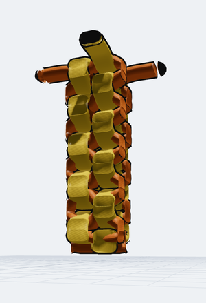
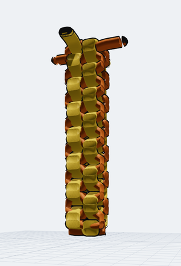

# Box stitch — stacked levels

The **box stitch** worked as a column: the starting stitch carried on for round
after round, each round a **level** above the last. Two built-in samples:

| sample | rounds | strands | masks | level breaks | junctions |
| --- | --- | --- | --- | --- | --- |
| **Box stitch — 10 levels** (`box-stitch-10`) | 10 | 42 | 10 | 9 | 40 |
| **Box stitch — 15 levels** (`box-stitch-15`) | 15 | 62 | 15 | 14 | 60 |

Both come out of one generator, `boxStitchRounds(rounds, name)` in
[`src/model/samples.ts`](../../src/model/samples.ts) — the round count is the
only thing that differs. The single-round case is the older hand-built
[**Box stitch — starting stitch**](../../README.md#the-box-stitch), which this
does not replace.

| 10 levels | 15 levels |
| --- | --- |
|  |  |

## The stitch, in three rules

**Geometry.** Seen from above, every round is the *same square*. The four arms
run along its four edges — the two orange arms on the bottom and top, the two
gold ones on the left and right — so they cross at the square's four corners,
and each fold's far end pokes a little past the corner before turning back. An
arm never changes which edge it lies on; it only reverses direction, because a
fold pivots at the arm's own free end and that end is already on the line.

**Order.** The four arms fold in a rotation around the square, and the rotation
**reverses every round**: `A,D,B,C` then `C,B,D,A` then `A,D,B,C`… That
alternation is what makes this the *box* stitch — keep turning the same way each
round and the same four moves give you the *round* (spiral) stitch instead. It
is also why the over/under at each corner flips from one level to the next, and
why the pattern repeats with period two: level 5 is level 3, level 6 is level 4.

**Weave.** Within a round the fold order already tells the truth at three of the
four corners: each arm was laid on top of the one before it, so with folds
`x, y, z, w` the stacking gives `y` over `x`, `z` over `y`, `w` over `z`. The
fourth corner is the move that locks the stitch — `w` tucks back **under** `x`,
closing the cycle — and that one contradicts the stacking, so it takes exactly
**one mask per round**. Rounds do not interlock with each other; they rest on
each other, which is what the level break between them says.

## Every round

The strands of round *r* occupy positions `2 + 4r … 5 + 4r` in the layer stack,
with a level break at `2 + 4r` for every round after the first — so the breaks
are `6, 10, 14, …`. Fold direction is given as a compass point on the drawing
plane (`E` = +x, `S` = +y).

| level | 1st fold | 2nd | 3rd | 4th | mask |
| --- | --- | --- | --- | --- | --- |
| 1 | `1_2` E | `2_2` N | `1_3` W | `2_3` S | `1_2` over `2_3` |
| 2 | `2_4` N | `1_4` E | `2_5` S | `1_5` W | `2_4` over `1_5` |
| 3 | `1_6` E | `2_6` N | `1_7` W | `2_7` S | `1_6` over `2_7` |
| 4 | `2_8` N | `1_8` E | `2_9` S | `1_9` W | `2_8` over `1_9` |
| 5 | `1_10` E | `2_10` N | `1_11` W | `2_11` S | `1_10` over `2_11` |
| 6 | `2_12` N | `1_12` E | `2_13` S | `1_13` W | `2_12` over `1_13` |
| 7 | `1_14` E | `2_14` N | `1_15` W | `2_15` S | `1_14` over `2_15` |
| 8 | `2_16` N | `1_16` E | `2_17` S | `1_17` W | `2_16` over `1_17` |
| 9 | `1_18` E | `2_18` N | `1_19` W | `2_19` S | `1_18` over `2_19` |
| 10 | `2_20` N | `1_20` E | `2_21` S | `1_21` W | `2_20` over `1_21` |
| 11 | `1_22` E | `2_22` N | `1_23` W | `2_23` S | `1_22` over `2_23` |
| 12 | `2_24` N | `1_24` E | `2_25` S | `1_25` W | `2_24` over `1_25` |
| 13 | `1_26` E | `2_26` N | `1_27` W | `2_27` S | `1_26` over `2_27` |
| 14 | `2_28` N | `1_28` E | `2_29` S | `1_29` W | `2_28` over `1_29` |
| 15 | `1_30` E | `2_30` N | `1_31` W | `2_31` S | `1_30` over `2_31` |

Levels 1–4 reproduce, fold for fold and mask for mask, a four-round stitch built
by hand in the app — which is where the pattern came from. The 10-level sample
is rows 1–10 of the same table; only its *geometry* differs slightly from the
15-level one (the fold slots below, and which round carries the loose tails).

## Every level, from above

Each level with everything above it hidden, the rounds below in grey, and **S**
(start) / **E** (end) marked on every strand. An arrow runs S→E.

- [**10 levels**](levels-10.svg)
- [**15 levels**](levels-15.svg)

A strand's **S** is glued to the **E** of the strand before it on the same arm,
one level down — that is the fold. Its **E** becomes the **S** of the same arm's
strand one level up. The last level's four **E** markers are the loose tails:
nothing folds back over them.

Level 1 holds six strands rather than four, because the two pinned laces `1_1`
and `2_1` are there too. Their endpoints are shared outright: `1_1`'s **S** *is*
`1_2`'s **S**, and `1_1`'s **E** *is* `1_3`'s **S**, which is the OpenStrand
attach shape — `1_2` and `1_3` grown off the two ends of `1_1`. In the figures
those points carry a wider ring behind the arm's marker.

## What a level had to become

A column of box stitches is the case that broke the original level rule, so the
rule changed with it. Full statement in [layer-levels.md](../layer-levels.md);
the short version:

**A storey is `2 × thickness`, not one.** One thickness is what "rests on"
means for a *flat* lace. What a level stacks here is a **woven round** — a lace
riding over and a lace ducking under, interlocked — and that is two thicknesses
tall. At one thickness the lace ducking under upstairs lands inside the lace
riding over downstairs, so every storey sank into the one below and a stitch of
any height collapsed into its bottom round.

**A crossing is woven about the plane of its own storey.** Crossing heights used
to be absolute about one plane for the whole scene, so every mask dragged its
two laces back to the middle of the model and undid the break that had just
lifted them.

**Two strands on different storeys are not woven together at all.** They are
already a storey apart; one simply passes above the other, and that is the
statement the level break makes. An explicit mask across storeys is still
honoured — asking for an over/under gets one, woven about the midpoint of the
two storeys.

**The weave swing is capped to fit inside a storey** once a scene has any
levels: half a thickness from the storey's plane, whatever the **Depth** slider
says. Uncapped, a generous Depth swings laces clean out of their own storey and
the column opens into a loose spiral with holes in it. Depth is unrestrained in
a scene with no levels, where there is nothing above or below to clear.

With the defaults (thickness 26, Depth 26) a storey is 52 source units and each
one clears the round below it by a full thickness: 15 rounds stand 738 units
tall on a 110-unit square.

## Fold slots, and why the tips are not all the same length

Two folds of one arm must not end on exactly the same point. What keeps them
apart in reality is the storey between them, but junction detection
([`connections.ts`](../../src/model/connections.ts)) glues endpoints purely by
coincidence in the drawing plane and cannot see storeys — identical tips would
be read as one junction and four strand-ends would fuse into a fork, breaking
the lace into pieces.

So each fold gets its own slot. An arm goes *out* on its even folds and *back*
on its odd ones, so only same-parity folds land near each other, and their slots
share a **fixed total spread** (14 units) centred on the nominal overhang:
early rounds sit a hair tighter, late ones a hair looser, mean unchanged. Adding
rounds packs the slots closer rather than widening the stitch, down to a floor
of 2 units — as close as two folds can sit and still be told apart by the
one-pixel snap.

Spreading them in one direction instead — a fixed step per round, which is what
this did first — compounds every second round: ten rounds fanned the column out
by 40 units, three quarters of a lace width, and the stitch read as a taper.
Centred, ten rounds drift 12 units and fifteen drift 12 and 14 at the two ends.

Past roughly 25 rounds the 2-unit floor binds and the spread grows again. The
real cure is to make junction detection level-aware — endpoints glue only when
their strands are on the same or adjacent storeys, with the declared
`parentId` lineage as the tiebreaker — after which the drift could be zero at
any height. That touches Move and Attach as well as these samples, so it is not
done here.

## Changing the round count

`boxStitchRounds` takes it as an argument; everything else follows.

```ts
// src/model/samples.ts
export const SAMPLES: Record<string, () => Scene3D> = {
  …
  'box-stitch-10': () => boxStitchRounds(10, 'Box stitch — 10 levels'),
  'box-stitch-15': () => boxStitchRounds(15, 'Box stitch — 15 levels'),
};
```

Add the matching entry to `SAMPLE_LABELS` and it appears in the Sample dropdown.

## What was verified

Rebuilding both scenes and re-running the DOM-free half of the Z pipeline
(`computeBaseZ` + the weave) confirms, at both 10 and 15 rounds:

- `2 + 4·rounds` strands, one mask per round, `rounds − 1` level breaks
- every strand on its default control-point set (both control points on the
  start, no centre — OSS line mode)
- `4·rounds` junctions, every one a clean two-way glue: no forked endpoint, and
  the whole thing resolves to exactly **two laces**
- every round weaving `x < y < z < w` with `w` tucked under `x`
- no crossing woven between two different storeys
- each storey clearing the one below by at least a full thickness
- a top-level strand being the highest thing in the scene
- the starting-stitch sample unchanged: 6 strands, 1 mask, no levels, nine
  crossings
