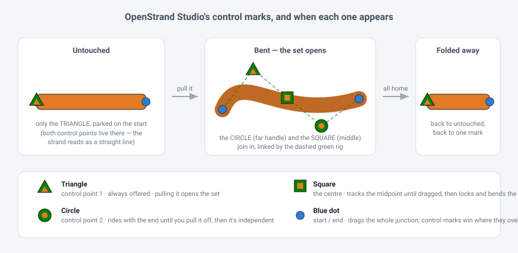

# Control points, the OpenStrand Studio way

Scoubidou3D already had OSS's curve *maths* (`src/geometry/bezier.ts`, a port of
`strand.py`'s profile builder). What it did not have was OSS's control-point
**UX**: what a strand offers you to grab, what each handle looks like, and what
grabbing one does to the others. This is that half, read out of the desktop app
and reimplemented in `src/model/controlPoints.ts`.

## What OSS actually does

Sources: `move_mode.py` (`try_move_control_points`, `update_strand_position`,
`mouseReleaseEvent`), `strand.py` (`update_shape`, the `start` setter) and
`strand_drawing_canvas.py` (`_draw_control_points_impl`).

**The marks.** Three shapes, all green with a black rim and a core in the
strand's own colour, at a radius of `11 × 1.333` canvas units:

| mark | what it is | OSS field |
| --- | --- | --- |
| triangle, apex up | control point 1 | `control_point1` |
| circle | control point 2 | `control_point2` |
| square, 0.7× size | the centre | `control_point_center` |

They are wired up with a **dashed green rig**: start→triangle, end→circle — or
start→circle while the circle is still parked on the start — plus centre→triangle
and centre→circle.

**A new strand carries all its control points on its start.** That is what makes
it straight (`buildProfile` reads "both control points at the start" as line
mode), and it is why the staging below exists at all: with everything stacked in
one spot, showing three marks would say nothing.

**The staged reveal.** An untouched strand offers only the triangle. Grabbing it
sets `triangle_has_moved`, and *that* is what brings out the circle and the
square. Put every mark back on the start and the set folds away again.

**The circle is passive until claimed.** While `control_point2_activated` is
false the circle simply rides with the strand's end, so dragging the end keeps a
straight strand straight. Pull the circle off the end and it becomes independent;
drop it back on the end and it goes passive again.

**The centre locks by being touched.** Unlocked, it just tracks the midpoint of
the other two — moving an end control point carries it along and explicitly does
*not* lock it. Dragging it sets `control_point_center_locked`, and from then on
the curve runs through it as two segments. Drop it back within half a pixel of
that midpoint and it quietly unlocks itself: the undo is the gesture.

**Control points outrank endpoints.** OSS tests its control-point rectangles
(50×50) before its endpoint areas (120×120), so where a mark and an endpoint
overlap — which is every mark on a fresh strand — the mark wins the click.

**Endpoints carry their control points.** The `start` setter moves any control
point sitting exactly on the old start, so a straight strand stays straight while
you drag its head around.

**The third mark is optional.** `enable_third_control_point` gates the square,
and the curve checks it too: with the setting off, a centre already locked by
hand is ignored rather than lost.

## What Scoubidou3D does with it

All of the above, in Move mode, with the marks as flat 3D chips lying in the
drawing plane so they read as OSS's triangle / circle / square from the top-down
view and still make sense once you orbit. The radius is OSS's own, converted
through the scene scale, so the marks sit the same size against a strand's width
as they do on the desktop canvas. The **Middle handle** toggle is
`enable_third_control_point`.

`triangleHasMoved` and `cp2Activated` are part of the strand and are saved with
the scene. An imported OSS file brings its own flags across; when a file predates
them, OSS's fallback applies — a strand counts as touched when its triangle sits
off the start.

### One deliberate difference

OSS's fold-away check on release looks at the circle and the centre but **not**
the triangle. So bending only the triangle and letting go folds the set away
again — and because the desktop app gates *drawing* on `triangle_has_moved` but
*selecting* on a separate `control_point2_shown` flag that survives the release,
the circle stays clickable while invisible, parked under the start point.

A handle you can grab but cannot see is a bad trade in a view you can orbit, so
Scoubidou3D includes the triangle in the test. The set folds away when the strand
is genuinely back to untouched, and never before. Everything else — the shapes,
the staging, the passive circle, the self-unlocking centre, the pick order — is
the desktop behaviour as written.
