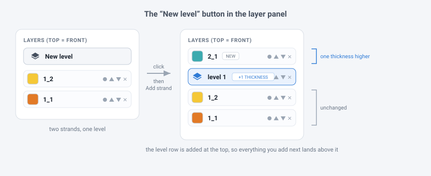
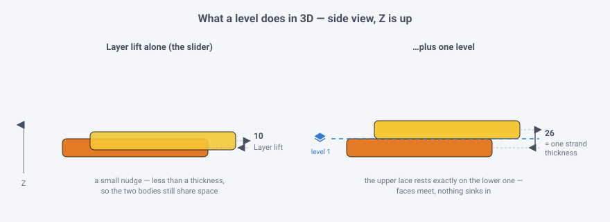

# Layer levels — the **Level** button

This is the written-out version of the request, so the behaviour is pinned down
before the code exists. Short form:

> Add a button to the layer panel that drops a **level** into the stack.
> Everything above it rests **one full strand thickness higher** in Z — so every
> layer you add after pressing it sits on a new storey.



> **The sketch above is the original spec**, drawn when a level was a *row* in one
> flat list. The panel has since been rebuilt to the mock-3 layout in
> [docs/panel-mocks](panel-mocks/) and a level is now a **card** holding the
> strands that rest on it: the rules below are unchanged, but where the doc says
> “the level row”, read “the level card's header”. Levels are also numbered from
> **0** — the ground — which is what `levelAt()` returns and what the panel now
> prints; earlier drafts of this file counted from 1.

## Why it is needed

Scoubidou3D already has two ways of moving a strand in Z, and neither one does
this job:

| control | what it does | why it isn't this |
| --- | --- | --- |
| **Layer order** (`▲`/`▼`) | Ranks laces, spaced by the **Layer lift** slider (default `10`). | The lift is one global number, much *smaller* than a strand's thickness — it separates the stack, it doesn't stack it storey by storey. |
| **Masks** (Weave tool) | At one *crossing*, one lace lifts and the other dips. | Purely local, and only where two strands actually cross. It says nothing about resting height. |

A **level** is the missing third thing: a permanent step in the resting plane,
the exact height of one strand body, applied to a whole region of the layer
panel.



Note the size. The Layer lift is deliberately *less* than a thickness, so two
laces that overlap without crossing still occupy some of the same space. One
level is exactly `2 · thickness`, and the factor of two is not padding — it is
what a level is *for*. The thing a level stacks is not a flat lace, it is a
**woven round**: a lace riding over and a lace ducking under, interlocked. That
is two thicknesses tall. A step of one thickness cannot hold it — the lace
ducking under upstairs lands inside the lace riding over downstairs, the two
storeys read as one, and a box stitch of any height collapses into its bottom
round.

The weave is held to the same measure from the other side: once a scene has
levels, a crossing lifts and dips by at most half a thickness from its storey's
plane, whatever the **Depth** slider says, so the swing stays inside the storey
it belongs to. Depth is unrestrained in a scene with no levels, where there is
nothing above or below to stay clear of.

## The instruction

1. **The button.** The Layers header gets a button showing the stacked-layers
   icon, labelled **Level**.
2. **What it adds.** Pressing it inserts a level at the *top* of the layer stack.
   The panel shows it as a card, badged with its number — counting up from `0`,
   the ground — and headed `+N storeys · M layers`.
3. **What it means.** Every strand **above** a level row rests one strand
   thickness (the Ribbon ▸ **Thickness** value) higher in Z than it otherwise
   would. Levels add up: two rows above a lace means two thicknesses.
4. **Why the top.** Because the row goes in at the top, *existing* strands don't
   move at all — but every strand born afterwards (**Add strand**, **Attach**,
   both of which push onto the top of the stack) lands above it, one storey up.
   That is the point of the button: press it, and the next thing you draw is on
   a new level.
5. **It is a real layer.** The card's own header carries `▲` / `▼`, so you can
   push the storey down through the stack and watch the strands it passes drop a
   level. `✕` removes it and everything settles back. Level 0 has no controls:
   the ground is not a break, it is what is left below the lowest one.
6. **A cord may climb.** Strands glued end to end share one *rank* — that is what
   stops a stitch from climbing a staircase along its own length just because of
   the order it happened to be drawn in. Levels are not like that: pressing **New
   level** and then **Attach** is the ordinary way to carry a cord up onto a new
   storey, so a level applies to the strand it is above, not to the whole lace.
   A cord therefore *can* stand half on the floor and half on the shelf, and it
   gets there the way a real one does — at a fold it doubles back and lies on the
   run it came off, and at a gentle joint it walks up over about a lace width.
7. **Crossings are unaffected.** A level changes where laces *rest*. Who goes
   over whom at a crossing is still decided by the masks and the layer order,
   exactly as before, so switching levels on can never silently rewrite a weave.
8. **It is saved.** Levels are part of the scene: they survive Save sample,
   Copy JSON, and paste-back. Older saves without them load as “no levels”.

## The rule, exactly

Levels are stored as break positions in the layer stack. A break at position `k`
means *every strand from index `k` upward is one storey higher*:

```
restZ(strand) = rank(lace(strand)) · layerGap  +  level(strand) · 2 · thickness
rank(lace)    = the lace's position in layer-panel order, ranked by its lowest member
level(strand) = how many breaks sit at or below the strand's own index
```

Crossings follow the strand up. A crossing is woven about the plane of the storey
it happens on, not about one plane for the whole scene — otherwise every mask in
the model drags its two laces back to the same height and the levels are undone
where they matter most. Two strands on *different* storeys are not woven together
at all: they are already a full storey apart, one simply passes above the other,
and that is the statement the level break makes. An explicit mask across storeys
is still honoured — asking for an over/under gets one.

Note the two scopes, which is the whole of it: `rank` is per LACE, because the
panel positions of one cord's members are incidental; `level` is per STRAND,
because a break is a deliberate statement about a particular row. The whole stack
is then re-centred on `z = 0`, so adding a level opens the model up rather than
sending it drifting off the grid.

Where a level break falls *inside* a lace, that lace's ribbon steps between the
two storeys along its own length — `easeFolds` lets a fold carry the step at its
crease, `easeSteps` walks a gentle joint up over about a lace width, and a joint
whose two ends are separate meshes is bridged by the usual lofted connector.

With no level rows, `level` is `0` everywhere and the formula collapses to the
current behaviour — the feature is invisible until it is used.

## The case that set the size

A box stitch worked round after round is levels at full stretch: ten or fifteen
woven rounds, each resting on the one below. It is where the one-thickness step
was found to be too short, and where the weave had to be taught to stay inside
its own storey. Both samples, every round and every mask in them, and the level
rule they forced: **[box-stitch-levels](box-stitch-levels/)**.
