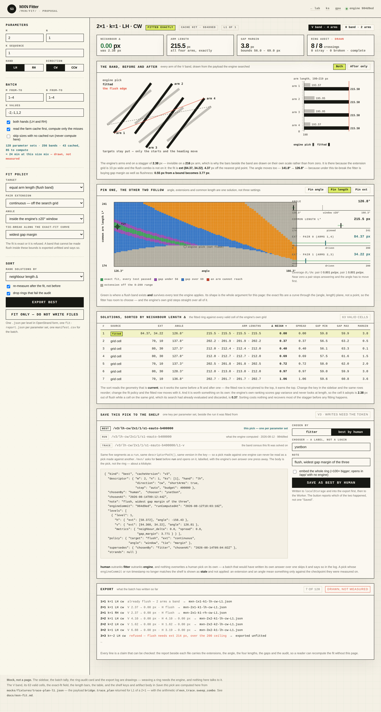

# The fitter, at /mxn/fit/

**Status: proposed. Nothing is built yet.** What exists today is this write-up,
a working drawing at [`mocks/fit.html`](../mocks/fit.html), and
[`scripts/check-fit.py`](../scripts/check-fit.py), which proves on committed
engine output every geometric claim made below. Read this, look at the picture,
run the checker, and say what is wrong before any of it is written.

A fourth tool over the same engine. `/mxn/` explores one parameter set by hand,
`/mxn/gpu/` fills a shelf, `/mxn/ks/` reads the shelf whole. The fitter does the
one thing none of them do: it takes `m`, `n`, `k`, a hand and a direction, and
hands back **a file** — the best ring those parameters admit, with the arms of
each band made exactly the same length, without anybody clicking through a
census to find it.

Four jobs, in the order they run:

| | | |
| --- | --- | --- |
| **1 · Export** | best solution for any `k, m, n, lh/rh`, one set or a whole sweep, written to disk | [§ Export](#1--export) |
| **2 · Fit** | pair extension and angle moved together until neighbouring arms are the same length | [§ The fit](#2--the-fit) |
| **3 · Sort** | rank what came out by how well neighbouring lengths agree — and it still means something *after* a fit | [§ The sort](#3--the-sort) |
| **4 · Save** | mark a ring on the v3 shelf **valid**, **best** or **rejected** — by hand — so every page reads the judgement back and the valid category loads | [§ Saving a judgement](#4--saving-a-judgement-picksv3) |

---

## The picture



Every number in that image is real. The V band it draws, its 63 valid cells, the
exact-fit field, the length bars and the whole solutions table are computed in
the page from `mocks/fixtures/trace-plan-l1.json` — the payload
`bridge.trace_plan` returned for L1 of a 2×1 — using the arithmetic of
`mxn_trace.sweep_combo` — including every judgement in the artifact body under
*Save a judgement*. What is drawn rather than measured says so on itself: the
batch tally, the ring-audit card, the source filter's counts and the export log.
Weaving a ring, auditing it and reading the shelf all need something the mock
does not talk to.

---

## The words, first

Everything below is about **one band of one level**. A level's ring is searched
as two independent bands, and the fitter treats them the same way.

| word | what it is in the engine |
| --- | --- |
| **band** | the H or V half of a level's new ring: `2q` arms, searched together. `q = m` for one band and `q = n` for the other |
| **arm** | one new `_4/_5` strand — the thing that grows this level |
| **parent** | the `_2/_3` strand the arm hangs off: the previous level's arm, or the starting stitch at L1 |
| **pair** | arms paired outside-in — first with last, second with second-last. `q` pairs a band, and *both arms of a pair always take the same extension* |
| **pair extension** `e` | how far the arm's start is slid **along its parent's own line**, `0…200 px` on a grid of 10. It lengthens the parent by exactly `e` |
| **angle** `a` | one heading the whole band adopts, searched inside a ±20° window the engine recomputes per combo |
| **length** `L` | how long an arm ends up: the projection of (target − start) onto the band's heading. This is `proj` in `mxn_trace.sweep_combo`, and it is what "strand length" means everywhere in this document |
| **gap** | perpendicular distance between neighbouring arms. Must sit in `[width + 10, width × 1.5]` — `56…69 px` at the shipped width |
| **neighbour** | consecutive arms in the band's own order. The gaps are measured between neighbours, and so is the length disagreement this page is about |

---

## Why this is worth a page

The engine already searches extension and angle. What it has never done is
**look at the lengths**. Its ranking of the valid angles, in
`mxn_trace.census` and in `_numpy_try_all_angles` alike, is:

```
lexsort by (first-to-last distance, variance of the GAPS, angle index)
```

Gaps, not lengths. So the arms of a band come out at whatever length the winning
combo happens to give them, and on a real stitch that is a stagger. Measured on
the 2×1's V band — `python3 scripts/check-fit.py`:

| | extensions | angle | neighbour Δ | gap margin |
| --- | --- | --- | --- | --- |
| what the engine ships | `[60, 0]` | 141.8° | **2.38 px** | 0.55 px |
| the flushest cell **on the engine's own grid** | `[70, 10]` | 137.8° | **0.37 px** | 0.52 px |
| the fitter, extensions off the grid | `[84.37, 34.22]` | 126.8° | **0.00 px** | 3.77 px |

Three things fall out of that table, and they are the three features:

1. **The engine's own search had already evaluated a cell six times flusher and
   discarded it**, because its ranking does not score length. A sort is enough
   to recover that — no new search, no new geometry. That is job 3.
2. **Zero is reachable, and not on the grid.** The extension grid is 10 px wide;
   the flush combo is at `84.37, 34.22`. Snap the fit back to the nearest grid
   point, `[80, 30]`, and it is not merely staggered again (0.12 px) — it fails
   the gap test outright. The grid steps straight over the answer. That is job 2.
3. The fit is not a compromise: it is **flush and further from every bound** —
   0.55 px of gap margin becomes 3.77 px. It is a better ring by the engine's
   own tests as well as by the new one.

And this is a 2×1, the second-smallest stitch there is, on one level. It is not
a corner case.

---

## The geometry the fit rests on

Four facts. All four are checked by `scripts/check-fit.py` against committed
engine output, and the residuals are floating-point noise, not tolerances.

**1 · Length is affine in extension.** Sliding a pair's start by `e` along the
parent's line moves the arm's length linearly:

```
L_p(e, a) = A_p(a) − B_p(a) · e
```

Worst residual over a 100 px slide, across both bands: `2×10⁻¹⁴`. Both
coefficients are read off two placements — no fitting, no search.

**2 · A pair moves only its own arms, and moves both alike.** Cross-talk between
pairs is exactly `0`. So a band's lengths are not `2q` coupled numbers; they are
`q` independent ones, one knob each.

**3 · Mirrored arms are already equal.** The ring has 180° symmetry, and a pair
is a mirror pair, so `L_i = L_{n−1−i}` for every combo at every angle — worst
observed `3×10⁻¹⁴`. A "band of 6 arms" is really three lengths.

**4 · So flushness is under-determined, and its solutions form a curve.**
`q` lengths to equalise is `q − 1` equations; the unknowns are `q` extensions
plus the shared angle, so `q + 1`. Two degrees of freedom left over — which is
why the green region in the middle panel of the mock is a *band across the
plane* and not a dot, and why the fitter gets to choose which exact fit it
takes.

`B_p(a)` is the **leverage**: how many pixels of length one pixel of extension
buys, at this heading. It is `0.801 px/px` for both pairs of the 2×1's V band.
Where it approaches zero a pair stops answering to its extension and the angle
has to move first — the page prints it for exactly that reason.

### The solver

There is no search. Given an angle `a` and a common length `L*`:

```
for each pair p:   e_p = (A_p(a) − L*) / B_p(a)
```

One division per pair. The fitter walks the angle grid the engine itself would
have walked, and for each angle walks `L*`; every `(a, L*)` whose extensions
land inside `0…200` is a candidate flush band, and every candidate is then put
through **the engine's own tests, unmodified** — reach, degeneracy, order,
overlap, too-far. What survives is the green region. The tie-break picks one
point in it:

| tie-break | picks |
| --- | --- |
| **widest gap margin** (default) | the flush band furthest from both gap bounds — the most robust ring |
| least total extension | the least deformation of the parents |
| nearest the engine's own pick | the smallest change from what ships today |
| longest common arm | the biggest ring the bounds allow |

---

## 1 · Export

The input is exactly what the user has: `m`, `n`, a `k` sequence, a hand and a
direction. The output is files.

**One parameter set.** Fill the sidebar, press **Export best**, get:

```
mxn-2x1-k1-lh-cw-L1.json     the ring, as the studio at /app/ reads it
mxn-2x1-k1-lh-cw.fit.json    the report: how it was fitted, and the proof
```

**A sweep.** Give ranges instead — `m 1–4`, `n 1–4`, `k −2,−1,1,2`, both hands —
and the queue walks all of them, reading the farm cache first
(`docs/mxn-farm.md`) so only the misses are computed in the browser. It adds:

```
manifest.csv                 one row per parameter set, with every metric below
```

**And onto the shelf — but only as work for you.** A batch writes files, and it
posts each fitted ring to the `solutions` table with **no verdict**, so it turns
up in the queue with everything else waiting to be looked at. It does not write
a judgement, ever: what is valid and what is best is yours to say, and the batch
exists to put the candidates in front of you rather than to answer for you. See
[§ Saving a judgement](#4--saving-a-judgement-picksv3).

**Without touching the page at all.** Every control is in the URL, so the export
is scriptable and a result is a link someone can be sent:

```
/mxn/fit/?m=2&n=1&ks=1&hand=lh&dir=cw&fit=flush&tie=margin&auto=1
```

`auto=1` runs and downloads on load. That, plus the batch queue, is what
"automatically export the best solution for any k m n lh rh" means here.

### What is in the report

The report exists so nobody has to trust the page. Per level, per band:

```json
{
  "params": {"m": 2, "n": 1, "ks": [1], "hand": "lh", "direction": "cw"},
  "engine": {"commit": "984d9ed", "source": "cache", "computed_at": "..."},
  "levels": [{
    "level": 1,
    "bands": [{
      "band": "vertical", "arms": 4, "pairs": 2,
      "before": {"ext": [60, 0], "angle": 141.8,
                 "lengths": [193.57, 195.95, 195.95, 193.57],
                 "gaps": [56.53, 59.88, 56.53],
                 "neighbour_delta": 2.38, "spread": 2.38, "gap_margin": 0.55},
      "after":  {"ext": [84.368, 34.220], "angle": 126.81,
                 "lengths": [215.50, 215.50, 215.50, 215.50],
                 "gaps": [59.771, 59.946, 59.771],
                 "neighbour_delta": 0.0, "spread": 0.0, "gap_margin": 3.771},
      "leverage": [0.801, 0.801],
      "policy": {"target": "flush", "ext": "continuous", "angle": "window",
                 "tie": "margin"},
      "exact": true
    }],
    "audit": {"crossings": 8, "expected": 8, "masks": 8, "stray": 0,
              "broken": 0, "complete": true}
  }]
}
```

`before` is the ring the engine ships, `after` is the ring in the file beside
it, and both carry every number the tests are made of. Given the two `ext`
arrays and the two angles, `scripts/check-fit.py`'s arithmetic reproduces both
rows from the same fixture — that is the standard every line in the export log
is held to.

### What is *not* exported

A ring that could not be fitted is still exported, **unfitted, and flagged**.
Silently shipping the engine's staggered ring under a filename that says `fit`
would be the worst thing this page could do. The refusals are listed under
[Where it refuses](#where-it-refuses).

---

## 2 · The fit

Also called the auto-fix. Pressing it does this, per band, per level:

1. Pull the band's inputs — the same ones `bridge.trace_plan` already returns.
2. Measure `A_p` and `B_p` at each angle in the engine's window.
3. Solve `e_p = (A_p − L*) / B_p` across the `(a, L*)` plane.
4. Keep only what passes reach, order, overlap, too-far, at extensions in range.
5. Apply the tie-break, take one point.
6. Build the candidate — literally a list of `(arm, parent, start, end)` moves,
   which is what `NX._apply_candidate` already consumes — weave the ring with
   `NX.apply_solution`, and **re-audit it**: crossings, masks, strays, breaks.
7. If the audit is worse than the unfitted ring, refuse and say so.

Step 6 is why this is safe to automate. The fitter does not assert that its ring
is good; it builds the ring and asks the engine's own audit, the same one every
row of `/mxn/` is graded by.

### The coupling, and the UI for it

"Change pair extension and change angle, each affects the other" is not a
metaphor here — it is `L_p = A_p(a) − B_p(a)·e_p`, in which the angle sets both
coefficients. Move the angle and every extension that keeps the band flush moves
with it. Move one extension and the angle that keeps the band flush moves back.

The middle panel makes that the interaction rather than a caveat. On the built
page this is the **Manual fit** panel: a slider and a number field for the
heading and for each pair's extension, every number beside them measured live
by the page's own arithmetic, and a live diagram that is the **real ring** —
the same `drawExactStage` renderer every card on the page uses, with the band's
arms moved to where the knobs place them (masks are intersections of their two
strands, so the crossings follow the moved arms by construction), the band
tinted one colour per pair, targets ringed and any shortfall drawn dashed red.

**Both bands are placed, not just the one on screen.** The band switch changes
which knobs are showing, not which work exists: `drawManualRing` takes every
band that has knobs and moves each from its own, so a V band a hand has already
fitted stays fitted while the H band is being edited, and the reverse. Only the
tinting distinguishes them — the focused band takes the per-pair colours and
the target rings, the other keeps the colours it was drawn in, and the legend
says which of the two it is showing. Drawing the unfocused band from the
engine's weave instead would make switching bands look like it had undone the
previous band's fit, in the one picture that is supposed to be the real ring.

The pairs move in one of two modes, picked by a switch in the panel's header:

- **Coupled** (the default): moving one pair re-solves the others live to the
  arm length it names (`followPair` in `src/mxn-fit/solve.ts`), and moving the
  angle re-solves them around the anchored pair.
- **Independent**: each pair moves alone and the others hold still. Once the
  neighbouring arms disagree, a **fix others from pair N** button lights up:
  one press solves every other pair's extension from the pair the hand fixed —
  the same `e = (A − L*) / B`, applied once, one division per pair. Unlike the
  live coupling, the button also answers for the geometry (`fixOthers`): a
  flush answer that fails `sweepAngle`'s own tests at the current heading is
  not landed as-is — the fixed pair's extension is held exactly and the
  heading walks the candidate walk's own widened window for the nearest
  placement whose flush ring passes, in-window placements first. Only when no
  heading works does the plain flush answer land, and the panel says so.

Either way, a pair that cannot reach the named length inside 0…200 px is
clamped and said so, never silently landed somewhere flush-looking.
*Weave and audit* puts the hand's configuration through `bridge.fit_weave`, and
an accepted ring can be adopted as the fitted one, so the stats, the export and
a judgement all read it. **Pin one, the other two follow:**

| pinned | driven | what it answers |
| --- | --- | --- |
| angle | extensions, `L*` | "hold the heading the engine chose — what extension flushes it?" |
| length `L*` | angle, extensions | "I want 215 px arms — where can I have them?" |
| an extension | angle, `L*` | "the parent can only take 60 px — is there still a flush ring?" |
| nothing | all three | the tie-break decides; this is what the batch does |

The two driven rails are drawn in blue and marked *driven*, and their knobs move
on their own when the pinned one is dragged. Behind them the field plots the
whole solution set — angle across, common length up, coloured by the verdict the
band would end on — so what is being dragged is visibly a point on a curve.

### What the fit moves besides the arms

Extension slides the arm's start **along its parent's line**, so a pair
extended by `e` lengthens **its parent by exactly `e`**. That has one consequence
worth stating plainly, because it is the least obvious thing on this page:

> Flushing level L stretches level L−1's arms by the pair's extension. If the
> extensions differ between pairs — and to flush a band they generally must —
> then a level that was itself flush **stops being flush** when the level above
> it is fitted.

At L1 the parents are the starting stitch, and nothing below cares. For a
multi-`k` sequence it is a real trade-off, so it is a policy, not a surprise:

| policy | what it gives |
| --- | --- |
| **flush the top level** (default) | the outermost ring is exactly flush; inner levels keep whatever the engine gave them, and the report prints what the fit did to each |
| flush every level, least squares | no level exactly flush; the total disagreement across all of them minimised |
| equal extensions | every pair of a band takes the same extension, so the level below keeps its flushness exactly — but this level is flushed only as far as the angle alone can manage, which is usually not far |

The report always carries the per-level `before`/`after` numbers for **every**
level, whichever policy ran, so the cost is visible rather than inferred.

---

## 3 · The sort

The third job, and the one that pays for itself first.

**The key.** For a band with lengths `L₁…L₂ᵩ` in the band's own order:

```
neighbour Δ  =  max over neighbours  |L_{i+1} − L_i|
```

Worst disagreement between arms that sit next to each other — not an average,
because an average hides the one joint that looks wrong. `spread`
(`max − min`) rides beside it as a second column; on a centrally symmetric band
the two usually agree, and where they disagree the band is disagreeing with
itself in an interesting way.

Other keys, all on the same rows: gap margin, total extension, and the engine's
own order, so its ranking can be compared against rather than replaced blind.

**Where it runs.** On whatever is on screen: the fitted ring, every valid cell of
the engine's own grid, and every solution `/mxn/`'s browser can already
enumerate. One list, one key.

**Why it survives a fit — the bit that was asked for explicitly.** The sort reads
**current geometry**, never a cached score from before the fix. So the sequence

```
fit  →  sort by neighbour length
```

works, and the fitted row is not pinned to the top of the table by fiat; it is
0.00 px, so it sorts to the top. Change the sort key and it moves. Turn the
fit off and the table is still a table — that is the "works after autofix" test:
the ordering is a function of the geometry, so it is meaningful before, during
and after.

And on its own, with no fitting at all, it recovers 2.38 px → 0.37 px on the
2×1's V band, out of cells the engine had already computed.

---

## 4 · Saving a judgement: `picks/v3/…`

A downloaded file is yours. It is not, on its own, an answer anybody else's page
can find. So what a person decides about a ring — *this is the one*, or *this
one is fine too*, or *no* — goes back onto the same Cloudflare shelf
`/mxn/gpu/` fills and `/mxn/` reads, under the same `v3`.

This is built: the artifact and its invariants live in `src/mxn-lab/cache.ts`
(`PicksArtifact`, `picksKey`, `mergeJudgement`), the Worker stores the third
kind beside `run` and `trace` and mirrors the verdict onto the `solutions` row
(`migrations/0003_verdict.sql`), and the fitter's sidebar carries the verdict
buttons — local copy first, then the shelf and the D1 row, with the status line
naming which of the three happened.

To read those judgements back from a terminal — to check a ★ best reached the
shelf, or to recover the knobs that reproduce a ring — see
[docs/picks-shelf.md](picks-shelf.md).

And the fitter reads it back. **Run and fit** looks for a judged **★ best**
before any policy is consulted — the shelf when a Worker URL is configured,
folded with the browser's own local judgements either way — and a found best is
woven, audited, and taken when the ring still closes, with the status naming
where it came from and who judged it. Only without one (or when a stored best
no longer survives the audit, which the status says out loud) does the page
fall back to the default walk, exactly-flush candidates offered longest-arm
first. There is no policy dropdown any more: a person's decision is the policy,
and the default covers the rest.

**What the run costs, and what it no longer costs.** Two caches sit in front of
the engine, because the slow part of pressing *Run* was never Cloudflare — it
was Pyodide booting and `bridge.generate` walking:

- **The run artifact.** `generate` is a pure function of the descriptor, so the
  fitter asks the shelf for `run/v3/…` before asking the engine, and *writes
  back on a miss*. The write is the half that makes it work: the runs already
  on the shelf were computed under different flags (`s1-e5-b100000000`) and can
  never match the fitter's own (`s1-eauto-b400000`), so a read-only cache would
  miss forever and be decoration. Writing needs the token; reading does not.

  **What a hit buys is the diagrams, not the engine.** The artifact holds what
  `generate` *returned* — the stages and the audit rows, all JSON. Every fit
  call reads what it *left behind*: the level checkpoints, candidate lists and
  band inputs that live in `bridge._SESSION`, in the worker's own Python. So a
  hit draws the whole stitch the moment Cloudflare answers, and the engine
  boots behind it to open the browsing session `fit_plan` and `fit_weave`
  read — `fitAt` is what waits, because it is what needs it. Skipping that
  session on a hit was a real bug: every fit died on `ValueError: level 1 has
  no browsing session; run generate first`, thrown by `bridge._level_session`,
  and it died *only* for readers with a worker url configured, because only
  they could get a hit.
- **The ring inside a judgement.** `Judgement.strands` is filled at save time,
  so reading a judgement back no longer needs an engine to rebuild a ring
  somebody already built — the strands *are* the answer, and the audit
  travelled with them. Judgements saved before this carry no strands and still
  ask for a weave, which is why both paths stay.

`qa:fit` proves the second by refusal rather than by timing: the seeded
judgement names extensions the stub worker explicitly declines to weave, so
the pick loading at all — status `ring read as stored` — can only mean the
stored strands were used. A stub cannot fake a ring it refuses to build.

It proves the first the same way. The stub worker keeps the one piece of engine
*state* the real one has — the browsing session — and answers any fit call that
arrives before a `generate` with the engine's own `no browsing session`
message. A last pass then drives a cache hit against a slowed generate: the
level cards have to be on screen while the engine is still booting (the hit is
worth something), and the fit that follows has to read its plan (the session
was opened). Neither can pass by accident.

**The preload — the best on screen before anything is pressed.** Both caches
above sit inside `Run`, and the best-fit lookup sits inside `fitAt`, which is
behind `generate`. So until this, storing the ring inside a judgement bought
nothing at the moment it was most wanted: a parameter set whose ★ best was
already decided still cost a Pyodide boot and a full exact walk before the
decided ring appeared. On a 3×1 that is the whole wait, spent recomputing
something a person had already settled.

The fitter now asks the shelf on load, and again on every parameter change,
*without speaking to the worker at all*:

1. `GET /cache/picks/v3/<hand>-<direction>/<m>x<n>/<ks>/s1-eauto-b400000`,
   folded with this browser's own judgements exactly as `Run` folds them.
   Reads on that key are public (`CACHE_PUBLIC_READS`), so no token is
   involved. A ★ best carrying `strands` is drawn immediately, by
   `drawExactStage` off those strands — one GET, no engine.
2. **On a miss, the `k = 0` default** for the same size, hand and direction.
3. **On that miss too, the nearest judged ★ best ANYWHERE on the shelf** — any
   size, any hand, any k. Local judgements are walked first because they cost
   nothing; then `/catalogue?prefix=picks/` is listed, every key read back
   through `parsePicksKey`, and the candidates ordered by `nearness()`: size
   dominates hand, hand dominates depth, because that is the order in which a
   different value makes the ring a different object.
4. With none of the three, the sidebar says so and `Run` is what computes one.

Rungs 2 and 3 are marked as what they are — a `not your parameters` chip on
the card, the substituted set named in the card's caption and in the sidebar —
and are *never* written into the form by themselves. A diagram captioned with
parameters it does not belong to is the one thing this page must not do, so
adopting a substitute is a button a person presses, and it adopts the whole
set: size, hand, direction and k together, not just the k.

A ★ best saved before rings were stored is a fifth answer and gets its own
line: there is a decision, it just cannot be drawn without a weave.

**Straight into the editor, with no run.** Drawing a judged ring needed only
its `strands`. *Moving* one needs the band plan — origins, directions, pair
indices, targets, the angle window, the gap bounds — and that arrived from
`bridge.fit_plan`, which opens with `_level_session(level)`: the browsing
session only `generate` opens, which is the whole run. So a reader who had a
judged ring on screen could look at it and nothing else.

The plan now rides in the judgement beside the strands (`Judgement.plan`), and
a preload that finds one opens the **manual panel directly** — knobs, live
readouts, the coupling, *fix others from pair N*, the diagram and the candidate
table, all of it, with zero messages to the worker. That works because every
function under the panel takes a `FitBand` and nothing else: `placeStarts`,
`sweepAngle`, `readAt`, `followPair`, `fixOthers`, `fitCandidates`. The plan was
never the hard part; getting hold of it was. It costs about 1.8 KB on a 2×1 —
every field is O(arms), not O(the search grid).

What stays behind the engine is **weave and audit**: only `bridge.fit_weave`
rebuilds a ring and counts its crossings. The button says so — `weave and audit
· needs Run` — rather than failing on the press.

Four things change their wording in this mode, because no engine ran and the
page must not imply one did:

- the baseline card reads `L2 · as judged`, not `L2 · engine` — the judged ring
  *is* the baseline here, and there is no separate engine ring to compare to
- the manual legend says the rest of the ring is drawn *as it was judged*
- **candidates woven** reads `0`, and the audit log stays closed: nothing was
  woven to get here, it was read
- an untouched shelf ring keeps the `source` it was judged under rather than
  claiming this page's fitter produced it

The runbar names the **ring's** parameters, not the form's, because in this mode
the two can differ — and when they do, the verdict buttons are disabled with the
reason spelled out. A judgement is addressed by the form's descriptor, so
offering one about a ring belonging to another set would file a true statement
under a false key. The runbar carries the button that resolves it, and it adopts
the whole set. `exportRing` follows the same rule for its filename and `params`.

Judgements saved before this carry no plan. Those still show the read-only card,
and it says which of the two it is: *drawn* without an engine but not *moved*,
Run opens the knobs, and re-judging afterwards stores the plan so next time it
opens straight into the editor.

**Why rung 3 exists at all.** The engine's cost is not linear in the size. A
level walks an extension grid of `(200/step + 1)` choices per pair with the
pairs independent, so `search-cost.ts` puts a one-level 4×1 at **194,502**
combinations against a three-level `2×2 [1,2,2]`'s **2,646** — and that 2×2 is
measured at 27 seconds of engine time. Tens of minutes, single-threaded, in a
tab. A page whose only answer to that was *press Run and wait* was not offering
a choice, it was offering a wall. Rung 3 means there is always a real ring on
screen within a second, and pressing Run for a 4×1 becomes a decision.

The walk is bounded at `ANYWHERE_LIMIT` (16) artifacts and says so when it
truncates — an artifact carries a whole ring, so an unbounded walk over a full
shelf would be megabytes for a card that is already a substitute. Each
candidate is read through `readPicks` rather than off the raw local row, so
`mergeJudgement`'s invariants apply and a locally-superseded best cannot come
back as one.

The lookup is debounced (the `k sequence` is a text field) and guarded by a
token, because two answers can land out of order and a slow reply about
parameters that have since been typed over must not overwrite a fast reply
about the ones on screen. The card disappears the moment a run produces a
plan: from then on the page has a live ring, and two rings captioned *best*
would be one too many.

`qa:fit` asserts this the only way that means anything — the stub worker counts
its own `postMessage` calls, so "the ring is on screen **and** the worker
received zero messages" is checkable, and it is checked on all four rungs: the
exact match, the `k = 0` default, a best judged for a different size and hand
standing in, and the nothing-judged case. It also checks that a substitute does
not touch the form and that its button adopts the whole parameter set.

The editor gets the same treatment, and it is the check that matters most here:
a judgement carrying its plan opens knobs, the knobs move, the coupling
re-solves the other pair, the diagram redraws — and the worker's message count
is `0` through all of it. Knobs on screen is easy to fake; knobs on screen with
an engine that was never spoken to is not.

**The timeline — which step is actually slow.** A long run said `Working…` and
nothing else, for as long as it took. The engine was never silent about it —
`bridge` emits *Loading the exact MXN engine…*, *Loading the numerical search
kernel…*, *Calculating L₁…*, and the worker forwards every one — but the page
rendered `{status || progress}`, so the page's own summary outranked all of it
and the longest wait on the site looked like a frozen string.

Now both are drawn, and every message is kept in a **Timeline** panel,
timestamped from the moment *Run* was pressed. The `+` column is the gap from
the line above, which is the one that names the slow step; rows over two
seconds are marked. `page` rows are the fitter's own — cache HIT or MISS with
the key it asked for, the session wait, `fit-plan`, the judgement read, the
candidate walk — and `engine` rows come from the worker. There is a **copy**
button, because the answer to "why is this slow" is usually a paste.

It exists because the distinction it draws is invisible without it. Measured
natively with `python3` against this repo's own engine:

| parameters | `generate` | `fit_plan` | plan size |
| --- | --- | --- | --- |
| 2×1 `k=1` | 1.0 s | — | — |
| 2×1 `k=1,1` | 1.2 s | 0.44 s | 1,925 B |
| 3×1 `k=-1` | 13.5 s | 3.98 s | 1,658 B |
| 4×1 `k=-1` | **280.7 s** | — | — |

On a 2×1 the search is one second and the **Pyodide boot** is the whole wait; on
a 4×1 the boot is a rounding error and the **search** is four minutes and forty
seconds — in WASM, more. Those are opposite problems with opposite fixes, and a
single `Working…` cannot tell them apart. The timeline can.

It also makes the run cache's limit legible. A cache hit draws the levels
immediately and then opens a browsing session anyway, because `fit_plan` reads
engine state the artifact does not hold — so the timeline says so in as many
words: *Levels drawn from the cache. Opening the browsing session — this runs
generate again, and it is the wait.*

**The knobs without the search.** The band plan is the *space* the search walks
— pair origins and directions, the arms' targets, the extension grid, the angle
window, the gap bounds — and none of it is a *result* of walking it. It is
complete the moment the search is handed its arguments, which is why
`_trace_band_inputs` already announces it from inside the hook rather than after
the replay returns.

`fit_plan` waits for the whole generate anyway, because it also wants the
engine's own pick to measure against. On a 4×1 that pick costs 194,481
combinations and about five minutes of CPU — and a reader who is about to move
the arms by hand is paying every second of it for an answer they are replacing.

So `bridge.fit_plan_now` grabs the inputs at the hook and stops the level there.
Measured against the full run on the same machine:

| parameters | plan ready | `generate` | what the search would have walked |
| --- | --- | --- | --- |
| 2×1 `k=1` | 0.13 s | 1.0 s | 441 |
| 3×1 `k=-1` | 0.12 s | 13.5 s | 9,261 |
| 4×1 `k=-1` | **0.13 s** | **280.7 s** | **194,481** |

Same plan, to the byte. The cheap band is searched first and the expensive one
second, so stopping when both sets of inputs are in hand costs the cheap band's
walk — 21 combos on a 4×1 — and skips the rest.

**Open the knobs · no search** does that, and opens the manual panel on it: the
sliders, the live readouts, the coupling, *fix others*, the diagram, and the
flush-candidate table, which is `fitCandidates` over the plan and needs no
engine either. What is given up is stated rather than faked — there is no
engine pick, so the arms start where `build_level_one` left them and there is no
before/after comparison; and **there is no audit**, so the ring-audit stat reads
`—` rather than a zeroed row, because quoting `0/0 · 0 stray` would be the page
asserting a check it never made. `Run` is still what weaves, audits, and gives
the engine's own ring.

L1 only, and it says so. Level *N*'s inputs hang off level *N−1*'s **solved**
ring, so anything above the first genuinely does need the levels below it
searched — which is `generate`, and is what `Run` is for.

**Why the worker URL carries a version.** `public/mxn/exact-worker.js` is
served verbatim under a stable URL — Vite hashes bundle assets, not `public/`
files — so a browser keeps its copy and answers today's page with yesterday's
worker. The dispatcher's `if (!handler) return;` then dropped any message type
added since on the floor: the page's promise never settled, and the tab sat on
*Working…* forever with nothing said. That is exactly what happened the first
time **Open the knobs · no search** shipped — the cached worker had no
`fit-plan-now`.

Two changes, because either alone leaves half the trap:

- The worker **answers** an unknown type with an error naming it and saying a
  cached copy is the likely cause. A permanent hang becomes one actionable line.
- The fitter asks for `exact-worker.js?v=…`, the way
  `src/mxn-lab/weave-studio.tsx` already did. **Bump it whenever the worker's
  message vocabulary changes.**

`qa:fit` holds both: one check reads the shipped worker and fails if
`if (!handler) return;` comes back, another fails if the fitter's URL loses its
version.

**Apply, and the two buttons it replaced.** The manual panel used to end in
*weave and audit* then *adopt as fitted*: two presses, both behind the engine.
In the no-search mode there is no session, so the first was permanently
disabled and the second could never light — a hand that had finished placing
the arms had nowhere to put them.

One button now: **Apply — this is the ring**. It needs no engine, because the
ring is not in doubt. `movedStrands` is the same arithmetic the diagram beside
the knobs is already drawing — lifted out of the drawing code so that one
function produces both, since two spellings of *where the knobs put the arms*
would drift and the first symptom would be a preview of a ring that is not the
one adopted. What lands in the "after" card is exactly the picture that was on
screen.

What IS in doubt is whether the ring still closes, and only `fit_weave` can say.
So an applied attempt carries `audited: false`, the ring-audit stat reads `—`
rather than its zeroed row, and **when a session exists the engine is asked in
the background** and the real count replaces it when it arrives. There is no
button for that: a verdict that can be fetched should not need to be requested.
An export says which it got — `audited` beside the configuration, and `audit:
null` when nothing graded it.

**Judged rings — the panel that shows the others.** The auto-load takes the ★
best and stops, so every other judgement needs a way to be looked at: somebody
else's, an older one, or a ✓ valid worth comparing against the best. The
**Judged rings** panel lists every judgement for the parameter set — verdict,
chooser, date, which levels it covers, its metrics and its audit — with a
**reload** that re-reads the shelf without re-running the engine, and a
**show** per row that weaves that pick and puts it in the fitted card.

`show` re-weaves rather than trusting the metrics stored with the judgement, so
the ring on screen and the crossings under it are that weave's own; a judgement
whose stored numbers have drifted from what the engine now builds shows the
engine's answer, not the stored claim.

**The fitted card names its provenance.** It used to read `fitted` whatever
produced it, which stopped being true once a person's ★ best could be what
loaded — three different provenances all called one thing. It now reads
`L2 · ★ best · <chooser>`, `L2 · adopted by hand`, or `L2 · fitted` for the
candidate walk. The **Every level** strip draws the fitted level from the ring
that is actually applied, for the same reason: two cards about one level
disagreeing about what that level looks like is the page contradicting itself.

### Three different things are called "valid" here

This has to be settled before anything else, because the word already means two
machine things in this codebase and the one being added is neither:

| | who says it | what it means | where it lives |
| --- | --- | --- | --- |
| `VALID` | the census | the geometry passed every test — reach, order, overlap, too-far | `mxn_trace`, the trace panel, the green cells in the mock |
| `healthy` / `complete` | the audit | the ring closes: crossings as expected, no strays, nothing broken | `solutions.healthy`, `AuditRow` |
| **human `valid`** | **you** | you looked at the woven ring and it is a real, usable stitch | **the new one** |

They do not imply each other in either direction. A ring can pass every
geometric test, close cleanly, and still be one a person would not make; and the
whole reason this page exists is that the engine's `VALID` cells include rings
whose arms are visibly out of flush. So in code the human one is never spelled
`VALID` — it is `verdict: "valid"` on a judgement written by a person. On screen
it says **valid**, because that is the word for it.

### One artifact per parameter set, holding every judgement

A **third artifact kind beside `run` and `trace`**, on the key grammar those two
already use, at the same cache version:

```
run/v3/lh-cw/2x1/1/s1-eauto-b400000            what the engine computed
trace/v3/lh-cw/2x1/1/s1-eauto-b400000/L1-v     one band's census
picks/v3/lh-cw/2x1/1/s1-eauto-b400000          ← every judgement, one list
```

> **This replaces the `best/v3/…` key** described here before the valid category
> was asked for. Two keys — one holding the best, one holding the valid set —
> can disagree: a best that is not in the valid list, or a valid list that
> contradicts the best. One key cannot, and the invariants below are checkable
> at write time. The read is one fetch either way; a judgement is about 200
> bytes, so fifty of them gzip to under two kilobytes.

Same five segments as a `run`, same `descriptorPath()`, same version in the key
— so a judgement is addressed by exactly the thing that makes it meaningful,
and one made against a different engine cannot be mistaken for one made against
this one.

### The verdicts

| verdict | how many | what it means | what reads it |
| --- | --- | --- | --- |
| `best` | **at most one** | the one to open on. Implies `valid` | `/mxn/`, `/mxn/fit/` |
| `valid` | any number | a real, usable stitch. The category you load | the fitter's table, the categoriser |
| `rejected` | any number | looked at, and no | the loaders, to stop offering it again |
| *(absent)* | — | nobody has judged this ring | everything, as today |

One word doing two jobs, and it is worth separating them: the sidebar's
**Export best** produces the fitter's answer for a parameter set, and that is a
*proposal*. `★ best` is a verdict, and only you can write one. A ring can be the
fitter's best and never become the `best` — that is the normal case until you
say otherwise.

`rejected` earns its place: without it "not yet looked at" and "looked at and
turned down" are the same state, and the valid category cannot be loaded
*correctly* — every load would re-offer the rings you already threw out. That is
the difference between a filter and a queue.

### A verdict has one author, and it is a person

**Nothing unattended ever writes a verdict.** Not the fitter, not a batch, not a
future version of either. A verdict is what *you* said about a ring, and if a
program could write one the word would mean nothing.

So the two things that were tangled up in "chosen by" are separated, and only
one of them is a judgement:

```
source:   where the geometry came from — "fitter" | "engine" | "grid" | "hand"
verdict:  what you said about it       — "valid" | "best" | "rejected"
chooser:  who said it
```

`source` is a fact about the ring and the machine may write it. `verdict` is
yours, and the write path has no other author to offer: a judgement with no
`chooser` is rejected by the client before it is sent.

What the fitter produces is therefore a **proposal**, not an answer. It is
labelled that way on screen — a fitted ring shows *proposed*, never *best* —
until you press something.

**The cost, stated plainly:** a parameter set nobody has looked at stays
unjudged forever. A batch can fit a hundred sizes overnight and the shelf will
still hold zero verdicts in the morning. That is the point, but it means the
batch's job is to *prepare* work rather than finish it — see below.

### The invariants

Enforced when the artifact is written, and re-checked when it is read:

1. **At most one `best`.** Marking a new best demotes the old one to `valid` and
   records it in `supersedes`. There is never a moment with two.
2. **`best` implies `valid`.** A ring cannot be the one to open on and not be
   one a person would make.
3. **`best` and `rejected` are exclusive.** Rejecting the current best clears
   the best; the page says so rather than silently leaving the parameter set
   pointing at a rejected ring.
4. **Only a person writes a verdict.** The Worker takes a judgement with no
   `chooser`, and the client refuses to send one. An unattended run has no way
   to express an opinion, by construction rather than by policy.
5. **Every judgement names the run it was made against.** `engineCommit` and
   `runComputedAt`; on a mismatch the entry is shown as *stale* and not applied.

### What is in it

The judgements, not the rings — each one is a pick, and a pick is
`(extensions, angle)` per band per level, which is enough to rebuild the exact
geometry through the same `NX.apply_solution` path the fit itself used:

```json
{
  "kind": "picks",
  "cacheVersion": "v3",
  "descriptor": {"m": 2, "n": 1, "ks": [1], "hand": "lh", "direction": "cw",
                 "shortArms": true, "step": "auto", "budget": 400000},
  "engineCommit": "984d9ed",
  "runComputedAt": "2026-08-12T18:03:10Z",
  "judgements": [
    {"id": "j-7f3a", "verdict": "best", "source": "fitter",
     "chooser": "ysetbon", "at": "2026-08-14T09:12:44Z",
     "note": "flush, widest gap margin of the three",
     "levels": [{"level": 1,
                 "h": {"ext": [58.372], "angle": -156.43},
                 "v": {"ext": [84.368, 34.220], "angle": 126.81}}],
     "metrics": {"neighbour_delta": 0.0, "spread": 0.0, "gap_margin": 3.771},
     "audit": {"crossings": 8, "expected": 8, "stray": 0, "broken": 0},
     "supersedes": "j-2b10"},

    {"id": "j-2b10", "verdict": "valid", "source": "engine",
     "chooser": "ysetbon", "at": "2026-08-14T09:04:02Z",
     "note": "the engine's own — fine, just not flush",
     "levels": [{"level": 1,
                 "h": {"ext": [60], "angle": -157.93},
                 "v": {"ext": [60, 0], "angle": 141.81}}],
     "metrics": {"neighbour_delta": 2.38, "spread": 2.38, "gap_margin": 0.549}},

    {"id": "j-9c04", "verdict": "rejected", "source": "grid",
     "chooser": "ysetbon", "at": "2026-08-14T09:06:10Z",
     "note": "gaps legal but the band reads twisted",
     "levels": [{"level": 1,
                 "h": {"ext": [60], "angle": -157.93},
                 "v": {"ext": [70, 10], "angle": 137.81}}],
     "metrics": {"neighbour_delta": 0.37, "spread": 0.37, "gap_margin": 0.517}}
  ]
}
```

Every judgement optionally carries `strands`, the whole ring, so `/app/` can
open it with no engine anywhere in the loop — at the cost of that entry being a
hundred times bigger. The fitter offers it as a checkbox and defaults it off.

### Loading the valid category

Two ways in, because there are two questions:

**"The valid ones for *these* parameters."** One `GET picks/v3/…`, filter
`verdict === "valid" || verdict === "best"`. No query engine involved, which is
what lets a static page do it. This is what the source filter above the
solutions table runs:

```
source:   all · fitted · grid cells · ✓ human valid (12) · ★ best · ✗ rejected (3)
```

Picking **human valid** loads the artifact and puts those rings in the table —
against the *same* columns and the *same* sort as everything else, so the
neighbour-length ranking applies to a human-blessed category exactly as it does
to a machine-generated one. That is the whole point of the sort reading current
geometry rather than a stored score.

**"Every valid ring anyone has blessed, across sizes."** A query, and that is
the `solutions` table's job. It gains one column:

```sql
-- worker-api/migrations/0003_verdict.sql
ALTER TABLE solutions ADD COLUMN verdict TEXT;         -- 'valid'|'best'|'rejected'|NULL
ALTER TABLE solutions ADD COLUMN verdict_by TEXT;      -- who; NULL is impossible when verdict is not
ALTER TABLE solutions ADD COLUMN verdict_at TEXT;
ALTER TABLE solutions ADD COLUMN source TEXT;          -- 'fitter'|'engine'|'grid'|'hand'
CREATE INDEX IF NOT EXISTS idx_solutions_verdict ON solutions (verdict, m, n, k, level);
```

and one filter beside the `kind`, `band`, `unrated` and `healthy` ones already
in `listSolutions`:

```
GET /solutions?verdict=valid&m=2&n=1&limit=200
```

Which keeps the two stores doing what they are each good at, and neither
pretending to be the other:

| | `solutions` (D1) | `picks/v3/…` (shelf) |
| --- | --- | --- |
| holds | every ring anyone starred, its rating and now its verdict | every judgement for one parameter set |
| answers | "show me all human-valid 3×2s" | "what do we think about *this* stitch?" |
| shape | many rows, queryable | one key, one fetch, no query engine |
| needed for | the categoriser, cross-size work | a static page opening on the right ring |

Pressing a verdict writes **both**: the row so it is queryable and rateable, the
artifact so `/mxn/` finds it. They cannot drift, because the artifact is the
authority and the row carries the same `id`.

### How a judgement is read back

`/mxn/` and `/mxn/fit/` both ask for `picks/v3/…` before falling back to the
`run`'s own choice — one extra request, cached like the rest. Both are built;
the lab's half is [docs/mxn-lab.md § A person's ★ best](mxn-lab.md), and the
two-store fold they share is `src/mxn-lab/picks-shelf.ts`.

- a `best` opens the level, with a chip saying **human pick** — it can say
  nothing else, since nothing else can write one — and the engine's own answer
  one press away, never hidden, because a page that quietly shows something
  other than what the engine computed is a page that cannot be trusted about
  anything;
- **no `best` means the engine's own pick stands**, exactly as today. There is
  no middle tier: either a person chose, or the engine did. The fitter's own
  answer is never adopted by a page on its own, however good its numbers look;
- `valid` entries do not change what opens. They populate the category, and the
  count appears on the filter so you can see there is something to load;
- `rejected` entries are not offered by any loader, and are shown only when the
  rejected filter is picked on purpose;
- a stale entry — `engineCommit` or `runComputedAt` no longer matching the shelf
  — is listed, greyed, and not applied. An extension and an angle mean something
  only against the checkpoint they were measured on. **This rung is not built,
  and deliberately so:** nothing writes `engineCommit` at all, and
  `runComputedAt` records the run the *fitter* had, which is a different key
  from the farm run a lab card is showing whenever the flags differ — so
  comparing them would grey out nearly every judgement and call it staleness.
  What does hold is the version: a picks key embeds `v3`, so an artifact from an
  older engine is never read under this one's key. A real staleness signal needs
  something to write `engineCommit` first;
- with no Worker configured none of this happens and both pages behave exactly
  as they do today. The shelf has always been optional and stays optional.

`/mxn/ks/` needs no change at all: it lists `run/v3/<hand-dir>/<m>x<n>/`
prefixes explicitly (`listRuns` in `src/mxn-ks/shelf.ts`), so a `picks/`
namespace is invisible to it. `parseRunKey` returns null for a `picks/…` key, so
even a future full-catalogue walk skips them rather than mis-reading them.

### Saving with nothing configured

The lab's discipline, kept: **the local copy is written first and the network is
an addition, never a replacement.** A judgement is stored in `localStorage` and
in the exported `.fit.json` whichever way the save goes, so a wrong URL or a bad
token loses the file, not the decision. The button reports which of the two
happened rather than one "Saved".

### What it costs to build

| where | change |
| --- | --- |
| `worker-api/src/index.ts` | `cacheKey(kind: "run" \| "trace" \| "picks", …)` with `wanted = kind === "trace" ? 6 : 5`, one more route line beside `/cache/run/`, and one `verdict` filter in `listSolutions`. Storage, catalogue, auth, CORS and the size ceiling are all kind-agnostic already |
| `worker-api/migrations/0003_verdict.sql` | the three columns and the index above, run once by hand as `0001` and `0002` were |
| `src/mxn-lab/cache.ts` | a `PicksArtifact` type, `picksKey()`, `parsePicksKey()`, `getPicks`/`putPicks`/`hasPicks`, and the five invariants enforced in one `mergeJudgement()` |
| `src/mxn-lab/weave-studio.tsx` | prefer a `best` over the run's own pick, and the chip that says so — built, with the numbers under the diagram coming from the judgement rather than from the run it displaced |
| `src/mxn-lab/picks-shelf.ts` | the two-store fold, lifted out of this file once /mxn/ needed it too, plus which flags-variants of one size a lab card may look under |

No cache migration: with R2 bound it is a new key prefix, and on D1
`cache_entries` is keyed by the same opaque string. Reads stay public, writes
stay token-gated.

---

## The UI, panel by panel

Same language as `/mxn/`: drafting paper, one palette, black rule, monospace
labels, no dark counterpart. Verdict colours are lifted from
`src/mxn-lab/trace-census.ts` so a reader who knows the trace panel already
knows this one.

**Sidebar — the whole input.** Parameters, then **Run · load best from
Cloudflare** (which reads **Run · load best fit** until a worker url is set,
because with no shelf configured the button must not claim to read one), then
**Export**, then the judgement fields and the three verdict buttons. Under the
button, ruled off from the run status below it, one line saying what the shelf
already holds for the parameters as typed — a ★ best drawn without the engine,
a substitute standing in for one (named, so it is never mistaken for the ring
that was asked for), or nothing judged anywhere. It updates as the parameters
are typed, and it is about the *button*, not about a run; the status line stays
what it always was.

There is no fit-policy dropdown and no sort dropdown. The policy went because a
person's ★ best is the policy and the default covers the rest; the sort key
went because the table's own numeric headings were already clickable and said
so with a ▾ — one control, on the thing it sorts, rather than two spellings of
it in two places. The pointer cursor now sits only on the four headings that
actually sort, which is the affordance the other five were borrowing.

**Header strip.** `2×1 · k=1 · LH · CW`, then the state of the thing —
`fitted exactly`, `cache hit`, `L1 of 1` — and the band switch on the right.
A band that needs no fitting (two arms are a mirror pair, so they are always
equal) says so rather than claiming a triumph.

**Four stat cards.** Neighbour Δ after, with *before* under it; the common arm
length; the gap margin against its bounds; the ring audit. The audit card is
there so a flush ring that broke the weave cannot be read as a success.

**The band, before and after.** The arms as they are, engine pick in grey, fitted
in black, with the flush edge in red. Beside it the lengths as bars — *on a
broken axis, and it says so*, because a 2.38 px stagger on a 216 px arm is
invisible at true scale and the panel would otherwise be a picture of nothing.

**Pin one, the other two follow.** [Above](#the-coupling-and-the-ui-for-it).

**Solutions, sorted.** The fitted ring against every valid cell of the engine's
own grid, columns for extensions, angle, all the lengths, neighbour Δ, spread,
gap min/max and margin. Headers sort. Above them the **source filter** — `all ·
fitted · grid cells · ✓ human valid · ★ best · ✗ rejected` — is how the valid
category is loaded: the last three read `picks/v3/…` and pour those rings into
the same columns under the same sort, so a human-blessed category is ranked by
neighbour length exactly as a machine-generated one is. Each carries its count,
so an empty category is visibly empty rather than an unhelpfully short list.

**Save a judgement to the shelf.** The three keys this parameter set has on the
shelf, then the verdict — `✓ valid`, `★ best`, `✗ rejected` — a chooser, a note,
and the artifact body as it would be written, so what the button does is on
screen before it is pressed.

**Export.** What the batch has written, one line per parameter set, with the
before → after on each. A refusal is a red line that names what stopped it.

---

## The ladder

*Built. `src/mxn-fit/ladder.ts`, `bridge.fit_adopt`, and the panel of the same
name. This is the answer to open question 3, and half the answer to 7.*

A stitch is a stack of rings and this page fits **one** of them. That is the
right unit for a two-level stitch and the wrong one for the sequences the k
boards link to:

```
/mxn/fit/?m=2&n=1&ks=-1-1-1-1-1-1-1-1-1-1&hand=lh&direction=cw
```

Ten levels. Measured on this repository's own engine, only two of them close:

| level | 1 | 2 | 3 | 4 | 5 | 6 | 7 | 8 | 9 | 10 |
| --- | --- | --- | --- | --- | --- | --- | --- | --- | --- | --- |
| crossings | 6/8 | 6/8 | 5/8 | 7/8 | 6/8 | 5/8 | 6/8 | 4/8 | 8/8 | 8/8 |

So the work is level by level, and it has to compose. It did not.

### Why a fit did not compose

`bridge.fit_weave` always starts from the level's own **checkpoint** — the ring
the RUN built underneath it — and hands back a ring. Nothing above the level
ever hears about it. So:

> Fit L1. Move to L2. L2 is still standing on the engine's L1.

The two fits never coexisted in a ring. Saving a judgement over both would be
describing a stitch nobody ever wove, which is the one thing this page must not
do — and it is invisible on screen, because each level's card is perfectly
truthful about the level it draws.

### What fixing a level does

`bridge.fit_adopt(level, …)` makes the fitted ring **the level's ring**, and
then builds every level above it again from there — same search, same flags,
same seeds, through the same `_grow_levels` that `generate` itself now uses. It
is the ladder's only real operation, and it is the only sense in which a level
is *done*.

The cost is the honest one: **a real search per level above**, because that is
what building those levels IS. Nothing can make that cheaper, so it is a button
that says how many levels it is about to rebuild, and a reader decides.

`rebuild=False` records the ring and leaves the levels above alone. They are
then marked, on the ladder and in the reply, as standing on a ring that has
moved — and they are refused from a saved stack, because they never stood on it.

### Level 1 comes off the shelf

`bridge.generate` already takes a whole judged L1 ring and adopts it instead of
searching (`level1_ring`, added for the farm). The fitter now asks for one on
every run, addressed by the **ks prefix**:

> The ring at level L of a run depends on `ks[0…L−1]` and nothing above it — the
> identity `generate` already relies on internally. So a ★ best judged on
> `ks=-1` IS level 1 of a ten-level `-1` run, and it is found by asking the
> shelf for `picks/v3/lh-cw/2x1/-1/…`, never for the ten-level key.

Two things follow, and the second is the point:

1. Level 1 is the ring somebody judged, not the engine's approximation of it. A
   hand-fitted ring sits off every grid, in angle as well as extension, so no
   amount of searching lands on it.
2. **Every level above is built on that ring**, so fixing the stack from there
   is fixing the right stack.

A run whose L1 is adopted is not cached. The run key has no segment that says
"this one's level 1 was a judged ring" — `-j…` belongs to the farm's hand grid —
and two different answers must never share a key, so the shelf is left out of
that run entirely rather than being handed both.

### Saving a stack

`Judgement.levels` has always been a list, and this page has always written one
entry in it. After a fix it can hold the whole ladder: each level's own pick,
under one verdict, and the picks genuinely coexisted in one geometry.

It is filed under the ks prefix of the **top fixed level**, not the whole
sequence. Six levels fixed out of ten is a judgement about a six-level stitch;
under the ten-level key it would claim four levels nobody has looked at. That is
also what makes the work reusable — the next run of the ten-level URL finds it
by prefix and starts from there.

### A fixed ring is never re-laid — placed levels

The report that forced this one, verbatim: *"i want l1 to be exactly this,
and when i press lvl2, the new level starting point and lvl1 ending point
will be those red points."* And the engine did the opposite by design:
`add_continuation_level` PULLED EVERY PARENT ARM END BACK to a crossing
(`_retract_end`, `anchor="crossing"`) before welding the next level on — so
the ring a hand had placed was re-laid the moment anything grew on it, and
the joints left the arm ends a person had chosen.

`anchor="placed"` is the answer: zero retraction, the parent's arms come
through byte-identical, and every new strand is welded exactly at a parent
arm end — extension 0 IS the fixed ring's arm end. In this mode the levels
above are **not searched**: they are registered as placed
(`"built at the fixed ring's arm ends — place this level by hand"`, knobs
opening at 0), because a reader who fixed a ring by hand asked for a
starting point on it, not for a searched default drawn over it.

The mode is asked for and earned, never ambient: `bridge.generate(...,
preserve_arms=True)` uses it only when a `level1_ring` was actually adopted,
and `bridge.fit_adopt(..., preserve_arms=True)` only on a rebuild. The page
sends it whenever the ring underneath is a person's — the adopted ★ best, a
remembered fix, or the ring being fixed right now. Default calls are
byte-for-byte the old behavior (`check:stack` claims 1–3 still pass
unchanged); claim 4 in `scripts/check-fit-stack.py` asserts the placed
contract: fixed arms identical under every level above, every new strand
starting on one, rows saying *placed at the ring below*, knobs at 0.

### A proposal survives a wander

*Apply — this is the ring* makes a **proposal** about one level, and only
*Fix* makes the levels above stand on it — the ladder has always said so. What
it must never do is punish a look: applying at L1 and clicking L2 to see what
it should stand on used to silently discard the applied ring, because opening
a level resets the editor. The reader came back to L1, found the engine's
default, and reasonably reported that "going to L2 reverts it".

Now the unadopted proposal is kept per level: the rung left behind reads
*fitted — not fixed yet*, coming back restores the applied ring with a status
naming the Fix button, and applying under levels that would not hear about it
says so at that exact moment. A proposal is dropped only when something makes
it untrue — its level is fixed, a rebuild below moves its ground, or a new Run
starts a new stitch. Driven end to end in `npm run qa:fit`.

### A fix survives the tab

Saving a stack is a judgement, and a judgement is deliberate: it has an author
and a verdict, and nothing writes one unattended. Which left a hole that was
reported exactly as it bites: *fix L1 by hand, come back, and the run gives the
default back* — every level above rebuilt on the engine's L1, with nothing
anywhere saying the fix was gone. The fix lived only in React state.

So every fix is **also** written to this browser's storage
(`mxn-fit-fixed`, keyed by the run's own `picksKey`, newest eight runs kept),
and the next Run of the same parameters reads it back: the saved level 1 —
strands and all — is handed to `generate` as `level1_ring`, adopted exactly the
way a judged ★ best is, the rung reads *fixed · placed by hand* again, and the
run opens at L2, which is the level the reader was about to edit. When both a
judged ★ best and a here-fixed L1 exist, the newer of the two human decisions
wins. It is a browser memory, not a shelf write — sharing the fix is still what
★ *save the stack* is for. The store logic is pure string-in string-out in
`ladder.ts`, checked in `npm run check:ladder`; the round trip is driven on the
real page in `npm run qa:fit`.

### `?ks=-1-1-1` is ten levels, not none

The URL above did not work. `ks` was split on spaces, commas, brackets and
underscores, and `-1-1-1-1-1-1-1-1-1-1` has none of those: `Number()` returned
NaN, the field was dropped, and the page opened on its `ks=1` default. A
ten-level stitch silently became a one-level one.

A term that is not a number and is nothing but digits and minus signs is now
re-read as a run of signed integers. Unambiguous for negatives — with no
separators every `-` must begin a new term — and deliberately not clever about
positives: `111` stays one k of 111, because it genuinely is one.

---

## Where it refuses

The fit is exact or it is not claimed. Six ways it can fail to be exact, all of
which the page reports and none of which it papers over:

| | what happened | what the page does |
| --- | --- | --- |
| **out of range** | flushing needs an extension past the 200 px ceiling, or below 0 | exports unfitted, prints the extension it wanted |
| **no valid angle** | every flush candidate fails a gap, order or reach test | exports unfitted, prints which test and how close |
| **zero leverage** | `B_p ≈ 0`: at this heading the pair's extension does not change its length | says which pair, and that the angle must move first |
| **audit regression** | the flush ring weaves worse than the unfitted one — fewer crossings, a stray mask, a broken over/under run | keeps the unfitted ring, prints both audits |
| **structure not as assumed** | facts 2 and 3 measured false for this band — no per-pair independence, or mirrored arms of different length | falls back to minimising the spread numerically, and marks the row `least-squares`, not `exact` |
| **no run** | no cached run and the browser cannot compute this size | skipped, listed, with a link to `/mxn/gpu/` |

The last two are the honest ones. Facts 2 and 3 are verified here **on a 2×1
only** — the fixture this repository actually carries. They are structural, not
coincidental: pairing is built outside-in by construction and the ring is
centrally symmetric by construction, so they should hold at every size. But
"should" is not "measured", so the page measures both before it trusts them, per
band, every time, and degrades to a numerical fit rather than asserting an
identity it has not checked. Confirming them at 3×3 and 4×4 wants a farm run,
and that is the first thing to do after this is agreed.

---

## How it would be built

Small, because nearly all of it already exists.

| file | what goes in it |
| --- | --- |
| `mxn/fit/index.html` | the entry, alongside the other five; eleventh input in `vite.config.ts` |
| `src/mxn-fit/main.tsx` | mounts the component |
| `src/mxn-fit/fitter.tsx` | the page |
| `src/mxn-fit/fit.css` | its stylesheet, importing `../mxn-lab/preflight.css` |
| `src/mxn-fit/solve.ts` | the solver and the ranking. Pure functions over `TraceInputs`, so it runs in a node check with no browser |
| `public/mxn/py/bridge.py` | one new function (below) |
| `src/mxn-lab/cache.ts` | the `picks` artifact — type, key, client methods and `mergeJudgement()` ([§ Saving a judgement](#4--saving-a-judgement-picksv3)) |
| `worker-api/src/index.ts` | one more kind in `cacheKey()`, one route line, one `verdict` filter |
| `worker-api/migrations/0003_verdict.sql` | three columns and an index on `solutions` |
| `src/mxn-lab/weave-studio.tsx` | prefer a saved `best` over the run's own pick, and say so on screen |

The solver needs nothing from Python: `TraceInputs` — `origins`, `directions`,
`pairIndices`, `targets`, the gap bounds — is what `bridge.trace_plan` already
returns, and `src/mxn-lab/trace-census.ts` already ports the tests to
TypeScript. So the fit is computed in the page, instantly, off a payload the
cache may well already hold.

Python is needed only to **weave and audit** the chosen cell, and
`bridge._weave_cell` is nine tenths of it already — it takes floating-point
extensions and an arbitrary angle today. What it does not do is move both bands
at once (it holds the untraced band at the engine's pick), so:

```python
def fit_weave(level, h_ext, h_angle, v_ext, v_angle):
    """Weave a ring with BOTH bands placed by the caller, and audit it."""
```

Modelled line for line on `_weave_cell`, sharing its placement code. Roughly
thirty lines.

Reuse, not re-implementation, everywhere else: `save-file.ts` for the downloads,
`cache.ts` for the shelf, `search-cost.ts` for the batch estimate,
`trace-census.ts` for the tests, `exact-draw.ts` for the band drawing.

---

## How to check it

```sh
python3 scripts/check-fit.py     # the four facts, and what they are worth
```

No numpy, no engine, no network — it reads `mocks/fixtures/trace-plan-l1.json`
and re-derives every number quoted in this document. It exits non-zero if any
of the four stops being true, which is the point: if a change to the engine
breaks the algebra the fitter stands on, this says so.

```sh
open mocks/fit.html              # the proposal, off disk. No build, no server
```

When the page exists, two more: `npm run check:fit` for the solver against the
same fixture, and a Playwright pass over the real page like `npm run qa:widgets`
does for the lab's widgets.

The ladder has three of its own, one per layer it lives in:

```sh
npm run check:ladder             # node: the URL, the prefixes, the states
npm run check:stack              # python: fit_adopt against the real engine
npm run qa:fit                   # playwright: the panel, on the real page
```

`check:stack` needs numpy and runs the engine, so it is not in CI — the same
line `check:l1` sits on. It is the one that matters most, because it is the one
that asserts a rebuilt level is the level the run would have built: adopt the
engine's own configuration at L1 and every level above must come back
byte-identical, hashed on the strands; adopt a *different* one and they must
move. Either check alone is worthless — a rebuild that silently replayed the run
would pass the first perfectly.

---

## Open questions

Answer these and the rest is typing.

*Decided already:* **you decide what is valid and what is best.** No unattended
process writes a verdict — see
[§ A verdict has one author](#a-verdict-has-one-author-and-it-is-a-person).

1. **The name and the address.** `/mxn/fit/`, "the fitter"? It sits beside
   `/mxn/ks/` and `/mxn/gpu/` in the masthead and in `docs/links.md`.
2. **Which is the default tie-break** along the exact-fit curve — widest gap
   margin, as drawn, or nearest the engine's own pick, which changes the least?
3. ~~**Multi-level policy.**~~ *Answered — see [§ The ladder](#the-ladder).*
   Neither: every level is flushed **exactly**, one at a time, and each fixed
   level becomes the ring the levels above are rebuilt on. The top level is no
   longer special; the order of work is up the stack.
4. **The export format.** OpenStrand strand-list JSON, as `/mxn/`'s *Copy JSON*
   produces and `/app/` reads — or something else you feed downstream?
5. **How far should the sweep reach by default?** `m,n ≤ 4` is what the farm has
   swept; 4×4 already refuses a trace, and 5×5 has never been run.
6. **Should the fitter be allowed off the ±20° angle window?** Everything above
   stays inside it. Outside is more room and less precedent.
7. **One judgement set per parameter set, or one per level?** The key is the
   whole descriptor — ks and all — so `[1, 1, −1]` and `[1, 1]` are different
   shelves and a judgement about the first says nothing about the second.
   *Half-answered by [§ The ladder](#the-ladder):* they are different shelves,
   and `[1, 1]` IS the first two levels of `[1, 1, −1]`, so the shallower key is
   read as a **prefix** of the deeper one rather than as an unrelated set. A
   stack is saved under the prefix it actually covers.
8. **Is `rejected` wanted, or only `valid` and `best`?** It is in because
   without it the valid category cannot be loaded correctly — every load
   re-offers the rings you already turned down. But it is a third button, and
   three buttons is more than two.
