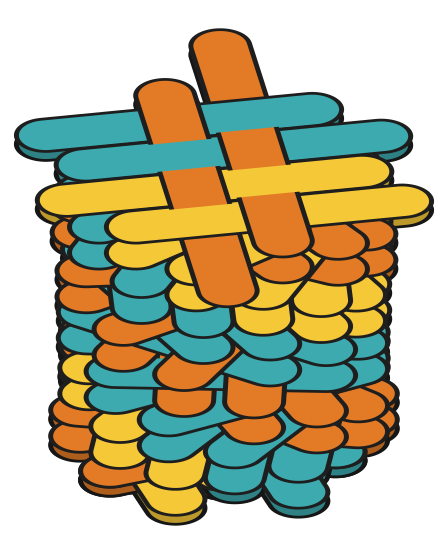
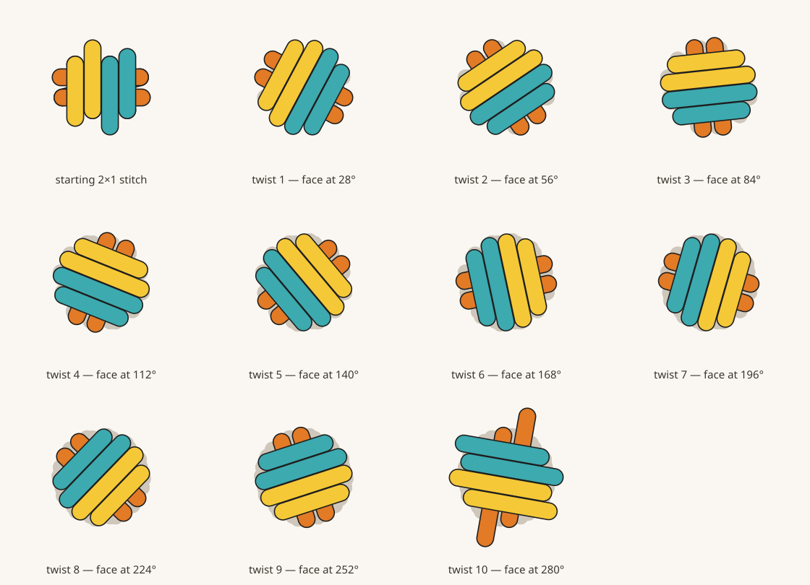

# The twist stitch — a hand-built stitch, carried upward

Three laces on a 2×1 face, and a column that **turns** as it climbs. One built-in
sample:

| sample | levels | strands | masks | level breaks | junctions |
| --- | --- | --- | --- | --- | --- |
| **Twist stitch — 10 twists** (`twist-stitch-10`) | 11 | 69 | 44 | 10 | 66 |

Eleven levels: a **starting 2×1 stitch** at the bottom and **ten twist stitches**
on top of it. It comes out of `twistStitch(twists, name)` in
[`src/model/samples.ts`](../../src/model/samples.ts).

Unlike every other sample in this repository, this one is **not an idealised
diagram**. Its first three levels are a scene built by hand in the app,
coordinate for coordinate, and every level above them is that scene turned. Why
that matters is [below](#why-it-is-grown-and-not-derived).



## The stitch, in three rules

**The face.** Seen from above, a stitch is one flat woven face: four arms lying
side by side **across** it (the *warp* — two gold, two teal) and two arms lying
**through** it (the *weft* — both orange). Four arms one way and two the other is
what makes the face twice as long as it is deep, which is the 2×1 the starting
stitch is named for; the box stitch is the 1×1 case, four arms round a square.
Every stitch is 4 × 2 = **eight crossings**, and warp never crosses warp.

**The weave.** A weft arm crosses all four warp arms in a row and goes **over,
under, over, under** along the way; the other weft arm runs the other direction
and lands on the opposite phase. Plain weave. The layer order already has half of
it right — every warp arm is laid above both weft arms — so it takes exactly
**four masks a stitch**.

**The twist.** Level *n+1* is level *n* **turned by 26°** about a fixed centre,
slot for slot. In ids that is simply *+2*: `1_8` is `1_6` turned, `3_9` is `3_7`
turned. Everything else follows from it — a fold hangs off its lace's *other* arm
one level down, so an arm's direction reverses **and** swings by 26° each time,
and the four masks repeat by slot.

## Every level, from above

Each level in colour with the levels below it in grey. Levels 1 and 2 are the
hand-built ones; 3 upward are turns of level 2.



## Why it is grown, and not derived

The first version of this sample was idealised: a face of four evenly spaced warp
lines and two weft lines, with each fold's reach *solved* so that every tip landed
exactly on the line it was about to fold along. That gives perfectly parallel arms
— and a **cylinder**. Every fold reaches the same distance, every tip lands on one
circle, and the column comes out looking turned on a lathe.

A real stitch does not do that. In the hand-built scene the six folds of a stitch
run **461, 405, 211, 267, 303 and 272** units — the ends stick out by different
amounts, and that unevenness is most of what makes the stack read as scoubidou.
Rotation carries it up the column unchanged, which is the entire reason this
sample turns a hand-built stitch rather than re-deriving one.

The arms still come out parallel, because they were drawn parallel: the
hand-built level 2 has its four warp arms within **2.5°** of each other, and every
level above it inherits exactly that.

## Working a stitch eats the tail

The top stitch's six ends are **loose tails**, drawn long — nothing folds back
over them. Work another stitch on top and they stop being tails: they become the
junctions the new folds hang off, and they pull in. `grow()` does that before
laying each new level, and where they pull in to is not a choice — it is
`turn(the ends one level further down)`, the same turn that makes the new level.
That is what keeps the new fold's start exactly on its parent's end.

Adding level 3, for instance, moves level 2's ends like this:

| arm | tail end | worked end | length |
| --- | --- | --- | --- |
| `1_6` | (285, 44) | (402, 153) | 461 → 303 |
| `1_7` | (602, 512) | (535, 433) | 405 → 302 |
| `3_6` | (641, 301) | (585, 325) | 211 → 151 |
| `3_7` | (347, 401) | (414, 385) | 267 → 201 |
| `2_6` | (616, 193) | (548, 210) | 303 → 235 |
| `2_7` | (255, 308) | (348, 277) | 272 → 176 |

Level 3 then inherits the old tail lengths unchanged, so the top of a ten-twist
column looks the way the top of the hand-built one did. Only the **last** level of
any twist count has long ends.

## Where the 26° comes from

It is measured, not chosen. Fitting each of the hand-built scene's two twists as a
**rigid turn of the starting stitch's eight crossing points** gives **24.6°** and
**26.0°**; 26° is the value carried upward. Ten twists wind the column 260°.

The centre `C` is the mean of the hand-built scene's three levels' crossing
centroids, (474.5, 304). Those centroids also *drift* by about (−9, −2) a level —
freehand wobble — and that drift is deliberately **not** carried up. Kept, it
would lean the column by most of a lace width over ten stitches.

## What was verified

Rebuilding the scene and walking every level confirms:

- 69 strands, 44 masks, 10 level breaks at 9, 15, 21 … 63
- every strand on its default control-point set (both control points on the
  start, no centre — OSS line mode)
- **66** glued endpoint pairs, one per fold, every one a clean two-way join: no
  forked endpoint, and every declared `parentId` / `parentSide` anchor sitting
  exactly on its parent's end
- closest pair of *distinct* endpoints **6.2** units apart, against the one-unit
  snap that decides what is glued to what ([`connections.ts`](../../src/model/connections.ts))
- the first 21 strands identical to the hand-built scene — same ids, same order,
  same parents, same masks — apart from level 2's six ends, which a stitch worked
  on top necessarily pulls in
- per level from 2 upward, the four warp arms within 2.5° of parallel and the two
  weft arms within 2.1°, inherited rather than imposed

## Changing the twist count

`twistStitch` takes it as an argument, and never fewer than the two that were
built by hand.

```ts
// src/model/samples.ts
export const SAMPLES: Record<string, () => Scene3D> = {
  …
  'twist-stitch-10': () => twistStitch(10, 'Twist stitch — 10 twists'),
};
```

Add the matching entry to `SAMPLE_LABELS` and it appears in the Sample dropdown.
Past roughly fourteen twists the column has turned far enough that a fold tip can
land on an earlier one — junction detection glues by coincidence in the drawing
plane and cannot see the storeys keeping them apart — so the closest-endpoint
figure above is worth re-checking if the count goes up. See
[box-stitch-levels](../box-stitch-levels/README.md#fold-slots-and-why-the-tips-are-not-all-the-same-length)
for the same problem and its real cure.
