# The twist stitch

Three laces on a 2×1 face, and a column that **turns** as it climbs.

| sample | levels | strands | masks | level breaks | junctions |
| --- | --- | --- | --- | --- | --- |
| **Twist stitch — 10 twists** (`twist-stitch-10`) | 11 | 69 | 44 | 10 | 66 |

Eleven levels: a **starting 2×1 stitch** at the bottom and **ten twist stitches**
on top of it. It comes out of `twistStitch(twists, name)` in
[`src/model/samples.ts`](../../src/model/samples.ts).

Unlike every other sample in this repository it is **not an idealised diagram**.
Its first three levels are a scene built by hand in the app, coordinate for
coordinate, and every level above them is that scene *turned*. Why it has to be
that way is [below](#why-it-is-grown-and-not-derived).

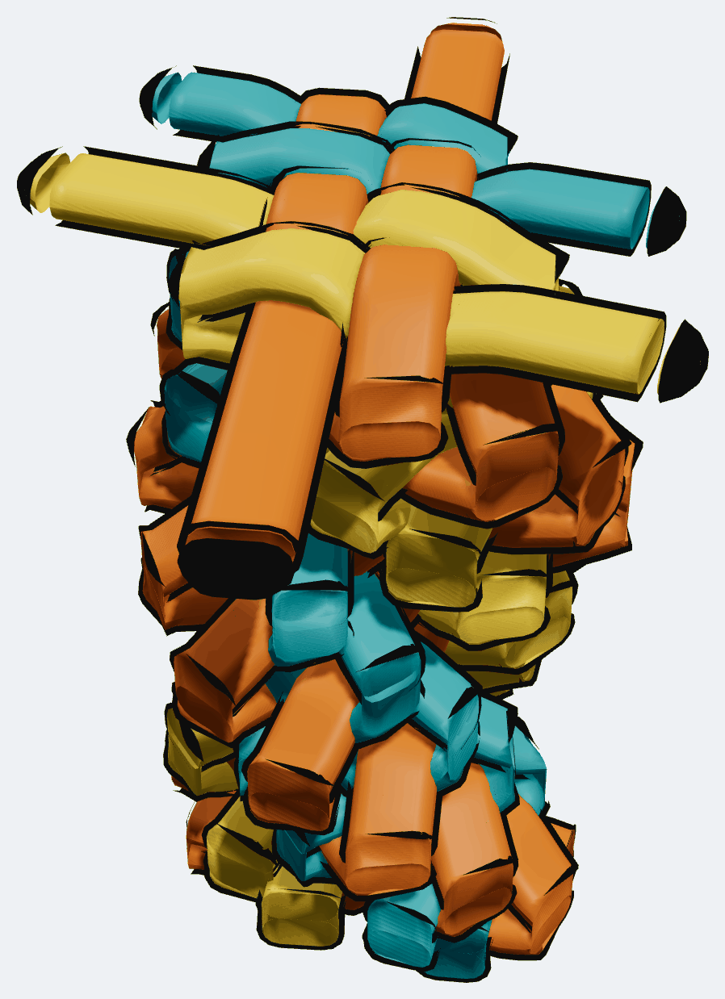

Every picture in this document is the sample's own geometry: the photographs are
the app rendering `twist-stitch-10` with layers hidden, and the diagrams are
drawn straight from its coordinates.

---

## 1. The face

Seen from above, one stitch is a single flat woven face. Six arms lie in it:

- four **warp** arms side by side across the face — two gold, two teal
- two **weft** arms through it — both orange

Four one way and two the other is what makes the face twice as long as it is
deep, and that is the 2×1 the starting stitch is named for. The box stitch is
the 1×1 case, four arms round a square. Every stitch is therefore 4 × 2 =
**eight crossings**, and warp never crosses warp.

The six positions are the **slots**. They are the vocabulary for everything that
follows:

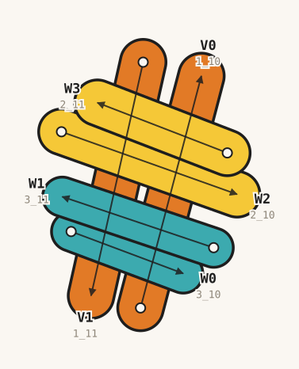

`V0` and `V1` are the two weft slots, `W0`…`W3` the four warp slots in order
across the face. Each slot fixes the direction its arm travels, so an arm
reverses simply by moving to another slot.

Here is that same level, level 4, as the app renders it — everything else
hidden:

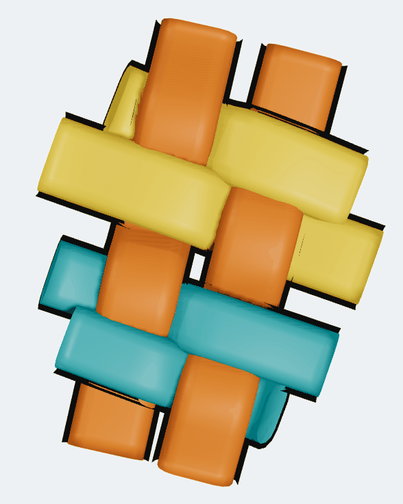 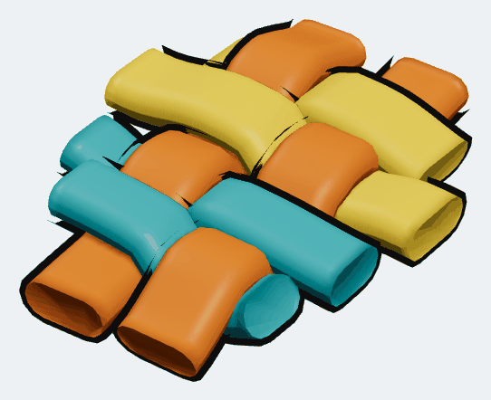

---

## 2. The weave

A weft arm crosses all four warp arms in a row and goes **over, under, over,
under** along the way. The other weft arm runs the other direction, so it lands
on the opposite phase. That is plain weave.

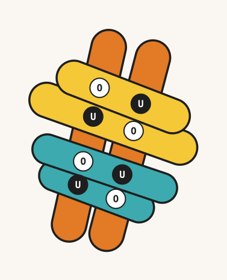

Half of it the layer order already gets right. Within a level the strands are
stacked `V0, V1, W0, W1, W2, W3`, so every warp arm sits above both weft arms,
and the four crossings where the weft ducks under need nothing said. The other
four — where the weft has to surface — take a mask each:

```
V0 over W0     V0 over W2     V1 over W3     V1 over W1
```

**Four masks a stitch**, identical at every level. That the masks always name a
`V` is bookkeeping, not geometry: stack the level weft-above-warp instead and
you would write the four masks the other way round and get the same fabric.

---

## 3. The generator

Level *n+1* is level *n* **turned by 26° about a fixed point**, slot for slot.
That is the whole stitch.

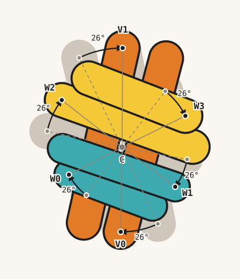

Grey is level 3, colour is level 4, and the arc on each slot is the same 26°.
The same two levels as the app renders them, in one frame so the rotation is
plain:

| level 3 | level 4 |
| --- | --- |
| 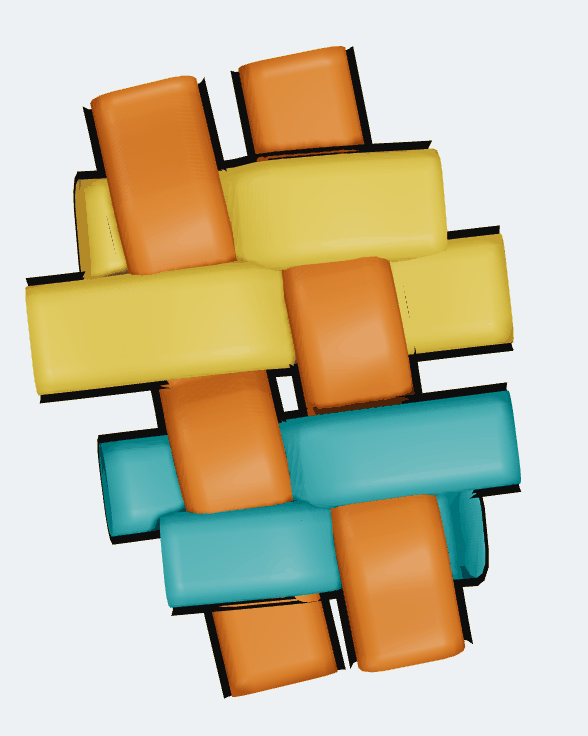 |  |

In ids the map is simply **+2** — `1_8` is `1_6` turned, `3_9` is `3_7` turned.

### As a matrix

Writing points as complex numbers is the shortest form:

```
ω = e^(i·26°)          T(z) = ω·(z − C) + C          C = 474.5 + 304.0i
```

As a homogeneous 3×3 — this is what the JSON stores, x and y only:

```
        ⎡ 0.898794  −0.438371   181.2871 ⎤
  T  =  ⎢ 0.438371   0.898794  −177.2405 ⎥        t = C − M·C
        ⎣ 0          0            1      ⎦
```

Rendered, it is a **screw motion** in SE(3): the same rotation about the vertical
axis through C, plus a rise of one storey. The app does not store z — it derives
it from `levelBreaks`, and one storey is `2 × thickness`, 52 source units at the
default thickness of 26 ([layer-levels.md](../layer-levels.md)). So the column is
the orbit of one stitch under

```
        ⎡ c  −s  0   181.2871 ⎤
  S  =  ⎢ s   c  0  −177.2405 ⎥        level n  =  S^n · (level 0)
        ⎢ 0   0  1    52      ⎥
        ⎣ 0   0  0     1      ⎦
```

The structure is the **cyclic group generated by S** — a discrete screw group.
M's eigenvalues are e^(±i·26°), so it has no real eigenvector: no direction is
invariant, and the only fixed point is C = (I − M)⁻¹t. That is why nothing in the
column ever lines up with itself.

### Where 26° comes from

It is measured, not chosen. Fit each of the hand-built scene's two twists as a
**rigid turn of the starting stitch's eight crossing points** and you get
**24.6°** and **26.0°**. 26° is the value carried upward; ten twists wind the
column 260°.

Measured is not the same as explained, and there is a proposition for where it
comes from — that the turn is whatever carries a fold's tip from its own line
onto its sibling's, so it is fixed by the face's shape and by how hard each fold
is pulled. For a snug m×n stitch that comes out as
`tan(θ/2) = 1/(M + √(M² + 2(N−1)))`, and **28.07°** for this one:
**[deriving-the-turn.md](deriving-the-turn.md)**. It is not settled — the test is
a hand-built 3×1, where it predicts about 18°.

C is the mean of the hand-built scene's three levels' crossing centroids. Those
centroids also *drift* by about (−9, −2) a level — freehand wobble — and that
drift is deliberately **not** carried up. Kept, it would lean the column by most
of a lace width over ten stitches.

---

## 4. Six circles

Because T is a rotation about C, a slot's start point keeps its **distance from
C** forever and only its **angle** changes, by exactly 26° a level:

```
P_k(n)  =  C  +  r_k · e^( i·(φ_k + (n−2)·26°) )
```

Every start point in the column, all 54 of them:

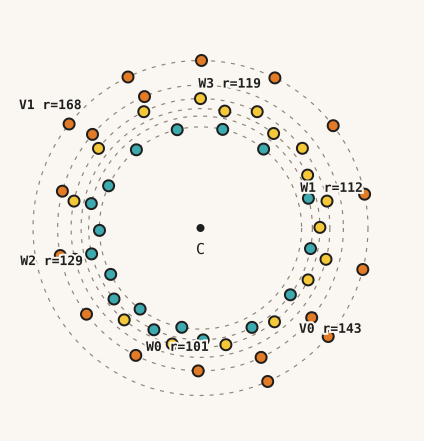

Six concentric circles, one per slot, each carrying nine points 26° apart.

| slot | lace | r | φ at level 2 |
| --- | --- | --- | --- |
| V0 | orange | 142.87 | 38.91° |
| V1 | orange | 167.54 | 218.36° |
| W0 | teal | 101.08 | 100.66° |
| W1 | teal | 111.94 | 344.61° |
| W2 | gold | 129.36 | 165.99° |
| W3 | gold | 119.45 | 281.73° |

Six radii, six phases, one shared angular step. Those are the only numbers the
geometry needs.

---

## 5. σ — the only coupling

Nothing else in the system talks to anything else. All six slots get the
identical treatment, six independent orbits, no slot derived from another. There
is exactly one place slots reference each other, and it is in the *end* point:

```
worked_end_k(n)  =  T^(n−1) · P_σ(k)
```

σ pairs **V0↔V1, W0↔W1, W2↔W3** — and those pairs are the two ends of the orange
lace, of the teal lace, and of the gold lace. It is not a geometric rule but
**physical continuity**: when orange's `V0` arm folds, the new segment has to
begin where orange's other end left off, because it is the same piece of plastic.
Teal has no way to reach orange.

Every parent link in the file, drawn from the `parentId` field:

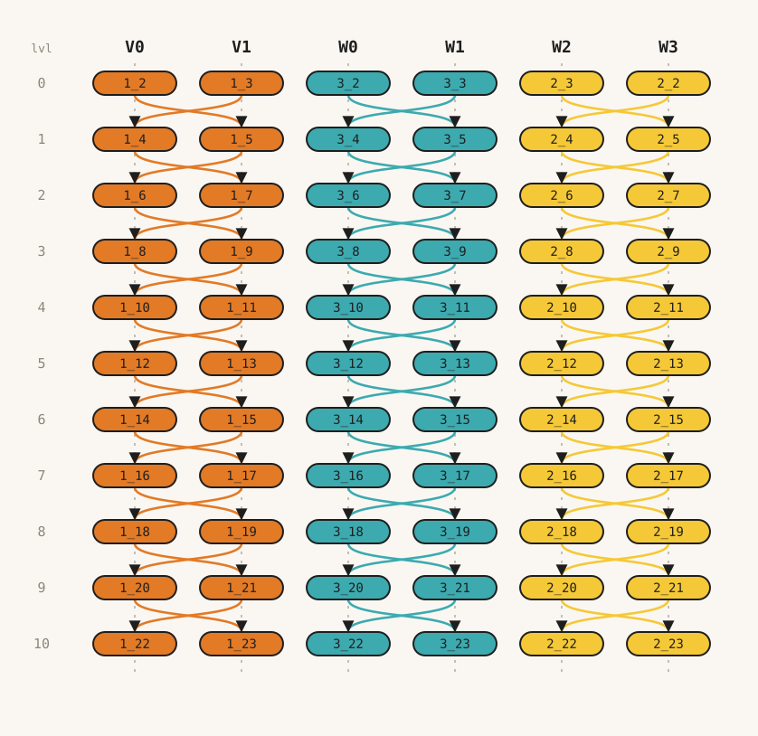

Every arrow crosses **within** a lace pair. Not one crosses between laces. The
one place the pattern reads differently is the starting stitch's gold pair: it
was folded the other way round when the scene was built by hand, so `2_2` sits in
W3 and `2_3` in W2. Only the naming differs — both are laid above both weft arms
either way, so the weave is untouched.

---

## 6. Working a stitch eats the tail

The top stitch's six ends are **loose tails**, drawn long; nothing folds back
over them. Work another stitch on top and they stop being tails — they become the
junctions the new folds hang off, and they pull in.

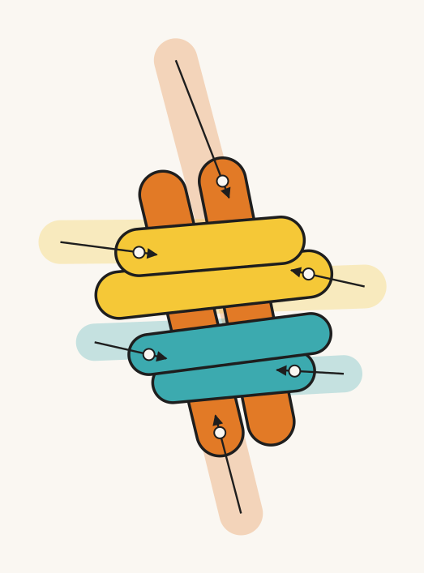

Where they pull in to is not a choice. It is `turn(the ends one level further
down)` — the same turn that makes the new level — which is exactly what puts each
new fold's start on its parent's end. Adding level 4 moves level 3's ends like
this:

| arm | tail end | worked end | length |
| --- | --- | --- | --- |
| `1_8` | (418, −13) | (476, 136) | 461 → 303 |
| `1_9` | (498, 547) | (472, 447) | 405 → 302 |
| `3_8` | (625, 374) | (564, 371) | 211 → 151 |
| `3_9` | (318, 335) | (385, 350) | 267 → 201 |
| `2_8` | (651, 266) | (582, 251) | 303 → 235 |
| `2_9` | (275, 212) | (373, 224) | 272 → 176 |

The new level inherits the old tail lengths unchanged, so the top of a ten-twist
column looks the way the top of the hand-built one did. Only the **last** level of
any twist count has long ends — here is the top of the column, level 10 alone:

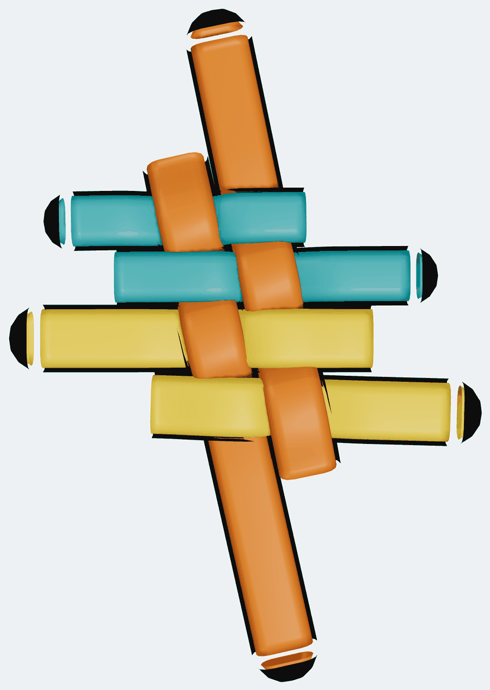

Cumulatively, that is the difference one `grow()` makes — the same scene with
everything above level 3 hidden, then everything above level 4:

| up to level 3 | up to level 4 |
| --- | --- |
| 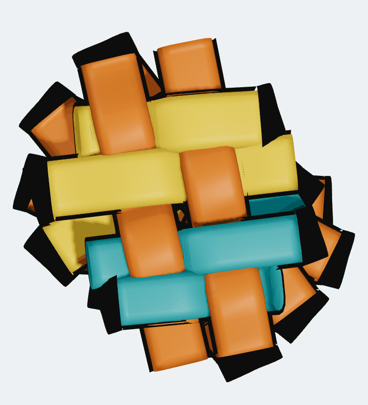 | 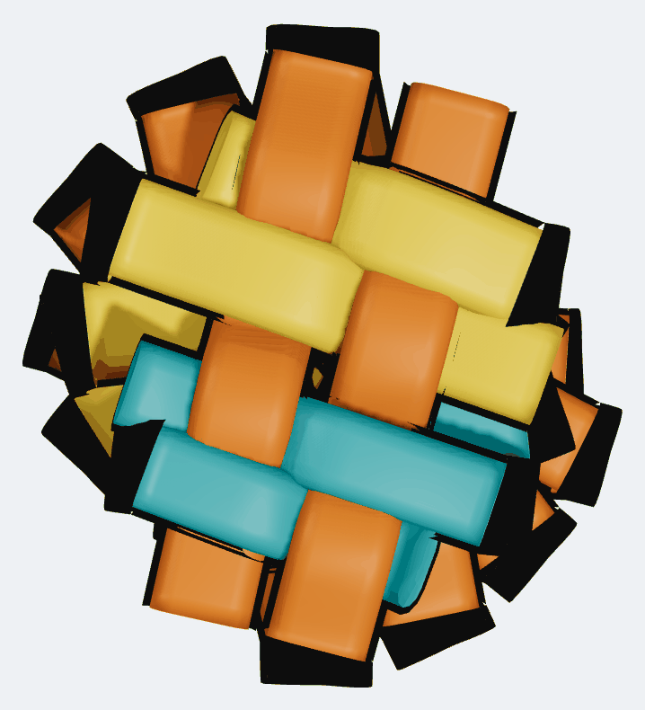 |

---

## 7. Computing any level

With m = n − 2 (the seed is level 2):

```
start_k(n)      = T^m (P_k)                 direction_k(n) = ω^m · d_k
tail_k(n)       = T^m (G_k)                 ← only the top level keeps this
worked_end_k(n) = T^(m+1) (P_σ(k))          ← once a stitch sits above
parent_k(n)     = arm σ(k) of level n−1, side 1
masks(n)        = V0>W0, V0>W2, V1>W3, V1>W1
```

T^m is just a rotation by m·26°, so any level can be written down directly —
no iteration, no accumulating float error. Checked against all nine generated
levels of the sample: **error exactly 0.0**.

The identity worth noticing is

```
worked_end_k(n)  =  start_σ(k)(n+1)
```

An arm's end **is** its sibling's start one storey up. Nothing enforces that; it
falls out of applying the same T to both, and it is why growing a level and
retracting the one below can never disagree.

### The seed

Level 2, six (point, vector) pairs. `d` is the direction the arm travels, `‖G−P‖`
its length as a loose tail, `‖worked‖` its length once a stitch sits on it.

| slot | lace | P | arg d | ‖G−P‖ | ‖worked‖ |
| --- | --- | --- | --- | --- | --- |
| V0 | orange | (585.67, 393.74) | 229.27° | 461.3 | 302.8 |
| V1 | orange | (343.12, 200.03) | 50.25° | 405.2 | 302.2 |
| W0 | teal | (455.80, 403.33) | 331.05° | 211.1 | 150.9 |
| W1 | teal | (582.42, 274.29) | 151.71° | 267.1 | 201.5 |
| W2 | gold | (348.98, 335.31) | 331.98° | 302.9 | 235.1 |
| W3 | gold | (498.78, 187.05) | 153.54° | 272.1 | 175.7 |

### Worked example

Level 3's teal arm `3_8`, using nothing but teal's own numbers:

```
P_W0    = (455.80, 403.33)        3_6's start
T(P_W0) = (414.15, 385.08)
3_8's start in the file = (414.15, 385.08)   ✓
```

### What is invariant

Every length, every angle between arms, the weave, the mask list, the whole 4×2
crossing pattern. A level is *congruent* to every other level; the column is a
single orbit. The only thing that changes is absolute orientation, 26° a step.

From level 2 up, measured on the sample: the four warp arms sit within **2.52°**
of parallel, the two weft arms within **2.10°**, and the warp family sits
**96.39°** from the weft family — the same three numbers on every level, because
they are inherited rather than imposed. The two hand-built levels below are
looser (8.0° and 12.4° of warp spread), and the top level reads 102.31° because
its ends are still tails.

---

## 8. Why it is grown, and not derived

The first version of this sample was idealised: a face of four evenly spaced warp
lines and two weft lines, with each fold's reach *solved* so that every tip landed
exactly on the line it was about to fold along. That gives perfectly parallel arms
— and a **cylinder**. Every fold reaches the same distance, every tip lands on one
circle, and the column comes out looking turned on a lathe.

A real stitch does not do that. In the hand-built scene the six folds run **461,
405, 211, 267, 303 and 272** units; the ends stick out by visibly different
amounts, and that unevenness is most of what makes the stack read as scoubidou.
Rotation carries it up the column unchanged. Compare the six radii in §4 — an
idealised stitch would put V0 and V1 on one circle and all four warp slots on
another; this one has six distinct.

The arms still come out parallel, because they were **drawn** parallel. The
hand-built level 2 holds its four warp arms within 2.5° of each other, and every
level above inherits exactly that.

---

## 9. Where the structure bites

ω generates a cyclic group and 26° does not divide 360°, but **26 × 14 = 364** —
only 4° from a full turn. Level *n* and level *n+14* therefore come back nearly
aligned. Since each slot's tips sit at fixed radii from C, two tips can land
within the app's one-unit junction snap and fuse four strand-ends into a fork:
junction detection ([`connections.ts`](../../src/model/connections.ts)) glues by
coincidence in the drawing plane and cannot see the storeys that really keep them
apart.

At ten twists the closest pair of distinct endpoints is **6.17** units, which is
comfortable. Past roughly fourteen it is worth re-measuring, and the cure is a
small nudge to the angle — 25.7° or 26.4° pushes the near-return well out of
range. The real fix is the same one the box stitch wants: make junction detection
level-aware. See
[box-stitch-levels](../box-stitch-levels/README.md#fold-slots-and-why-the-tips-are-not-all-the-same-length).

---

## 10. Every level, from above

Each level in colour with the levels below it in grey. Levels 1 and 2 are the
hand-built ones; 3 upward are turns of level 2.


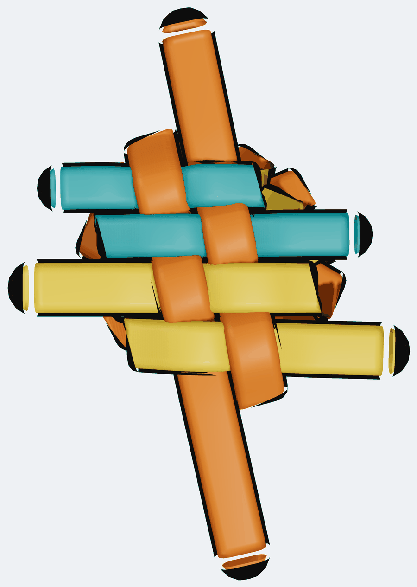

---

## What was verified

Rebuilding the scene and walking every level confirms:

- 69 strands, 44 masks, 10 level breaks at 9, 15, 21 … 63
- every strand on its default control-point set (both control points on the
  start, no centre — OSS line mode)
- **66** glued endpoint pairs, one per fold, every one a clean two-way join: no
  forked endpoint, and every declared `parentId` / `parentSide` anchor sitting
  exactly on its parent's end
- closest pair of *distinct* endpoints **6.17** units, against a one-unit snap
- the closed form of §7 reproducing all nine generated levels to **0.0**
- the first 21 strands identical to the hand-built scene — same ids, same order,
  same parents, same masks — apart from level 2's six ends, which a stitch worked
  on top necessarily pulls in
- per level from 2 up: warp spread 2.52°, weft spread 2.10°, warp-to-weft 96.39°

## Changing the twist count

`twistStitch` takes it as an argument, and never fewer than the two that were
built by hand.

```ts
// src/model/samples.ts
export const SAMPLES: Record<string, () => Scene3D> = {
  …
  'twist-stitch-10': () => twistStitch(10, 'Twist stitch — 10 twists'),
};
```

Add the matching entry to `SAMPLE_LABELS` and it appears in the Sample dropdown.
Re-check the closest-endpoint figure in §9 if the count goes much higher.
