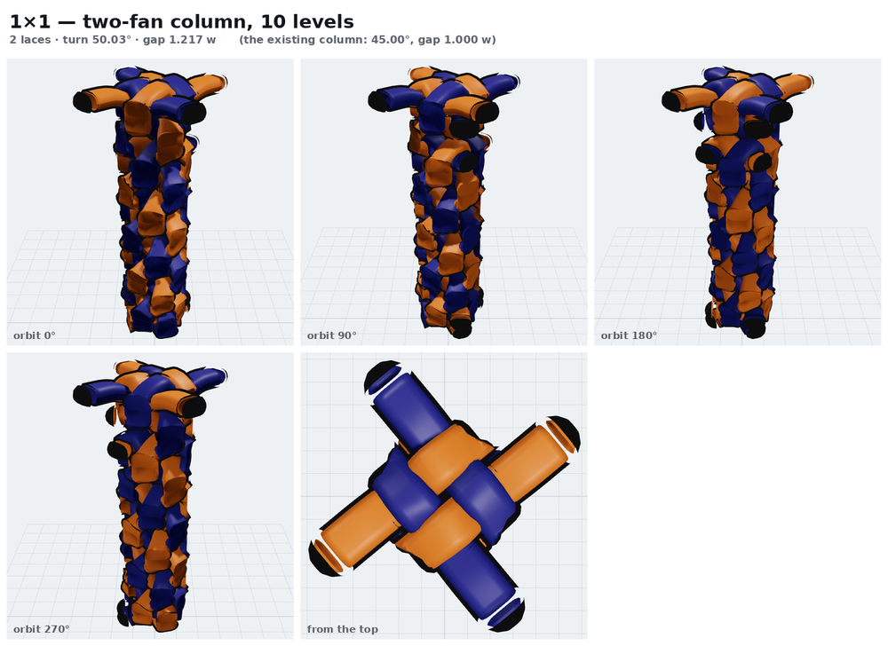
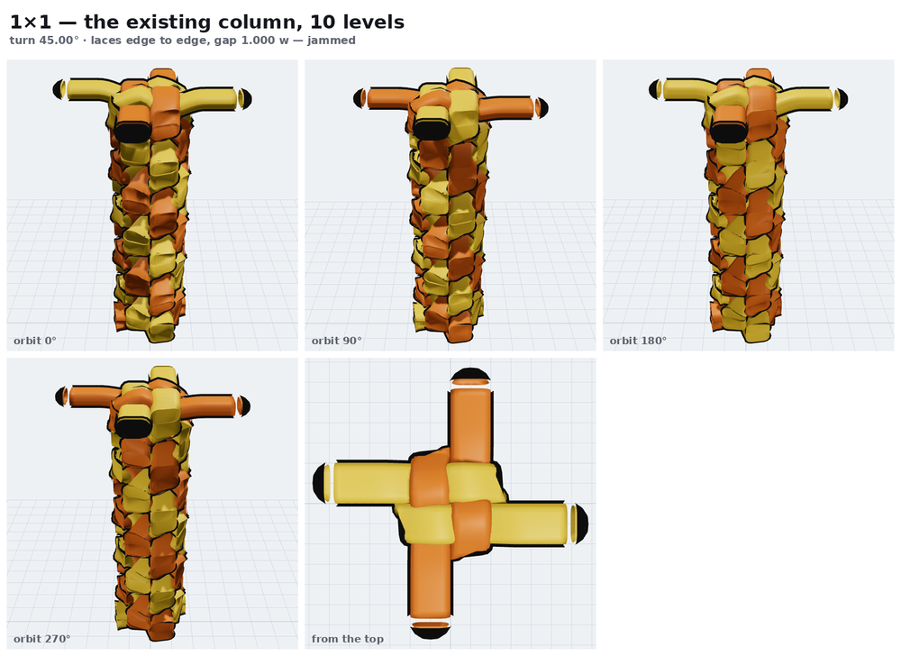
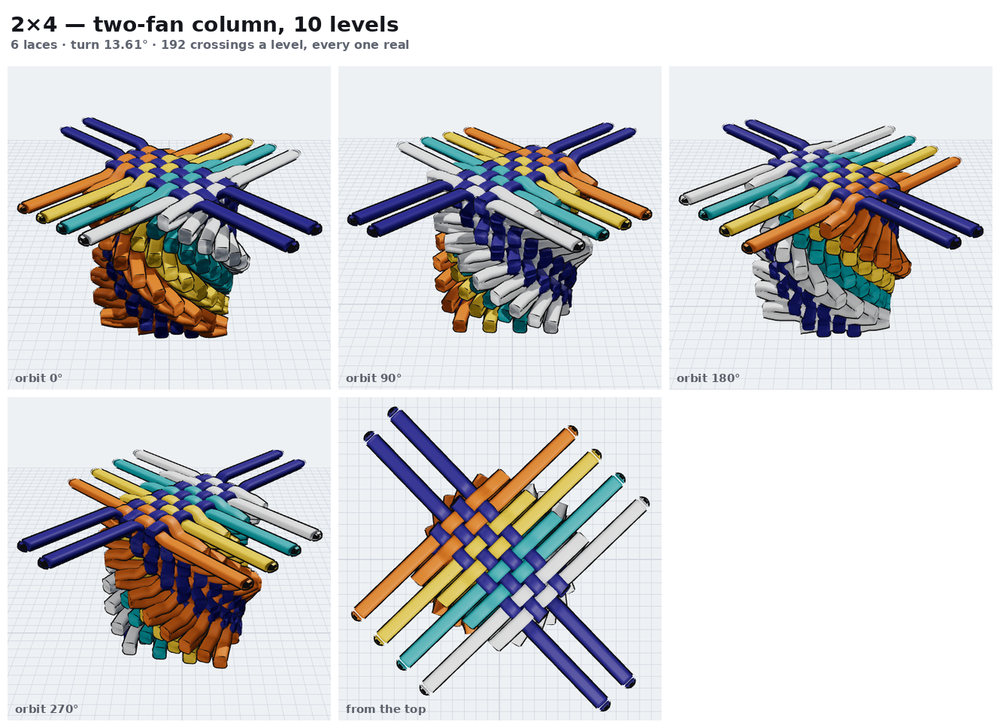
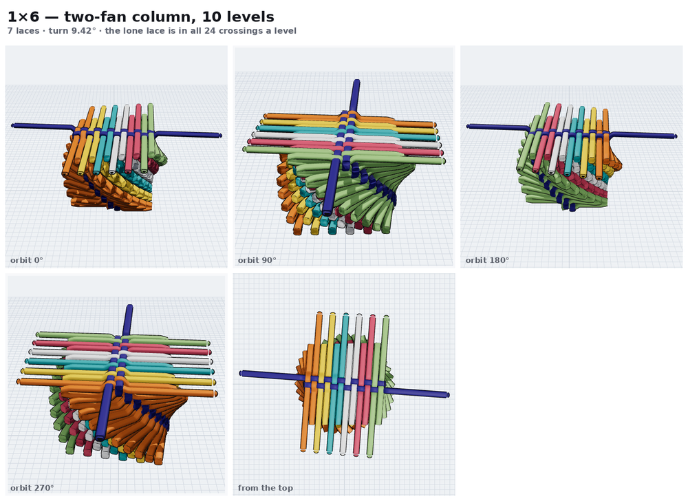

# The 1 × n reference: the two fans have different turns

An external reference — a generated study of the 1 × n twist stitch at k = +1,
n = 1 … 8, in both hands, built from a working generator rather than from the
derivation in this folder. It reports **two angles per stitch**, one per family,
and they are not the same angle.

This contradicts [deriving-the-turn](../../deriving-the-turn.md), which gives a
stitch one turn. The contradiction is the useful part.

## What it says

Three rules, and everything else follows:

1. Each family's twist strands form a **fan of parallel strands with equal gaps**.
2. A gap is at least `w + 10` and at most `1.5 w`. For a 46 px lace: **56 … 69 px**.
3. Each arm may be **slid out** past the block by its own extension before its
   twist strand leaves; a pair shares one extension, first with last.

Push every gap to the floor and spend the last degree of freedom on the least
deformation — which empties the shortest arm — and the stitch is pinned. Nothing
is chosen.

## The numbers

Both angles measured off their own family's axis, so they are comparable:

| 1 × n | weft fan (n pairs) | warp fan (1 pair) | `arctan(1/max(m,n))` |
| --- | --- | --- | --- |
| 1 × 1 | 50.04° | 50.04° | 45.00° |
| 1 × 2 | 38.72° | 27.15° | 26.57° |
| 1 × 3 | 33.32° | 18.50° | 18.43° |
| 1 × 4 | 29.89° | 14.01° | 14.04° |
| 1 × 5 | 27.43° | 11.27° | 11.31° |
| 1 × 6 | 25.54° | 9.42° | 9.46° |
| 1 × 7 | 24.02° | 8.09° | 8.13° |
| 1 × 8 | 22.77° | 7.09° | 7.13° |

The two fans agree only at 1 × 1, where m = n. Everywhere else they diverge, and
the divergence grows with the lopsidedness — a factor of three by 1 × 8.

## What it overturns

**Our turn was the right angle for the wrong fan.** Compare the last two columns:
18.43 against 18.50, 14.04 against 14.01, 9.46 against 9.42, 7.13 against 7.09.
`arctan(1/max(m,n))` tracks the *minority* family — the lone lace of a 1 × n — to
within 0.05°, and we then applied that same angle to all 2n strands of the
majority family as well. A 1 × 6's six-set wants 25.54° and we lay it at 9.46°.

**45° was never available at 1 × 1.** At 45° that stitch's gap computes to
45.25 px on a 46 px lace: the laces overlap. Our generator uses `G = V = w`, laces
edge to edge with zero clearance — permanently at the jamming limit, which is why
no choice of turn ever made both sides sit right.

**It dissolves the open problem.** The `|m − n|` slack rests on one sentence:
*one turn cannot serve both families*. That is true, and the answer is not to find
a better single turn — it is to stop using one. Give each fan its own angle and its
own extension ladder and every gap lands at the floor: 56.00 px, in all sixteen
stitches, to machine precision.

## Files

| | |
| --- | --- |
| [measured.json](measured.json) | angles, gaps and spreads read off the reference's own drawings — its coordinates, not its prose |
| [fans.py](fans.py) | the construction derived from the three rules, and the check against the table |
| [`src/model/twofan.ts`](../../../../src/model/twofan.ts) | the generator — the reference's stitch, and the column it implies, in both hands |
| [`scripts/check-twofan.ts`](../../../../scripts/check-twofan.ts) | `npm run check:twofan` — the generated scenes against the table above |

`fans.py` fits nothing. It reproduces all 16 angles to **0.016°** and 7 of the 8
extension ladders exactly, from the rules alone.

## The samples

`twistStitchMN` is untouched — everything here sits beside the original 64 rather
than replacing them, so the two can be compared. Every existing thumbnail in
`site/art` re-renders byte-identical, which is the check that nothing moved.

The sample browser has two twist folders. The first is the original family. The
second is this one, split into **Left hand** (clockwise) and **Right hand**
(counter-clockwise), 64 faces each — hand is part of the key, so a face is a
different sample in each. Both are real: the reference tabulates every size in
both, and one is the exact mirror of the other. Mirroring across the vertical
takes a direction θ to 180° − θ, which carries the 1×2's LH `H` of −141.28° to
−38.72° and its `V` of 117.15° to −117.15° — both the reference's own RH numbers.
`npm run check:twofan` verifies the right hand against **the reference's RH
column**, not against our left hand reflected: largest error **0.016°** over all
eight sizes, the same as the left.

`npm run check:twofan` compares the generated scenes with the measured table:

- both fan angles, within **0.02°** on all eight
- every gap exactly `56` — largest error `4 × 10⁻¹³` px over 92 gaps
- the extension ladders, within **1 px** (the reference's own 1 × 8 lists 136
  where its own step gives 135.4)
- every weft twist strand really crosses every warp one: **144 of 144** crossings
- all **144 browser samples** build, both hands

The block matches the reference **exactly** — all nine strands of a 1 × 2, both
endpoints, to the last decimal — and every twist strand starts on the right point
in the right direction.

One thing is not the reference's: **how long a twist strand runs**. Its tails come
out of its aligner's bookkeeping rather than out of the geometry, and are 8–29%
longer with no rule behind the variation. Here a twist strand runs until it has
cleared the last line it crosses by `POKE + w/2`, the same clearance its arm used.
Everything that carries meaning — the two angles, the gaps, the extensions — is
the reference's.

## Seeing them

Four orbits and a top view of each, shot from the app's own 3D view rather than
redrawn — `scripts/orbit-shots.mjs`, then `scripts/orbit-sheet.py`.

| | |
| --- | --- |
|  | **1×1 at 50.03°** — two laces, the plain scoubidou spiral |
|  | **the same face at 45°**, the existing column, for comparison |
|  | **2×4 at 13.61°** — 192 crossings a level, every one real |
|  | **1×6 at 9.42°** — the lopsided case. The top view is the argument: six laces fan wide and one runs straight through them. Ribbons round a spine |

## Why a lopsided column's middle levels do not look like its top

Take a 1×5 and look at every level (`scripts/level-shots.mjs`). Levels 1–9 carry
big bundles of folded-back arm on two sides; level 10 is clean. The difference is
not the turn — it is that the top level's arms are **never folded again**, so they
run out straight instead of doubling back.

The mechanism, exactly:

| | the 5 side (weft) | the 1 side (warp) |
| --- | --- | --- |
| band it must cross | 28 px | 252 px |
| arm length it gets | **287 px** | **287 px** |
| overshoot | **6.05 widths** | 0.70 widths |

Both families own two lines one gap apart, so **both arms are the same length**,
`g / sin θ`. And the turn is set so that length just carries the minority family
across its deep band — `g/sin(11.26°) = 287` against `252 + 32 = 284`. The
majority family gets handed the same 287 to cross 28, and the extra 6 widths is
what hangs out the side.

So it is not a slack that a better turn removes; it is the same length being
right for one family and six widths too long for the other.

**What was measured against it, on a 1×5:**

| | 5-side overshoot | crossings a level |
| --- | --- | --- |
| the derived turn, 11.26° | 6.05 w | **200 / 200** |
| the 5 side's own fan, 27.44° | 3.07 w | 162 / 200 |
| letting the 5 side climb 3 storeys | 2.87 w | — |

Both halve the overshoot and neither closes it. The 27.44° column costs 38
crossings a level — the lone lace stops reaching across. `twoFanColumn` takes an
optional turn override so this comparison can be re-run rather than believed.

The k-storey figure also corrects an earlier claim in
[attempts/README](../README.md), which put a 1×6 at k = 5 at +0.05 widths. That
took one arm of a pair; across all of them the best any k does for a 1×6 is
**3.25 widths**, at k = 4.

## What is not settled

The reference covers **m = 1 only**. `fans.py` carries the same derivation to a
general m × n — the weft fan gets n pairs and columns `(2m−1)g + 2c` apart, the
warp fan m pairs and `(2n−1)g + 2c` — and it reduces correctly at m = 1, but 2 × 2
and up are unverified. The hand-built 2 × 1's ≈26° is consistent with its
single-pair fan at 27.14°, which is a check but a weak one.

Adopting this in `twistStitchMN` is not a change of constant. Two angles means
level 1 is no longer level 0 rotated, so the column stops being the orbit of one
stitch under a screw motion — the model the rest of the generator is built on.
