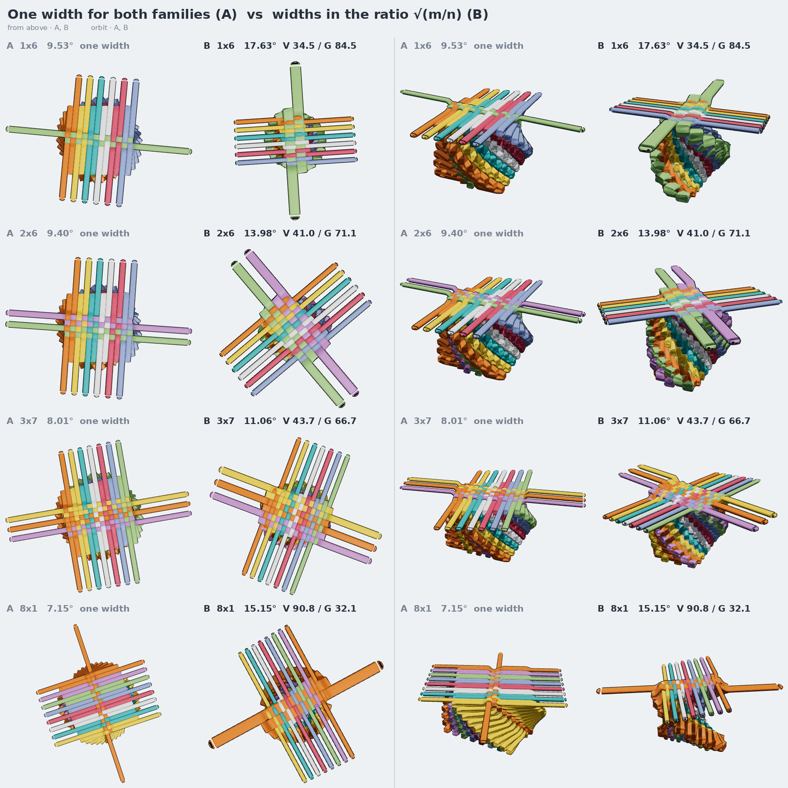

# Two widths: the only way both sides come out snug

**Status — rejected.** The widths are not free: a stitch is made from one gauge of
lace, and changing that is not a fix, it is a different object. What survives is
the measurement — `|m − n|` widths of overhang — and the proof that the turn
cannot be blamed for it. Kept for that, not as a proposal.

## The complaint

`1×6` and `6×1` both leave wide space along their six-side. Measured across the
family, the worst arm of an `m×n` overhangs the band it crosses by

```
   overhang ≈ |m − n| lace widths
```

| | 1 | 2 | 3 | 4 | 5 | 6 | 7 | 8 |
| --- | --- | --- | --- | --- | --- | --- | --- | --- |
| **m=1** | 0.00 | 1.25 | 2.33 | 3.38 | 4.40 | 5.42 | 6.43 | 7.44 |
| **m=2** | 1.25 | 0.45 | 1.47 | 2.49 | 3.49 | 4.49 | 5.49 | 6.50 |
| **m=3** | 2.33 | 1.47 | 0.61 | 1.59 | 2.58 | 3.57 | 4.56 | 5.55 |
| **m=4** | 3.38 | 2.49 | 1.59 | 0.69 | 1.66 | 2.64 | 3.62 | 4.61 |
| **m=5** | 4.40 | 3.49 | 2.58 | 1.66 | 0.74 | 1.71 | 2.69 | 3.67 |
| **m=6** | 5.42 | 4.49 | 3.57 | 2.64 | 1.71 | 0.78 | 1.75 | 2.72 |
| **m=7** | 6.43 | 5.49 | 4.56 | 3.62 | 2.69 | 1.75 | 0.81 | 1.78 |
| **m=8** | 7.44 | 6.50 | 5.55 | 4.61 | 3.67 | 2.72 | 1.78 | 0.83 |

Under a width on the diagonal, five widths at `1×6`, seven at `8×1`.

## Why the turn cannot fix it

Every arm gets the same reach, because the reach comes from the turn and the
pitch alone:

```
   reach ≈ V / sin θ        (V = the arm's own pitch)
```

and every arm has to cross its own band, `m·G` one way and `n·V` the other. The
wider of those two caps the turn at `sin θ ≤ 1/max(m,n)`; turn any tighter and the
wide-band arms fall short and the weave opens a hole. The current law already sits
exactly on that cap, so **no single turn does better** — the arms crossing the
narrow band are left `|m−n|` widths long no matter what θ is chosen. The overhang
is forced by the assumptions, not by the arithmetic.

## Two assumptions the hand-built 2×1 confirms, so not those

`sigma-check.py` reads them straight off the hand-built scene:

- **An arm's successor stays in its own family.** Every level-0 arm's axis turns by
  22°–38° into its successor — the level turn — never by ~90°. A lace does *not*
  turn the corner and become a perpendicular arm, so "one twist advances each arm
  one position around the perimeter", the round-stitch rule, is **out**.
- **A tip lands on the rotated line of its lace's other arm.** Measured offsets
  0.10 – 0.39 widths, on all six arms. The landing law is right.

## The assumption that is left

Both families being the same width. Release it — `V` for the weft lace, `G` for
the warp — and each family's snug condition is

```
   weft:  V / sin θ = m·G          warp:  G / sin θ = n·V
```

Two equations, two unknowns, and they are compatible:

```
   V / G = √(m/n)              sin θ = 1 / √(m·n)
```

**Zero overhang on both sides, for any m and n.** With `V = G` it collapses to
`sin θ = 1/max(m,n)` and the `|m−n|` overhang — what ships today. The face's aspect
stops being `n : m` and becomes `√(n/m)`.



| shape | A: one width | | B: ratio √(m/n) | | |
| --- | --- | --- | --- | --- | --- |
| | turn | worst overhang | turn | widths V / G | worst overhang |
| 1×6 | 9.53° | 5.42 | 17.63° | 34.5 / 84.5 | **1.55** |
| 2×6 | 9.40° | 4.49 | 13.98° | 41.0 / 71.1 | **1.23** |
| 3×7 | 8.01° | 4.56 | 11.06° | 43.7 / 66.7 | **1.16** |
| 2×4 | 13.83° | 2.49 | 17.31° | 45.4 / 64.2 | **0.91** |
| 8×1 | 7.15° | 7.44 | 15.15° | 90.8 / 32.1 | **1.86** |
| 2×1 | 28.07° | 1.25 | 32.65° | 64.2 / 45.4 | **0.59** |

Not quite zero: within one family the reach still varies by `2·o·tan(θ/2)` from the
middle line out, so the outermost arms run a little long. What is left is the same
order as the diagonal shapes already carry, and about what the hand-built 2×1
carries.

## What the 2×1 says about it

It sits between the two. Its widths are 54 / 54 / 46 — `V/G ≈ 1.08` against B's
`√2 = 1.41` — and its turn is 26°, below even A's snug 28.07°. So the one stitch
built by hand is an equal-width stitch pulled slightly slack, which is A, not B.
But at `|m−n| = 1` the two are barely a width apart, so it cannot discriminate.
**A lopsided hand-built stitch is still the only thing that can.**

## One width: the turn is already against the ceiling

If the widths are fixed, the only knob left is the turn, and it has no room. Force
it higher and count the crossings that *physically* happen — every weft arm
against every warp arm of its level, tested as segments rather than assumed:

| shape | snug turn | at snug | +0.5° | +2° |
| --- | --- | --- | --- | --- |
| 1×6 | 9.53° | all | all | 24 gone |
| 2×6 | 9.40° | all | all | 48 gone |
| 3×7 | 8.01° | all | all | 72 gone |
| 2×4 | 13.83° | all | all | 24 gone |
| 4×4 | 13.13° | all | all | 28 gone |
| 2×1 | 28.07° | all | all | all |

At the shipped turn every crossing is real. Two degrees tighter and the arms stop
reaching each other — the weave is not merely loose, it comes apart. So the turn is
within about a degree of its hard ceiling for every lopsided shape, and the
`|m − n|` slack on the long side cannot be turned away.

The 2×1 is the exception that explains the hand-built one: at `|m − n| = 1` the
ceiling is far enough above the snug turn that the stitch tolerates being pulled
past it, which is the 8% slack the hand-built sample shows.

## Where this leaves it

- With **one width**, `|m−n|` widths of overhang is a theorem, not a bug. If real
  laces come in one width, a lopsided twist really is loose, and A is already
  optimal.
- With **two widths in the ratio √(m/n)**, it goes away — but that is a different
  object, not this one, and it is rejected on those grounds.
- One door not opened: keeping one width but dropping *"every arm crosses the whole
  face"*. That would free the turn to go higher, at the cost of arms that stop
  inside the face and a crossing count below `4mn`. Nothing here tests it.

[**Prior art**](../prior-art.md): this is textile *jamming* — a plain weave can be
warp-jammed or weft-jammed and only in special cases both — and it is the standard
problem of braiding over a non-circular mandrel, where a fixed carrier count over a
rectangular section gives measured angle differences of 10°+ and the same slack,
slip and bridging. The industry fixes are the same two we found (vary the yarn
width, or vary the count), and nobody makes the mismatch vanish.

`generator.ts` builds either variant — `build(m, n, twists, V, G, name)` solves the
turn by bisection rather than by the closed form, so it stays honest when `V ≠ G`.
