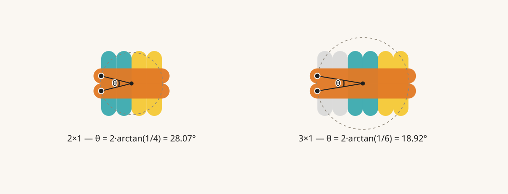
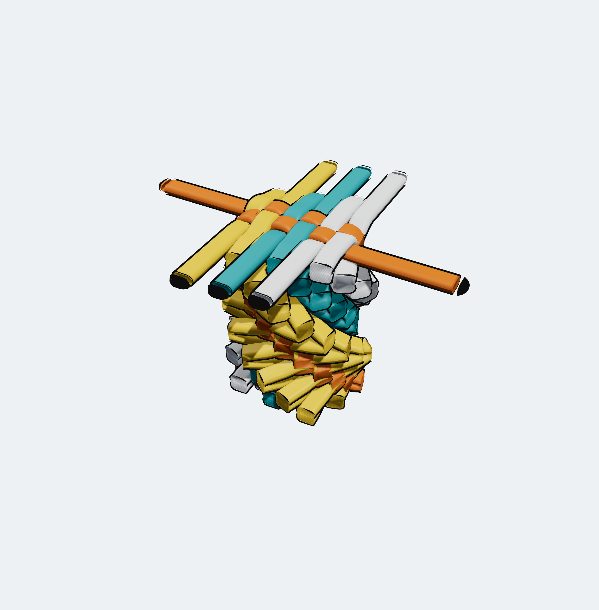
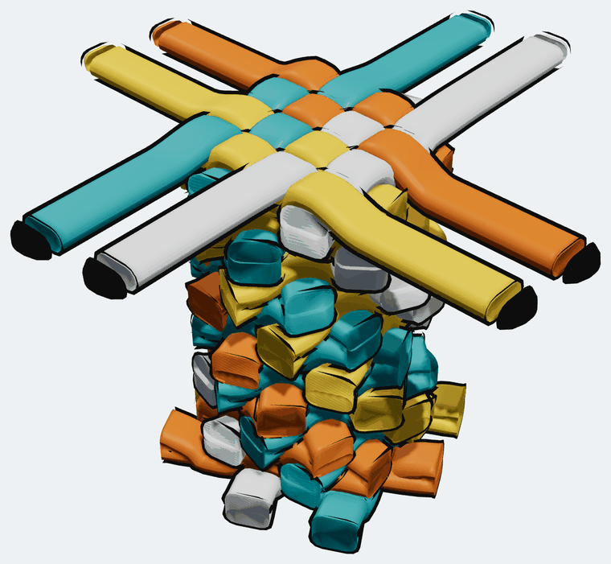
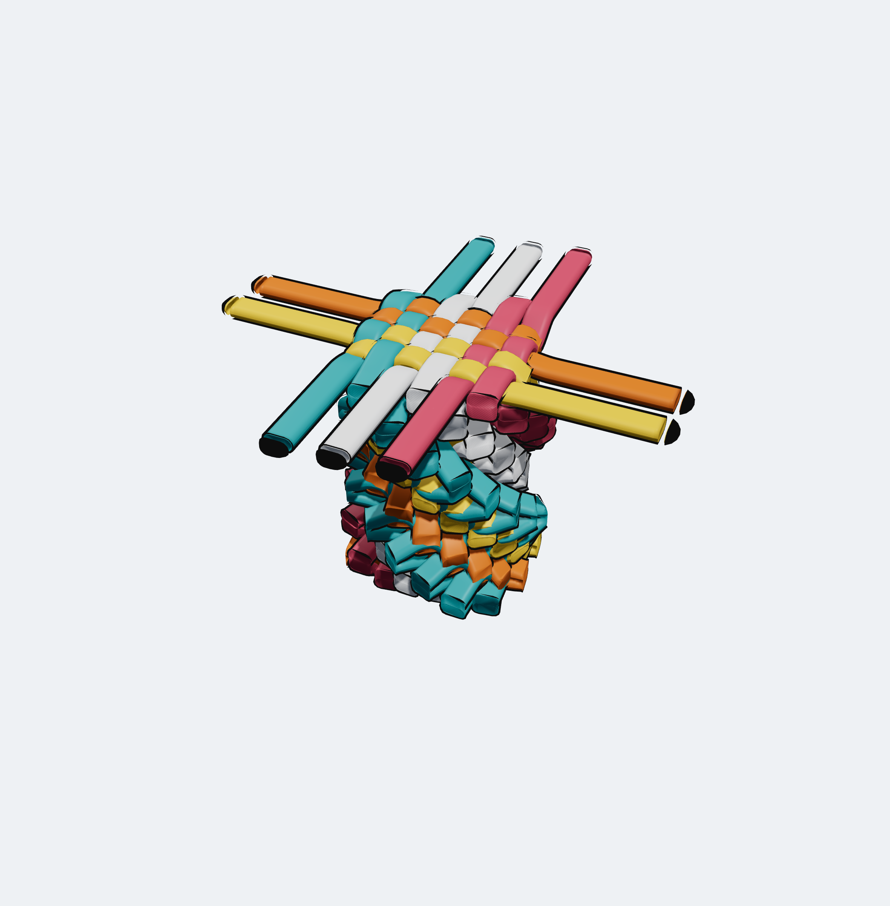
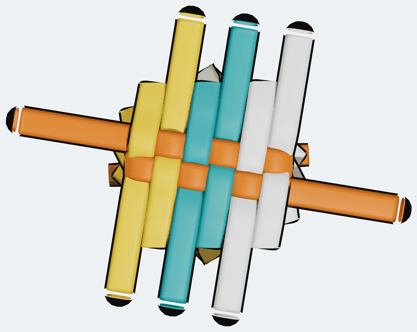
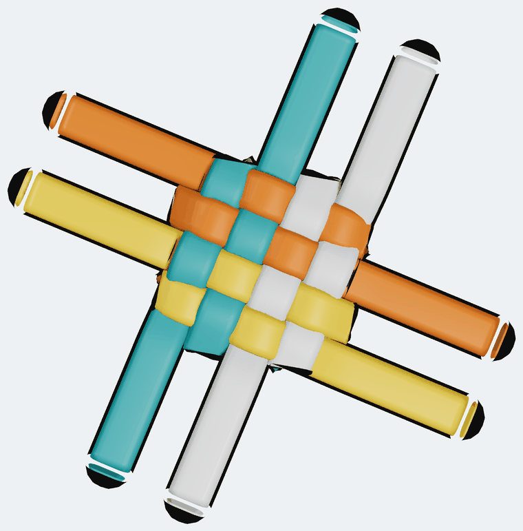
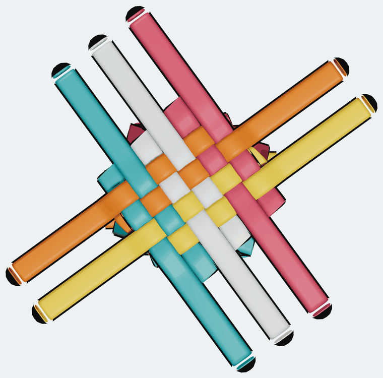
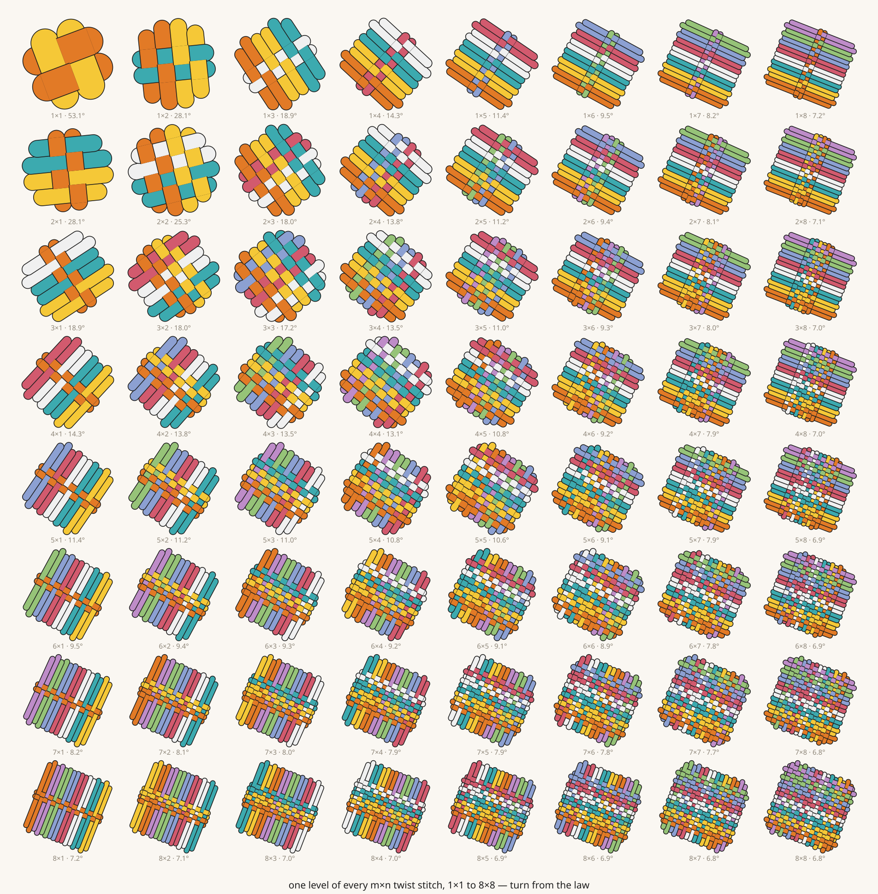
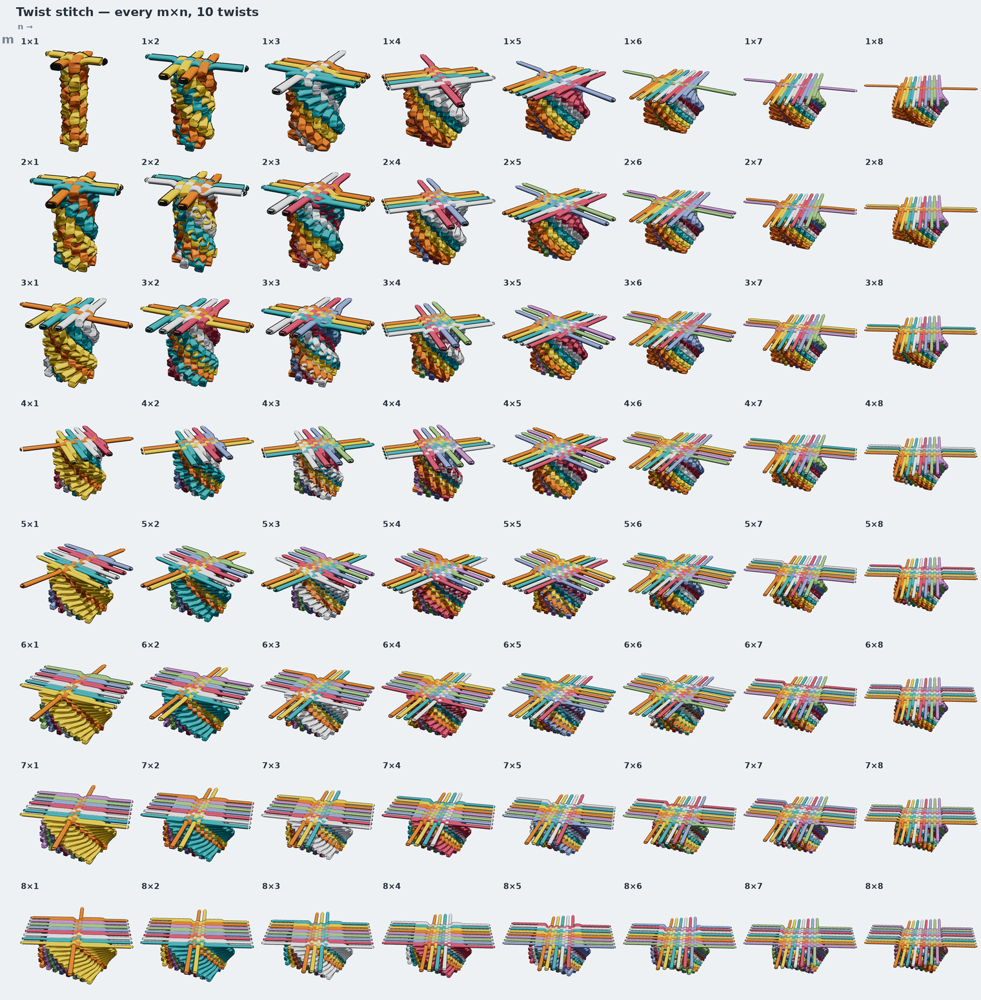
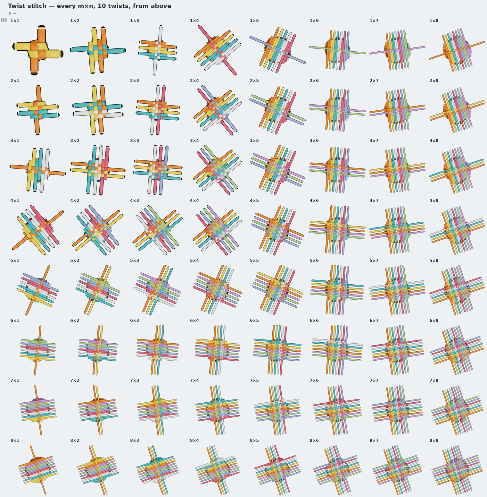

# Deriving the turn — a proposition

*Status: proposition. The algebra is proved and the construction is built and
machine-checked for every m×n from 1×1 to 8×8. The turn is
[§4b](#4b-the-turn-a-second-measurement-pins-it), `arctan(1/max(m,n))`, which is
pinned by the two angles anyone has measured — a 1×1's 45° and the hand-built
2×1's 26° — and supersedes the snug limit of [§4](#4-the-snug-limit). The
stitches in [§7](#7-what-it-predicts) are still predictions waiting to be built,
and the `|m − n|` slack on a lopsided face is
[unresolved](attempts/prior-art.md).*

---

## The question

The 26° in [the twist-stitch note](README.md) was **fitted** — a Kabsch fit of
one hand-built scene onto itself one level up, 24.6° and 26.0°, and 26 carried
upward. That is a measurement, not an explanation. It does not say why a 2×1
stitch turns about 26° rather than 5° or 50°, and it gives nothing for any other
stitch.

This note proposes that the turn is **not a free parameter**: it is fixed by the
shape of the woven face and by how far each fold is pulled through. Everything
else — every reach, every arm length, which way each arm even runs — follows.

> **A first draft of this note only varied m, holding n = 1.** That was wrong,
> and it hid the interesting half of the answer. The face has two dimensions and
> the law has to treat them the same way. Everything below is symmetric in m and
> n, and n = 1 falls out as a special case.

---

## 1. The m×n family

An **m×n** stitch is a column whose woven face is an m-by-n rectangle of cells.
Count the arms round its perimeter and there are `2(m + n)`:

| | m×n |
| --- | --- |
| laces | m + n |
| arms per level | 2(m + n) |
| **warp** arms — across the face | 2m |
| **weft** arms — through it | 2n |
| crossings per level | 4mn |
| masks per level | 2mn |
| strands, k twists | 3(m+n) + 2(m+n)·k |
| junctions, k twists | 2(m+n)·(k+1) |

`1×1` is the box stitch (2 laces, 4 arms). `2×1` is what we built — 3 laces, 6
arms, 8 crossings, 4 masks, and at ten twists 69 strands / 44 masks / 66
junctions, which is exactly what `twist-stitch-10` has.

Write `w` for the lace width, `G` for the gap between neighbouring warp lines,
`V` for the gap between neighbouring weft lines. Laid snug, all three are equal.
The lines sit at

```
warp   a_j = (m − ½ − j)·G      j = 0 … 2m−1
weft   b_i = (n − ½ − i)·V      i = 0 … 2n−1
```

and each lace owns an **adjacent pair** — `(0,1), (2,3), …` in each family. So a
fold always migrates by exactly one gap, whatever m and n are. The two families
differ in nothing but which axis they run along.

---

## 2. The law

An arm has to lie **along** its own line, not at an angle to it. Its far end is
its tip, which we put on the line by construction. Its near end is the tip its
lace left behind one level down — a point placed in the *previous* frame. So:

> **The tip a fold leaves must land on the line its lace folds onto next.**

Turning the frame by θ takes an offset `o` and an along-coordinate `x` to
`o·cosθ ± x·sinθ` — plus for one family, minus for the other. Setting that equal
to the sibling line's offset `o′` and solving for `x` leaves exactly one answer:

```
────────────────────────────────────────────────────
     x  =  ( o′ − o·cosθ ) / ( ±sinθ )
────────────────────────────────────────────────────
```

Two things come out of that single equation, and neither is a choice.

**The reach** is `R = |x|` — how far past the middle the tip has to sit.

**The direction the arm travels** is `sign(x)`. An arm has no freedom about which
way it runs; the requirement that its tip land on the next line picks the
direction for it. (The first draft of this note hard-coded an alternating
pattern and got the weft backwards for n ≥ 2. Deriving the sign removed both the
guess and the bug.)

### The one physical quantity

For the **outermost** slot of a family the reach comes out smallest, and that arm
is the one that has to work hardest. Call its reach `ρ` — *how far the fold is
pulled through*. Rearranged for the simplest case, n = 1, where the two weft
lines sit symmetrically at `±V/2`:

```
ρ  =  (V/2)·cot(θ/2)          θ = 2·arctan( (V/2) / ρ )
```

**The turn and the pull are the same number seen twice.** Pull tighter — smaller
ρ — and the stitch twists *more*. Leave slack and it twists less.



On the left, `2×1`: the two weft lines are symmetric about the middle, so θ is
simply the angle they subtend at the centre from the tip's distance. On the
right, `2×2`: the binding slot is the outer weft line and its sibling is one gap
in, so the wedge is lopsided — but it is the same statement. **θ is whatever
carries the tip from its own line onto its sibling's.**

---

## 3. What follows, for free

With θ fixed, nothing is left to choose:

- **Arm length = 2R.** The arm runs from `+R` to `−R` along its own line. The
  incoming tip landing at exactly `+R` is not assumed — it falls out of the
  rotation.
- **A lace's two reaches sum to `g·cot(θ/2)`**, where `g` is that family's gap.
- **Every arm of a snug m×1 is the same length as the face is long.**

So the ideal stitch is *uniform*. Which is
[the cylinder we started from](README.md#8-why-it-is-grown-and-not-derived) — see
[§6](#6-slack-is-what-makes-a-stitch-look-handmade).

### The one length that is a clearance, not a reach

Every arm above the base is bounded at both ends by the law: it starts on the tip
its lace left one level down and stops on the line its lace folds onto one level
up. The **base level is not**. Its arms start on the pinned run that was simply
laid across the face, and how far that run pokes past the face before its loop
turns back is not a reach — nothing lands on it.

It is a **clearance**, and clearances do not scale with the face. The loop turns
around the outermost perpendicular arm, so it needs half a width past that arm's
far edge and no more, whatever m and n are:

```
   E = w/2                        ← a constant
   entry = band + E               ← where the base arm starts
   band  = (·−½)·gap + w/2        ← the far edge of the band it crosses
```

Getting this wrong is the one error that *looks* like the turn is wrong. Making
`E` proportional to the reach — `0.55·min reach`, which is what this note first
built — leaves the four loop sides of the base stitch standing off the face by a
distance that grows with the shape: half a width at 1×1, two widths at 2×4,
nearly four at 3×7. The column above is correct and every crossing is right, but
the bottom stitch reads as slack on all four sides, and slack is exactly what a
snug derivation is not allowed to have.

The hand-built 2×1 measures it directly. Its three pinned runs span, from the
face centre:

| pinned run | measured | `band + w/2` |
| --- | --- | --- |
| weft lace, across | 133 | 135 |
| warp lace 2, through | 85 | 81 |
| warp lace 3, through | 78 | 81 |

Within the 4 units a hand-laid scene is placed to. So `E = w/2` is not a fitted
constant either — it is read off the one stitch that was built by hand, and it is
the same half width for all 64 shapes.

### The one thing the geometry does *not* fix

The weave has two phases. A face is a grid, so "over, under, over, under" can
start either way — and the complement of a plain weave is another plain weave,
alternating just as correctly along every row and every column. Nothing in the
reach algebra prefers one.

The **hand-built 2×1 pins it**, and pins it for every shape. Read by *position* —
weft and warp lines each ordered by their offset across the face — its outermost
weft line goes **under** the outermost warp line:

```
   sample, level 4, by position:      uOuO
                                      OuOu
```

So the rule is: a weft line rides **over** the warp lines of *opposite* parity,
counting both from the outside in. The first version of this note had it the
other way round for every shape, which is a valid weave and the wrong one; the
sample was the only thing that could tell, and it does.

---

## 4. The snug limit

> **Superseded by [§4b](#4b-the-turn-a-second-measurement-pins-it).** The bound
> derived here is real, but it is not the turn a hand pulls: it misses both
> angles that have since been measured. Kept because §4b is a correction *to* it,
> and because the bound still matters — it is what says how far the turn can be
> pushed before the weave comes apart.

ρ still has to come from somewhere, and there are now **two** bounds, one per
family, each saying an arm must cross the band it is woven through:

```
weft crosses the warp band:   R_weft,min  ≥  (m − ½)·G + w/2
warp crosses the weft band:   R_warp,min  ≥  (n − ½)·V + w/2
```

Both matter, and which one binds depends on the shape. Laid snug (`G = V = w`)
and writing `t = tan(θ/2)`, the two conditions become two quadratics:

```
2(n−1)·t² + 2m·t − 1  ≤  0
2(m−1)·t² + 2n·t − 1  ≤  0
```

The tightest stitch takes the smaller of the two positive roots, and it
rationalises to one closed form. With `M = max(m, n)` and `N = min(m, n)`:

```
────────────────────────────────────────────
   tan(θ/2)  =  1 / ( M + √( M² + 2(N−1) ) )
────────────────────────────────────────────
```

(Checked against solving the quadratics directly for every m, n up to 8: max
error 2·10⁻¹⁶.)

Two sanity checks fall straight out. For **n = 1** the square root collapses to M
and it becomes `1/(2m)` — the clean form the first draft found. For **1×1** it
gives `1/2`, θ = 53.130°, the box stitch.

|  | n=1 | n=2 | n=3 | n=4 | n=5 |
| --- | --- | --- | --- | --- | --- |
| **m=1** | 53.130° | 28.072° | 18.925° | 14.250° | 11.421° |
| **m=2** | 28.072° | 25.333° | 17.992° | 13.835° | 11.203° |
| **m=3** | 18.925° | 17.992° | 17.217° | 13.463° | 11.000° |
| **m=4** | 14.250° | 13.835° | 13.463° | 13.128° | 10.811° |
| **m=5** | 11.421° | 11.203° | 11.000° | 10.811° | 10.634° |

Symmetric, as it must be — an m×n stitch is an n×m stitch looked at sideways.

The shape of the table is the interesting part. **The turn is set mostly by the
larger dimension**; the smaller one only nudges it. A 3×1, a 3×2 and a 3×3 turn
18.9°, 18.0° and 17.2° — all "about eighteen" — while going from 2 to 3 in the
long direction drops the turn by a third. Whatever the stitch's aspect ratio, the
long way across is what the fold has to reach, and reach is what sets the turn.

For n = 1 the numbers are rational in a way that looks like a coincidence and is
not: `(4m² − 1, 4m, 4m² + 1)` is a Pythagorean triple, so `cos θ` and `sin θ` are
rational for every whole m — 15/17 and 8/17 for the 2×1, 35/37 and 12/37 for the
3×1.

---

## 4b. The turn: a second measurement pins it

§4 asks how tight the stitch *can* be pulled. That is a bound, and a bound is not
a law — it says where the wall is, not where the hand stops. Two angles have now
been measured, and they agree with each other and not with the wall:

| | 1×1 | 2×1 |
| --- | --- | --- |
| **measured** | **45.00°** | **≈26.0°** (hand-built) |
| §4's snug limit | 53.13° | 28.07° |
| **arctan( 1 / max(m,n) )** | **45.00°** | **26.57°** |

Several forms hit 45° at a 1×1 — `90/(m+n)` and `arctan(2/(m+n))` both do. The
hand-built 2×1 is what separates them, sending them to 30° and 33.69°. Only
`arctan(1/max)` survives both.

And it says something simpler than §4 did:

```
   tan θ = one lace width / the face the arm crosses = 1 / max(m, n)
```

**Over the run of the face, a fold migrates exactly one lace width.** No arctan of
a square root, no `2(N−1)` correction term. §4 was solving a stricter version of
the same idea — it required every arm to clear the far *edge* of its band, half a
width beyond the last line's centre, and that half width is the whole of the
1.5° it lands tight by.

Only the larger dimension appears, so the turn is flat along each row past the
diagonal:

```
          n=1    n=2    n=3    n=4    n=5    n=6    n=7    n=8
  m=1   45.00  26.57  18.43  14.04  11.31   9.46   8.13   7.13
  m=2   26.57  26.57  18.43  14.04  11.31   9.46   8.13   7.13
  m=3   18.43  18.43  18.43  14.04  11.31   9.46   8.13   7.13
  m=4   14.04  14.04  14.04  14.04  11.31   9.46   8.13   7.13
  m=5   11.31  11.31  11.31  11.31  11.31   9.46   8.13   7.13
  m=6    9.46   9.46   9.46   9.46   9.46   9.46   8.13   7.13
  m=7    8.13   8.13   8.13   8.13   8.13   8.13   8.13   7.13
  m=8    7.13   7.13   7.13   7.13   7.13   7.13   7.13   7.13
```

It sits *inside* §4's wall on the lopsided shapes and just outside it on the
diagonal, where an arm ends up to **0.40 widths** short of its band's far edge —
worst case 8×8. That costs nothing: the shortfall is entirely inside the half
width of clearance, and every one of the `4mn` crossings on every level of all 64
shapes still physically happens, tested as segments rather than assumed.

What it does **not** do is close the `|m − n|` slack on the long side of a
lopsided face — for those shapes it moves the turn by less than a tenth of a
degree. That is a separate problem, and [prior art](attempts/prior-art.md) says it
is the same one weavers call *jamming* and braiders meet on a rectangular mandrel.

---

## 5. Does it reproduce the 2×1?

Building an m×n from the formulas above and nothing else, then measuring it:

| | from the law | `twist-stitch-10` |
| --- | --- | --- |
| strands (10 twists) | 69 | 69 |
| masks | 44 | 44 |
| level breaks | 10 | 10 |
| junctions | 66 | 66 |
| warp parallel to | 0.0000° | 2.52° |
| weft parallel to | 0.0000° | 2.10° |
| weave, by position | `uOuO / OuOu` | `uOuO / OuOu` |
| θ | 26.57° ([§4b](#4b-the-turn-a-second-measurement-pins-it)) | 26.0° fitted |

Every count matches, the weave matches crossing for crossing once both are read
by position, and the generated stitch is *more* regular than the hand-built one —
the expected direction. The angle now matches too: **26.57° against 26.0°
measured**, half a degree, which is inside what a hand-placed scene resolves.

The first version of this note read the remaining gap — 28.07° against 26.0° — as
slack, a scalar ρ measuring how much further than snug the folds are pulled. That
was fitting a residual that turned out to be an error in the law: with §4b the
residual is 0.57°, and there is nothing left for a slack parameter to explain.
Slack is still real in a hand-built stitch, but this sample is not evidence of it.

---

## 6. Slack is what makes a stitch look handmade

The ideal predicts every fold the same length. The real one has six folds of 461,
405, 211, 267, 303 and 272 units. No contradiction: **ρ is per arm.** Each is
pulled a slightly different amount, so each has its own `ρ_k` and would imply its
own `θ_k`.

But a level can only turn by one angle. The stitch settles the disagreement by
letting arms **lean** slightly off their lines — which is exactly the 2.5° of
warp spread the hand-built one carries, and exactly what an idealised
construction throws away.

> The law fixes the mean turn. The scatter of `ρ_k` about it is the hand of
> whoever tied it, and it comes out as lean.

Sharper form, and testable: **the spread of arm lengths within a level should
predict the spread of arm angles.**

---

## 7. What it predicts

Built straight from the law, no measurement of a real stitch anywhere in them:

| | 3×1 | 2×2 | 3×2 |
| --- | --- | --- | --- |
| θ | 18.435° | 26.565° | 18.435° |
| laces | 4 | 4 | 5 |
| arms per level | 8 | 8 | 10 |
| crossings per level | 12 | 16 | 24 |
| masks per level | 6 | 8 | 12 |
| |  |  |  |
| from above |  |  |  |

Machine-checked on every build, for 1×1, 2×1, 3×1, 4×1, 2×2, 3×2 and 3×3: strand,
mask and junction counts as predicted; every parent anchor exact; **exactly 4mn
crossings per level and not one more** (no warp crossing warp, no weft crossing
weft); every weft arm reading `O,u,O,u…` across all 2m warp arms on every level;
and warp and weft each parallel to **0.0000°**. The 2×1's weave now matches the
hand-built sample's, read by position — which is what fixed the phase.

The 3×1's reaches, all forced, at `w = G = V = 54`:

| lace | slots | reach out | reach back | arm lengths |
| --- | --- | --- | --- | --- |
| weft | V0 / V1 | 166.4 | 166.4 | 332.8 / 332.8 |
| warp A | W0 / W1 | 148.9 | 183.9 | 297.8 / 367.8 |
| warp B | W2 / W3 | 166.4 | 166.4 | 332.8 / 332.8 |
| warp C | W4 / W5 | 183.9 | 148.9 | 367.8 / 297.8 |

There is no slack factor in these any more. The 2×1's 26.0° is 0.57° off
`arctan(1/2)`, which is inside what a hand-placed scene resolves, so the
`18.92° → 17.49°` correction the first version of this note applied was
correcting for its own error, not for a hand.

---

## 7b. The whole family, built

> The 64 scenes this section describes are stashed, with the generator that made
> them and the reason they are parked, in
> [attempts/2026-07-snug-turn](attempts/2026-07-snug-turn/). The law is not
> settled: the shapes it gives off the m = n diagonal are the open question, and
> nothing but a hand-built 3×1 can close it.

Every m×n from 1×1 to 8×8, ten twists each, generated by `twistStitchMN` from the
law and nothing else — one level of each, drawn from its own mask list:



All 64 come out as genuine stitches: every weft arm reads `O,u,O,u…` across every
warp arm on every level, warp and weft each parallel to **0°** within 1e-13, every
`parentId` anchor exact, and strand / mask / junction / crossing counts exactly as
predicted by §1.

**But in 39 of the 64, two tips that are not the same joint come closer in the
drawing plane than the app's one-unit snap** — and that is worth stating plainly
rather than hiding. It is not a broken stitch. Fold tips ride *circles* about the
column, spaced by the turn — see [six circles](README.md#4-six-circles) — and two
laces that mirror each other across the face ride the *same* circle. When their
angular offset comes near a whole number of turns, one lace's tip at level *n*
passes within a fraction of a unit of the other's at level *n±k*:

| closest pair that is not a joint | shapes |
| --- | --- |
| nothing within 2 units | 16 |
| within 2 units, outside the snap | 9 |
| inside the one-unit snap | 39 |

The separations are real — 0.27 to 1.0 units, never zero — and the two points are
storeys apart in space. Only the projection puts them together, and
[`connections.ts`](../../src/model/connections.ts) used to pair a start with
*whichever* coincident endpoint came first in the strand array. Across those 39
shapes that bridged **784 arms to the wrong strand**, mostly to the mirror lace
one to three levels below.

The cure is not level-aware detection. 760 of the ambiguous pairs are exactly
**one** storey apart — and so is every genuine link in a chain, since an arm hangs
off the arm below it. No rule on storeys can separate those two cases. What can is
that the generator already *says* which endpoint each arm hangs off:
`parentId` / `parentSide` is a declaration, and coincidence is only how an
undeclared pairing is recovered. Preferring the declaration takes the 784 wrong
bridges to zero and leaves all twelve other samples bit-identical.

Two smaller things the near-misses still cost, both editor-only: dragging one of
the pair moves the other, and the junction dot is drawn once for what look like
two joints. Both would need the projection to carry the storey.

### All 64, ten twists each

Rendered from the app, one scene per cell, m down and n across:



The shape of the family is legible at a glance. Down the **m = n** diagonal the
column is square and upright. Off it, the smaller dimension sets the turn — the
face is short one way, so the arms crossing the long way run far past it and the
column opens into a skirt, the more so the further from square. `8×1` is the
extreme: a one-deep face with arms as long as the face is wide, fanned almost
flat. Every one of them is a genuine stitch by the checks above; the ones that
look loose are loose *because the law says they are*, not because the build is
wrong.

From above, the same 64 — this is the view that shows the weave and the twist:



---

## 8. How to falsify it

Build a 3×1 by hand in the app the way the 2×1 was built — starting stitch plus
two twists — and fit the turn the same way. [§4b](#4b-the-turn-a-second-measurement-pins-it)
commits to a number with no free parameter left in it:

- **θ ≈ 18.4°** → the law holds for a third shape and there is nothing left to fit.
- **θ ≈ 26° again, independent of the shape** → the law is wrong. The turn would
  be something about the *lace* rather than the face — thickness, friction, how
  far a thumb naturally pushes a fold. Note that a 2×2 is *also* 26.57°, so the
  shape to build is the 3×1, not the 2×2: only a change in max(m,n) separates the
  two explanations.
- **In between** → the face shape matters but this form is wrong.

> The first version of this note guessed its own correction here: *"perhaps a
> fold must clear the face by a fixed margin rather than reach exactly to its
> edge, which would put a constant inside the arctan."* That is what happened.
> The margin was the half width of clearance in §4's band, and taking it out is
> §4b.

---

## 9. What this still does not explain

- **Why the loop clearance is half a width rather than some other constant.** It
  is measured off the hand-built 2×1 and it is the smallest value that lets a
  fold turn without the loop biting the arm it turns around — but that is an
  argument about lace stiffness, not about the screw motion, and this note does
  not derive it. Only that it is a constant is derived: see
  [§3](#the-one-length-that-is-a-clearance-not-a-reach).
- **Whether the snug bound is really the tightest a hand can pull.** It is the
  tightest that still *works*; a real thumb may stop short of it.
- **Why the two families should share one gap.** `G = V = w` is assumed for the
  snug case; a lace that is wider than it is thick might not pack that way, and
  the general law keeps G and V separate for exactly that reason.
- **Non-rectangular cross-sections** — a triangular or hexagonal column has a
  different perimeter count and the two-family split stops making sense.
